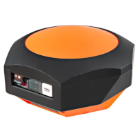
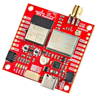
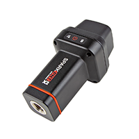

SparkFun RTK Everywhere Firmware
===========================================================

The line of RTK Everywhere products offered by SparkFun all run identical firmware. The [RTK Everywhere firmware](https://github.com/sparkfun/SparkFun_RTK_Everywhere_Firmware) and this guide cover the following products:

<table class="table table-hover table-striped table-bordered">
	<tr align="center">
		<td></td>
		<td></td>
		<td></td>
	</tr>
	<tr align="center">
		<td><a href="https://www.sparkfun.com/sparkfun-rtk-evk.html">SparkFun RTK EVK (GPS-24342)</a></td>
		<td><a href="https://www.sparkfun.com/sparkpnt-rtk-facet-mosaic-l-band.html">SparkFun RTK Facet mosaic (GPS-24903)</a></td>
		<td><a href="https://www.sparkfun.com/sparkfun-rtk-postcard.html">SparkFun RTK Postcard (GPS-26916)</a></td>
	</tr>
	<tr align="center">
		<td><a href="https://docs.sparkfun.com/SparkFun_RTK_EVK/">Hookup Guide</a></td>
		<td><a href="https://docs.sparkfun.com/SparkFun_RTK_Facet_mosaic/">Hookup Guide</a></td>
		<td><a href="https://docs.sparkfun.com/SparkFun_RTK_Postcard/">Hookup Guide</a></td>
	</tr>
	<tr align="center">
		<td></td>
		<td></td>
	</tr>
	<tr align="center">
		<td><a href="https://www.sparkfun.com/sparkfun-rtk-torch.html">SparkFun RTK Torch (GPS-25662)</a></td>
		<td><a href="https://www.sparkfun.com/sparkpnt-tx2.html">SparkPNT TX2 (GPS-29524)</a></td>
	</tr>
	<tr align="center">
		<td><a href="https://docs.sparkfun.com/SparkFun_RTK_Torch/">Hookup Guide</a></td>
		<td><a href="https://docs.sparkpnt.com/TX2/">Hookup Guide</a></td>
	</tr>
</table>

The [SparkFun RTK EVK](https://www.sparkfun.com/sparkfun-rtk-evk.html) is the perfect development platform for your fixed or mobile high-precision positioning and navigation needs. We called it the EVK (Evaluation Kit) as it truly covers all the options: L1 + L2 RTK GNSS, with L-Band correction built-in. Regarding connectivity, the SparkFun RTK EVK has it all: WiFi / Bluetooth®, Ethernet and LTE cellular!

The [SparkFun RTK Facet mosaic](https://www.sparkfun.com/sparkpnt-rtk-facet-mosaic-l-band.html) is the gold standard. Featuring the mosaic-X5 GNSS module from Septentrio, the Facet mosaic can track all GNSS constellations and their current and future signals including L-Band. In the contiguous USA and with a subscription to u-blox PointPerfect, the Facet mosaic can deliver centimeter accuracy in areas with no cellular coverage and without needing corrections from a RTK Base.

The [SparkFun RTK Postcard](https://www.sparkfun.com/sparkfun-rtk-postcard.html) is a scalable DIY RTK device capable of running the RTK Everywhere Firmware. The LG290P RTK module lives at the heart of the RTK Postcard providing 10mm accuracy and L1/L2/L5 reception. Add the [Portability Shield](https://www.sparkfun.com/sparkfun-portability-shield.html) to add a display, battery charging and logging.

The [SparkFun RTK Torch](https://www.sparkfun.com/sparkfun-rtk-torch.html) is a centimeter-level GNSS receiver. With RTK enabled, these devices can output your location with 8mm horizontal and vertical [*accuracy*](https://docs.sparkfun.com/SparkFun_RTK_Everywhere_Firmware/accuracy_verification/) at up to 20Hz. It supports Galileo E6 HAS and has built-in tilt compensation too!

The [SparkPNT TX2](https://www.sparkfun.com/sparkpnt-tx2.html) is the latest generation of the [SparkFun RTK Torch](https://www.sparkfun.com/sparkfun-rtk-torch.html). The perfect entry-level surveying tool, which is now compatible with iOS devices.

This repo houses the [RTK Product Manual](https://docs.sparkfun.com/SparkFun_RTK_Everywhere_Firmware) and the firmware that runs on the SparkFun RTK product line including:

* [SparkPNT TX2](https://www.sparkfun.com/sparkpnt-tx2.html)
* [SparkFun RTK Torch](https://www.sparkfun.com/sparkfun-rtk-torch.html)
* [SparkFun RTK EVK](https://www.sparkfun.com/sparkfun-rtk-evk.html)

For compiled binaries of the firmware, please see [SparkFun RTK Everywhere Firmware Binaries](https://github.com/sparkfun/SparkFun_RTK_Everywhere_Firmware_Binaries).

Documentation
--------------

* **[RTK Everywhere Product Manual](https://docs.sparkfun.com/SparkFun_RTK_Everywhere_Firmware/)** - A detailed guide describing all the various software features of the RTK product line. Essentially it is a manual for the firmware in this repository.

Repository Contents
-------------------

* **/Firmware** - Source code for SparkFun RTK Everywhere Firmware as well as various feature unit tests
* **/Graphics** - Original bitmap icons for the display
* **/docs** - Markdown pages for the [RTK Product Manual](https://docs.sparkfun.com/SparkFun_RTK_Everywhere_Firmware/)

Repository Branch Structure
---------------------------

This repository has two long-term branches: `main` and `release_candidate`.

With respect to the firmware, `main` is a branch where only changes that are appropriate for all users are applied. Thus, following `main` means updating to normal releases, and perhaps bugfixes to those releases.

In contrast, `release_candidate` is where new code is added as it is developed.

The documentation source code is in docs/ on `main`. It is built automatically on push and stored in the branch `gh-pages`, from which it is served at the above URL. Documentation changes are pushed directly to main.

Release Process
---------------

A release is made by merging `release_candidate` back to `main`, and then applying a tag to that commit on `main`.

A pre-release is often created using the latest stable release candidate. These binaries will have extra debug statements turned on that will not be present in a formal release, but should not affect behavior of the firmware.

Building from Source
--------------------

For building the firmware, see the [Firmware README](Firmware/readme.md). For compiled binaries of the firmware, please see [SparkFun RTK Everywhere Firmware Binaries](https://github.com/sparkfun/SparkFun_RTK_Everywhere_Firmware_Binaries).

For the documentation, see [mkdocs.yml](https://github.com/sparkfun/SparkFun_RTK_Everywhere_Firmware/blob/main/mkdocs.yml) and [/workflows/mkdocs.yml](https://github.com/sparkfun/SparkFun_RTK_Everywhere_Firmware/blob/main/.github/workflows/mkdocs.yml).

For building the Uploader_GUI see [SparkFun_RTK_Firmware_Uploader](https://github.com/sparkfun/SparkFun_RTK_Firmware_Uploader). The pyinstaller executables are generated by the [/workflows](https://github.com/sparkfun/SparkFun_RTK_Firmware_Uploader/tree/main/.github/workflows)

For building the u-blox_Update_GUI see [u-blox_Update_GUI](https://github.com/sparkfun/SparkFun_RTK_Everywhere_Firmware_Binaries/tree/main/u-blox_Update_GUI) and the header comments of [RTK_u-blox_Update_GUI.py](https://github.com/sparkfun/SparkFun_RTK_Everywhere_Firmware/blob/main/u-blox_Update_GUI/RTK_u-blox_Update_GUI.py)

License Information
-------------------

This product is _**open source**_! Please see [License.md](./License.md) for more details.

Please feel free to [contribute](https://docs.sparkfun.com/SparkFun_RTK_Everywhere_Firmware/contribute/) to both the firmware and documentation.

Please use, reuse, and modify these files as you see fit. Please maintain attribution to SparkFun Electronics and release anything derivative under the same license.

Distributed as-is; no warranty is given.

- Your friends at SparkFun.
