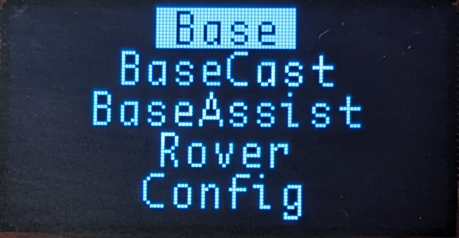

# Configure From Display

<!--
Compatibility Icons
====================================================================================

:material-radiobox-marked:{ .support-full title="Feature Supported" }
:material-radiobox-indeterminate-variant:{ .support-partial title="Feature Partially Supported" }
:material-radiobox-blank:{ .support-none title="Feature Not Supported" }
-->

- EVK: :material-radiobox-marked:{ .support-full title="Feature Supported" }
- Facet mosaic: :material-radiobox-marked:{ .support-full title="Feature Supported" }
- Postcard: :material-radiobox-marked:{ .support-full title="Feature Supported" }
- Torch: :material-radiobox-blank:{ .support-none title="Feature Not Supported" }
- TX2: :material-radiobox-blank:{ .support-none title="Feature Not Supported" }

<figure markdown>

<figcaption markdown>
Configuration from the Display
</figcaption>
</figure>

On devices that have an external display, pressing buttons can navigate through a limited set of menus and options.

## RTK EVK

<figure markdown>

<figcaption markdown>
Front face of the RTK EVK
</figcaption>
</figure>

The RTK EVK has a 1.3" OLED with a MODE button and a recessed RESET button. Pressing the button will display the configuration menu. Single-tapping the button will advance the menu. Double-tapping the button will select the highlighted item. If there is no button press for 2 seconds, the menu will exit. Pressing the reset button will immediately reset the system.

## RTK Facet mosaic

<figure markdown>

<figcaption markdown>
Front face of the RTK Facet mosaic
</figcaption>
</figure>

The RTK Facet mosaic has a 0.93" OLED with a single POWER/SETUP button. Pressing the button will display the configuration menu. Single-tapping the button will advance the menu. Double-tapping the button will select the highlighted item. If there is no button press for 2 seconds, the menu will exit.

## RTK Postcard

<figure markdown>

<figcaption markdown>
Portability shield shown mounted to the RTK Postcard
</figcaption>
</figure>

The RTK Postcard comes without a display. If a user elects to add the [Portability Shield](https://www.sparkfun.com/sparkfun-portability-shield.html), a 1.3" OLED and 5-way joystick are enabled as shown above. A  [Navigation Switch Cover](https://www.sparkfun.com/sparkfun-navigation-switch-cover-set.html) is also shown. Any press of the joystick will open the menu. Pressing down or right will move forward a menu item. Pressing up or left will move back a menu item. Pressing in the middle of the joystick will select. If there is no button press for 2 seconds, the menu will exit.
