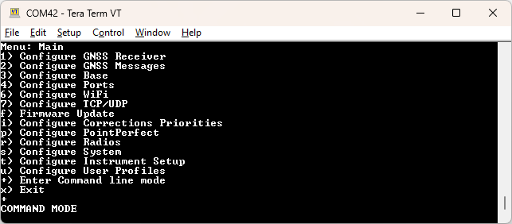

# Configure with CLI

<!--
Compatibility Icons
====================================================================================

:material-radiobox-marked:{ .support-full title="Feature Supported" }
:material-radiobox-indeterminate-variant:{ .support-partial title="Feature Partially Supported" }
:material-radiobox-blank:{ .support-none title="Feature Not Supported" }
-->

- EVK: :material-radiobox-marked:{ .support-full title="Feature Supported" }
- Facet mosaic: :material-radiobox-marked:{ .support-full title="Feature Supported" }
- Postcard: :material-radiobox-marked:{ .support-full title="Feature Supported" }
- Torch: :material-radiobox-marked:{ .support-full title="Feature Supported" }
- TX2: :material-radiobox-marked:{ .support-full title="Feature Supported" }

<figure markdown>

<figcaption markdown>
Entering Command line mode
</figcaption>
</figure>

For advanced applications, the RTK device can be queried and configured using a command line interface (CLI). This mode can be entered from the main serial menu using '**+**' or over Bluetooth by sending 10 dashes ('**----------**'). To exit CLI, type `exit` or use the `$SPEXE,EXIT*77` command.

The commands and their responses are implemented as an extension to the standard NMEA format. This allows the use of the same parser to parse NMEA sentences and the SparkFun commands/replies.

Each command or response sentence begins with the talker id $SP.

The commands end with a * followed by a two hex character checksum, and then a <CR><LF> line terminator. The checksum is in accordance with the NMEA-0183 standard.

## Checking For an Active Command Interface

The client can check whether the command interface is active by sending the following command.

	$SPCMD*49<CR><LF>

If the command interface is active, the receiver will respond with the following within 2 seconds.

	$SPCMD,OK*61<CR><LF>

If the expected response is not received, the client may attempt to send the escape sequence again to enter the command interface.

## Getting Configuration Values

To get a setting value, the client sends the following.

	$SPGET,[setting name]*FF<CR><LF>

The receiver responds with

	$SPGET,[setting name],[setting value]*FF<CR><LF>

If there was an error in getting the setting value, such as the setting name being unavailable, the receiver responds with the following error message.

	$SPGET,[setting name],,ERROR,[Verbose error description]*FF<CR><LF>

!!! example
	For example, to get the elevation mask:

	Send:

		$SPGET,elvMask*32<CR><LF>

	Receive:

		$SPGET,elvMask,15*1A<CR><LF>

If a setting is a string, the setting will be surrounded in quotes. Any internal quotes will be escaped.

## Getting Changed Settings

To retrieve only CLI settings that differ from their factory defaults, send:

	$SPGET,changedSettings*36<CR><LF>

The receiver first sends device metadata (`deviceName`, `bluetoothId`, `deviceId`, `profileNumber`,
`espFirmwareVersion`, and `gnssModuleInfo`; `tiltState` is included on tilt-capable platforms). It then sends one
`$SPLST,[setting name],[setting type],[setting value]` response for each changed setting, followed by:

	$SPGET,changedSettings,[number of changed settings],OK*FF<CR><LF>

The checksum in each response is calculated by the receiver. This query is intended for clients that already know the device model and setting definitions.

For direct serial testing, enter `changed` to list the changed settings without NMEA command framing.

## Getting Tilt State

To get the current tilt sensor state, send:

	$SPGET,tiltState*FF<CR><LF>

The receiver returns the numeric `TiltState` enum value. The response does not include the IM19 navigation-status bitfield.

## Changing Modes

To switch the device between Rover, Base, and the other modes without a reset, send:

	$SPSET,setState,[mode]*FF<CR><LF>

| Mode | Value |
|------|-------|
| Rover | 0 |
| Base | 1 |
| NTP Server (devices with Ethernet only) | 2 |
| Base Caster | 3 |
| Base Assist (fixed base at the current position) | 4 |

The device starts the new mode right away and uses it again at the next power on. An unknown mode, or NTP on a device without Ethernet, returns an error.

!!! example
	Switch to Base mode:

	Send:

		$SPSET,setState,1*45<CR><LF>

	Receive:

		$SPSET,setState,1,OK*6D<CR><LF>

	An unsupported mode:

	Send:

		$SPSET,setState,9*4D<CR><LF>

	Receive:

		$SPSET,setState,,ERROR,Unknown or unsupported state*5B<CR><LF>

To read the current mode, send `$SPGET,setState*4C`. The receiver returns one of the values above, or -1 while in another mode (for example, Web Config or ESP-NOW pairing). For example, `$SPGET,setState,1*51` means Base. Base Assist is reported as 4 only briefly, and then as Base once the fixed base starts.

!!! note
	The `lastState` setting also selects Rover, Base, NTP, or Base Caster, but only takes effect after a reset. It is deprecated for changing modes; use `setState` instead.

Send:

	$SPGET,ntripClientCasterUserPW*35

Receive:

	$SPGET,ntripClientCasterUserPW,"pwWith\"quote"*38

Setting the Configuration Values

To set a configuration value, the client sends the following.

	$SPSET,[setting name],[new value]*FF<CR><LF>

The receiver responds with

	$SPSET,[setting name],[new value],OK*FF<CR><LF>

If there was an error in setting the value, such as the setting name being unknown, the receiver responds with the following error message. The previous value is optional and will be blank in case the setting name is not found.

	$SPSET,[setting name],[optional: current value],ERROR,[Verbose error description]*FF<CR><LF>

!!! example
	For example, to set the elevation mask:

	Send:

		$SPSET,elvMask,15*0E<CR><LF>

	Receive:

		$SPSET,elvMask,15,OK*26<CR><LF>

Using the $SPSET command only sets the configuration value in the firmware memory. The settings are not applied until an APPLY action is executed.

Settings containing strings must be surrounded by quotes:

Send:

	$SPSET,ntripClientCasterUserPW,"MyPass"*08

Receive:

	$SPSET,ntripClientCasterUserPW,"MyPass",OK*20

Below, quotes are allowed within the string but must be escaped. Response will also be escaped, but the device will store the setting with escape characters removed:

Send:

	$SPSET,ntripClientCasterUserPW,"pwWith\"quote"*2C

Receive:

	$SPSET,ntripClientCasterUserPW,"pwWith\"quote",OK*04

*ntripClientCasterUserPW* will be set to: `pwWith"quote`

Below, commas are allowed within the string but must be between two quotes:

Send:

	$SPSET,ntripClientCasterUserPW,"complex,password"*5E

Receive:

	$SPSET,ntripClientCasterUserPW,"complex,password",OK*76

*ntripClientCasterUserPW* will be set to: `complex,password`

Below is a combination of an internal escaped quote, and comma within a setting:

Send:

	$SPSET,ntripClientCasterUserPW,"a55G\"e,e#"*5A

Receive:

	$SPSET,ntripClientCasterUserPW,"a55G\"e,e#",OK*72

*ntripClientCasterUserPW* set to: `a55G"e,e#`

## Local Firmware Update

A phone app can update the device's subsystems (ESP32, GNSS, LoRa, IMU) without the device having internet access. The app downloads the firmware files, the device starts a Wi-Fi access point for the phone to join, and the device then downloads the files from a small HTTP server run by the app. Any version can be installed, older or newer than the current one.

### 1. Read the current versions

	$SPGET,subsystemVersions*31<CR><LF>

The device replies with `subsystem:chip:version` for each subsystem it has, separated by semicolons:

	$SPGET,subsystemVersions,"ESP32:ESP32:3.1.0.0;GNSS:LG290P:2.1.0.0;LoRa:LoRa-STM32WL:1.2.0.0"*25<CR><LF>

A debug build adds `-rc` to the version, and `unknown` means the chip did not report a version. Use the chip name to pick the firmware file.

### 2. Start the access point

	$SPEXE,UPDATEAP*77<CR><LF>

The device creates a WPA2 access point with a new SSID and password for this session, and replies with both:

	$SPEXE,UPDATEAP,"RTK Update B4E706-9F3A","q7Hk2mPz8xLw4RtN",OK*36<CR><LF>

Sending `UPDATEAP` again returns the same SSID and password. Only one device (the phone) can join. The request is refused with `Soft AP in use` while another feature has an access point running (Web Config, the TCP or UDP server over the access point, or Base Caster mode); switch to Rover first.

### 3. Wait for the access point, then join it

Poll the status until it reports `AP_READY`, then join the network from the phone:

	$SPGET,updateStatus*5C<CR><LF>
	$SPGET,updateStatus,"AP_READY,,0,"*69<CR><LF>

The status is `state,subsystem,percent,message`:

| State | Meaning |
|-------|---------|
| IDLE | No update access point. The message says why it stopped (`Canceled`, `Timed out`, ...) |
| AP_STARTING | The access point is starting |
| AP_READY | Ready for `UPDATEFILE` and `UPDATESTART` |
| UPDATING | Downloading and programming `subsystem`, `percent` complete |
| FAILED | The update of `subsystem` failed. The access point is still running, so the app can retry with `UPDATESTART` or send `UPDATECANCEL` |
| COMPLETE | Every file was programmed. The device reboots a moment later |

### 4. Queue the files

Serve each file over HTTP from the phone, then send one command per subsystem:

	$SPEXE,UPDATEFILE,[subsystem],[chip],[url],[file bytes],[CRC32]*FF<CR><LF>

!!! example
	Send:

		$SPEXE,UPDATEFILE,GNSS,LG290P,http://192.168.4.2:8080/LG290P.pkg,6291456,0x1A2B3C4D*7E<CR><LF>

	Receive:

		$SPEXE,UPDATEFILE,OK*48<CR><LF>

* **subsystem** and **chip** must match `subsystemVersions`. A mismatched chip is refused, for example `$SPEXE,UPDATEFILE,ERROR,Device has LG290P*1A`.
* **url** must be `http://` and use the phone's address on the device's access point.
* **file bytes** and **CRC32** (the CRC-32 of the whole file, in decimal or `0x` hex) are checked during the download. Both are listed in the firmware manifest in the binaries repository.

Files stay queued until the update finishes or is canceled; sending a subsystem again replaces its file.

### 5. Start the update

	$SPEXE,UPDATESTART*26<CR><LF>
	$SPEXE,UPDATESTART,OK*0E<CR><LF>

The phone must be connected to the access point. Keep polling `updateStatus`:

	$SPGET,updateStatus,"UPDATING,GNSS,47,"*42<CR><LF>

The ESP32 is always programmed last. When every file succeeds, the status shows `COMPLETE` and the device reboots, which drops the Bluetooth connection. Reconnect and check `subsystemVersions`. If a file fails, the status shows `FAILED` with the subsystem:

	$SPGET,updateStatus,"FAILED,GNSS,12,Update failed"*47<CR><LF>

### Canceling

	$SPEXE,UPDATECANCEL*60<CR><LF>

This stops the access point and forgets the queued files. It is refused while an update is running. The access point also stops on its own after 5 minutes without any of these commands.

## Receiver Actions

The $SPEXE command can be used to execute various actions on the receiver.

	$SPEXE,[action name]*FF<CR><LF>

The receiver responds with the following.

	$SPEXE,[action name],OK*FF<CR><LF>

The response is sent before carrying out the action if it involves a reboot or exit. It is sent after carrying out the action if the receiver will remain in command mode.

If the receiver is unable to carry out the action, the following error message is returned.

	$SPEXE,[action name],ERROR*FF<CR><LF>

The following actions shall be implemented.

- **`APPLY`**: applies the currently stored settings, rebooting if necessary.
- **`SAVE`**: Saves current settings to NVM
- **`EXIT`**: Exits the command interface
- **`REBOOT`**: Restarts the receiver firmware without applying settings.
- **`LIST`**: List all firmware configuration fields.

## LIST Action

Executing the list action will return a list of the configuration values.

Send:

	$SPEXE,LIST*75<CR><LF>

The response is in the form of multiple $SPLST sentences, followed by an acknowledgement of the $SPEXE command.

The $SPLST sentences shall have the following structure:

	$SPLST,[setting name],[data type],[current value]*FF<CR><LF>

The data type contains whether the field is a char[n], int, bool, or float.

!!! example
	Example response:

		$SPLST,enableSD,bool,true*6A<CR><LF>
		$SPLST,enableDisplay,bool,true*27<CR><LF>
		$SPLST,maxLogTime_minutes,int,1*01<CR><LF>
		$SPLST,maxLogLength_minutes,int,10*38<CR><LF>
		$SPLST,observationSeconds,int,10*37<CR><LF>
		$SPLST,observationPositionAccuracy,float,0.5*59<CR><LF>
		.
		.
		.
		$SPEXE,LIST,OK*5D<CR><LF>
