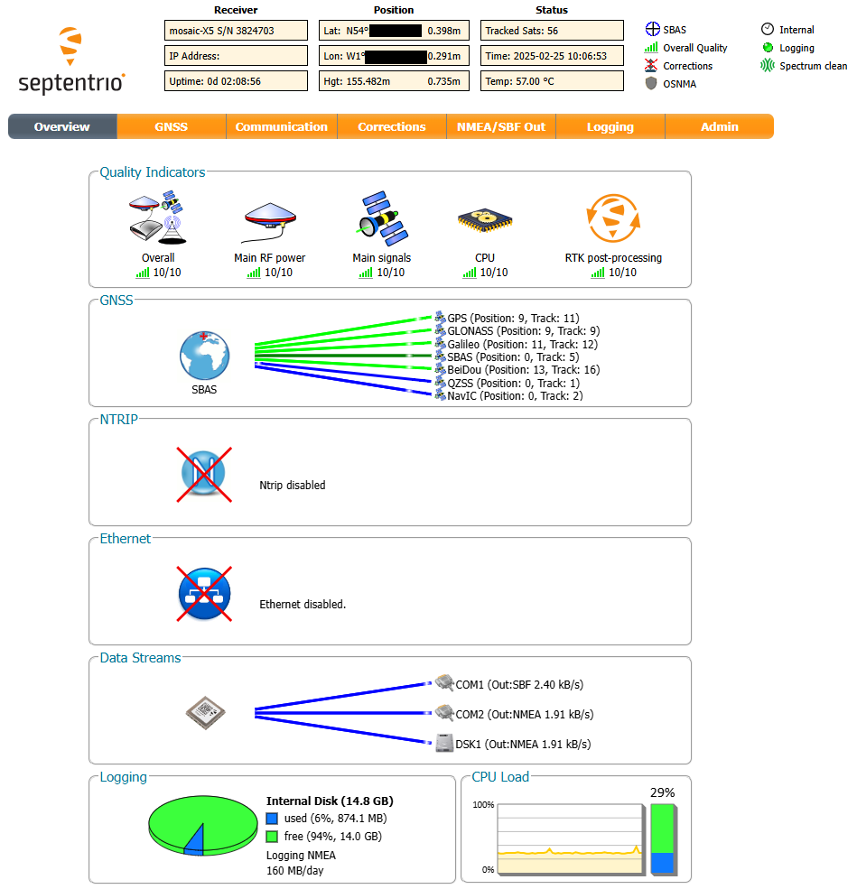
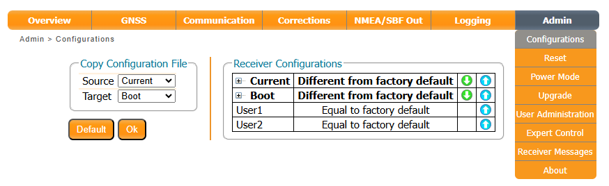
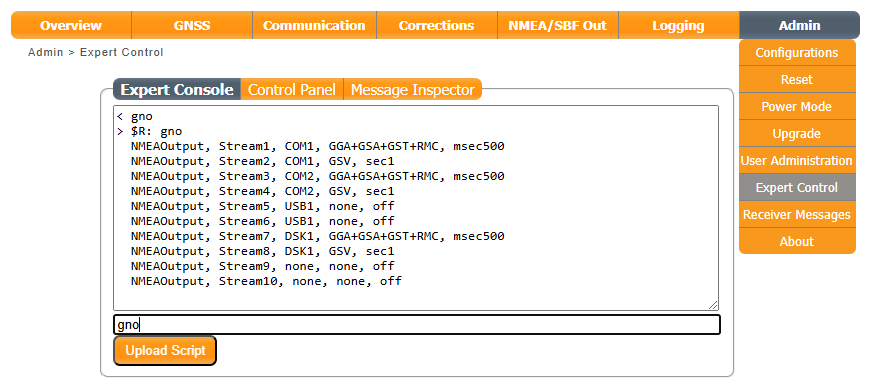
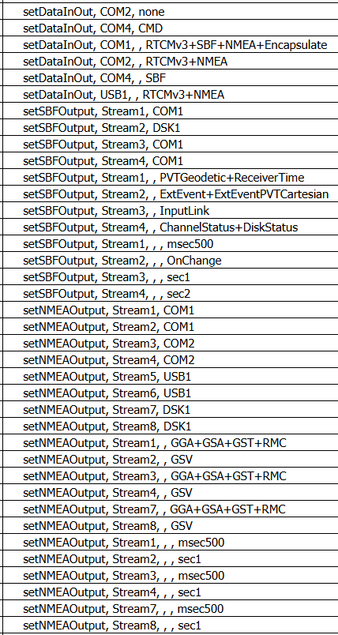
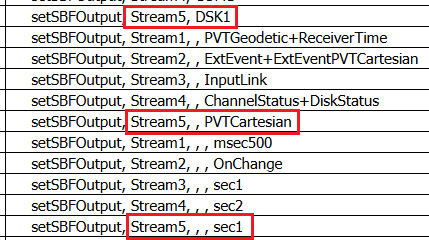

# Configure with Ethernet Over USB

<!--
Compatibility Icons
====================================================================================

:material-radiobox-marked:{ .support-full title="Feature Supported" }
:material-radiobox-indeterminate-variant:{ .support-partial title="Feature Partially Supported" }
:material-radiobox-blank:{ .support-none title="Feature Not Supported" }
-->

<div class="grid cards fill" markdown>

- EVK: :material-radiobox-blank:{ .support-none title="Feature Not Supported" }
- Facet mosaic: :material-radiobox-marked:{ .support-full title="Feature Supported" }
- Postcard: :material-radiobox-blank:{ .support-none title="Feature Not Supported" }
- Torch: :material-radiobox-blank:{ .support-none title="Feature Not Supported" }

</div>

On the RTK Facet mosaic, it is possible to configure the mosaic-X5 GNSS module using Ethernet-over-USB and the X5's internal web page.

However, because the ESP32 does considerable configuration of the mosaic-X5 and the _Boot_ and _Current_ receiver configurations at power on, you need to use a little care when modifying the settings of the X5 using the internal web page. Nothing will break, but your changes could be overwritten at the next power cycle or if you [Factory Reset](./menu_system.md#factory-reset) the settings.

Download and install [Septentrio's RxTools](https://www.septentrio.com/en/products/gps-gnss-receiver-software/rxtools) before continuing. This will also install the USB drivers needed to communicate with the mosaic-X5 using Ethernet-over-USB.

Connect the RTK Facet mosaic to your computer using a USB-C cable. Power on the RTK and wait a few seconds for the mosaic-X5 to boot up. The OLED display will show the Satellites In View count and Horizontal Accuracy once the mosaic-X5 is running. Open a web browser and navigate to **192.168.3.1**. You should see the mosaic-X5's internal web page.

<figure markdown>

<figcaption markdown>
The mosaic-X5 internal web page
</figcaption>
</figure>

## RTK Facet mosaic Essentials

You can do **SO** much with the mosaic-X5's internal web page that it is difficult to know where to begin. In this section we summarise the essentials: how the mosaic-X5 is interfaced; how it is configured by the ESP32 processor and the RTK Everywhere firmware; and how it is possible to change and save that configuration using the internal web page.

The mosaic-X5's internal web page is (probably) the easiest way to view and change the X5's configuration. But it is far from the only way. The configuration can also be changed using [Sepentrio's RxTools](./configure_with_rxtools.md). Or, if you study the [mosaic-X5 Firmware Reference Guide](https://docs.sparkfun.com/SparkFun_RTK_Facet_mosaic/assets/component_documentation/mosaic-X5%20Firmware%20v4.14.0%20Reference%20Guide.pdf), you can also do all of the following manually by entering Commands over any COM (Serial) port.

### mosaic-X5 Interfaces

The following is a summary of the mosaic-X5's interfaces and how they can be accessed on the RTK Facet mosaic:

- **Ethernet-over-USB:**
    - If you have followed the instructions above, the X5's internal web page can be viewed at **192.168.3.1**. This address is fixed and cannot be changed. If any of your computer's other interfaces (WiFi, Ethernet) also use the 192.168.3.nnn subnet, you will run into conflicts. You will need to change the configuration of the other device to use a different subnet.
- **USB COM (Serial) Ports:**
    - When connected via USB, two additional COM ports will appear. Internally to the X5, these are named _USB1_ and _USB2_. RxTools can connect directly to these ports. Or, if you wish, you can open a serial console / terminal emulator and enter commands directly. We recommend using _USB2_ since _USB1_ may have been [configured for GNSS Output](./menu_ports.md#output-gnss-data-over-usb).
- **RADIO Port**:
    - The RTK Facet mosaic RADIO port is connected directly to the mosaic-X5 **COM2** serial / UART port. Normally this port carries NMEA and/or RTCM data to/from an external radio module. But, if you wish, you can enter commands direct to this port too. The baud rate can be changed through the menu; the default baud rate is **57600** (8 data bits, no parity, 1 stop bit).
- **DATA Port:**
    - The RTK Facet mosaic DATA port is connected to the mosaic-X5 **COM3** serial / UART port via a hardware multiplexer. Please see [Ports Menu](./menu_ports.md) for more details, and the section on the [Mux Channel](./menu_ports.md#mux-channel) in particular. Set the multiplexer to **GNSS TX Out/RX In** to connect X5 COM3 to the **DATA** port. The baud rate can be changed through the menu; the default baud rate is **230400** (8 data bits, no parity, 1 stop bit). Commands can be entered over this port too.
- **ESP32 and RTK Everywhere Firmware:**
    - The ESP32 processor is connected to the mosaic-X5 **COM1** and **COM4** serial / UART ports. Configuration is performed over COM4. COM1 is used to: provide RTCM correction data _to_ the X5 in Rover mode; carry NMEA and / or RTCM data _from_ the X5 in Base mode. If you have a mobile phone connected to the RTK Facet mosaic over Bluetooth, corrections received over Bluetooth are pushed to the X5 on COM1. If the ESP32 is connected directly to WiFi, TCP (NTRIP) corrections received over WiFi are also pushed over COM1. COM1 also carries the raw L-Band correction stream from the X5, when the X5 is configured to use u-blox L-Band PointPerfect corrections (only available in the contiguous USA).

### mosaic-X5 microSD

If you are familiar with the other SparkFun RTK products, you will know that most provide data storage on microSD card. On the RTK Facet mosaic, the microSD card is connected directly to the mosaic-X5. It is not connected to the ESP32 processor. This provides many advantages and some disadvantages.

The mosaic-X5 can be configured to log NMEA messages direct to SD card. It also supports data logging in RINEX format, opening a new log file every 15 mins / 1 hour / 6 hours / 24 hours automatically if desired.

Because the SD card is connected directly to the mosaic-X5 using SDIO, the X5 is able to log data at much higher rates than our other RTK products. The data does not need to be passed to the ESP32 via UART for logging via SPI.

But, because the SD card is connected directly to the mosaic-X5, it cannot be read easily by the ESP32 and so can not be used for RTK Everywhere ESP32 firmware updates.

The RTK Everywhere Firmware [Data Logging Menu](./menu_data_logging.md#rtk-facet-mosaic) can be used to enable logging to microSD. The NMEA messages to be logged are defined via the [Configure GNSS Messages](./menu_messages.md#rtk-facet-mosaic) menu. RINEX data can be logged too for PPP. Additionally, the mosaic-X5 supports a huge list of SBF binary-format "blocks". It is not possible to select SBF blocks for logging through the RTK Everywhere Firmware, but you can do it manually. We have provided details [below](#custom-configuration).

The mosaic-X5 SD card must be mounted for data logging. But it can also be unmounted, causing it to appear as a mass-storage device ("thumb drive"). Files can be downloaded or uploaded very quickly over the USB interface. The RTK Everywhere Firmware does not currently support mounting / unmounting, but it is [something we will add](https://github.com/sparkfun/SparkFun_RTK_Everywhere_Firmware/issues/559) in the near future. However, you can unmount the SD card manually. We have described how to do this [below](#accessing-the-sd-card-as-mass-storage).

### Receiver Configuration

The mosaic-X5 supports five Receiver Configurations:

- _RxDefault_
- _Boot_
- _Current_
- _User1_
- _User2_

_RxDefault_ is read-only. During a [Factory Reset](./menu_system.md#factory-reset), _RxDefault_ is copied into both _Current_ and _Boot_.

_Boot_ contains the configuration which is loaded when the mosaic-X5 boots up. The RTK Everywhere Firmware modifies the _Boot_ configuration to (e.g.): change the COM port settings; enable a stream of NMEA and RTCM messages.

_Current_ is the current configuration. Commands can be used to alter the current configuration. _Current_ can be copied to _Boot_ if desired. During a [Factory Reset](./menu_system.md#factory-reset) the RTK Everywhere Firmware: copies _RxDefault_ into both _Current_ and _Boot_; makes changes to _Current_; and then copies _Current_ to _Boot_.

If you want to save the X5 configuration after you have changed it, we recommend using either of the _User1_ or _User2_ Receiver Configurations. The RTK Everywhere firmware will modify the _Current_ and _Boot_ Receiver Configurations, but it leaves _User1_ and _User2_ for your use. Copy the _Current_ configuration into (e.g.) _User1_ to save the modified configuration. You can restore it later by copying _User1_ into _Current_.

The _Admin / Configurations_ tab can be used to view and copy the receiver configurations:

<figure markdown>

<figcaption markdown>
The mosaic-X5 configurations web page
</figcaption>
</figure>

Clicking on the small **+** icon next to **Current** will show how the current configuration differs from the RxDefault.

### Expert Control

The _Admin / Expert Control / Expert Console_ option can be very useful when modifying the mosaic-X5 configuration. It provides full access to configuration and makes it possible to use script files.

<figure markdown>

<figcaption markdown>
The mosaic-X5 configurations web page - Expert Console
</figcaption>
</figure>

_Expert Control_ is so powerful, you may wish to use the _Admin / User Administration_ settings to limit access to the X5's configuration. But be careful that you do not prevent the firmware on the ESP32 from accessing the COM ports!

### Streams

On the mosaic-X5, NMEA and SBF binary messages need to be allocated to _Streams_. Each stream can then be directed to one or more "Connector Descriptors (Cd)". Connector descriptors include: COM1-4 (the UART ports), USB1-2 (additional COM ports on USB), DSK1 (the "internal disk"  which is the SD card), etc..

Each stream has one fixed interval. So, to output NMEA messages at two different rates, two streams are required. This is why [Menu Messages](./menu_messages.md#rtk-facet-mosaic-nmea-messages) is arranged the way it is.

<figure markdown>

<figcaption markdown>
The mosaic-X5 configurations web page - Current Configuration
</figcaption>
</figure>

The RTK Everywhere firmware uses the following streams:

- NMEA Streams:
    - 1: COM1 (ESP32)
    - 2: COM1 (ESP32)
    - 3: COM2 (RADIO port)
    - 4: COM2 (RADIO port)
    - 5: USB1 (USB COM)
    - 6: USB1 (USB COM)
    - 7: DSK1 (SD card)
    - 8: DSK1 (SD card)
- By default:
    - NMEA GGA + GSA + GST + RMC are output on Streams 1,3,5,7 with an interval of 500ms
    - NMEA GSV is output on Streams 2,4,6,8 with an interval of 1s

NMEA Streams 9 & 10 are available for your own use. You could use them to log or output additional NMEA messages at alternate rates.

- SBF Streams:
    - 1: COM1 (ESP32) - PVTGeodetic (position) + ReceiverTime (time) with an interval of 500ms
    - 2: DSK1 (SD card) - EXTEvent + ExtEventPVTCartesian (external events / triggers) on change
    - 3: COM1 (ESP32) - InputLink (incoming RTCM byte count) with an interval of 1s
    - 4: COM1 (ESP32) - ChannelStatus (SIV) + DiskStatus (SD free space) with an interval of 2s

SBF Streams 5-10 are available for your own use. You could use them to log or output additional SBF blocks at any desired rate.

RxTools can read and analyse SBF log files, and convert the data into other formats.

### Custom Configuration

The RTK Everywhere Firmware does not currently provide a way of configuring (e.g.) the logging of additional SBF binary blocks. There are just so many, managing the menu choices alone would be quite a task.

However, it is straightforward to define your own SBF Stream and point it at DSK1 for logging.

The abbreviated steps are:

- Select the _Logging_ tab
- In the _General_ window, select "New SBF stream"
- Select the interval (e.g. 1 sec)
- Click the "Detailed selection" button to reveal the vast list of SBF blocks
- Select (e.g.) PVTCart / PVTCartesian
- Click OK
- Click OK again to apply the changes

The PVTCartesian SBF block will now be logged to DSK1 (SD card) with an interval of 1 second. The firmware automatically selects SBF Stream 5, knowing it to be free.

<figure markdown>

<figcaption markdown>
The mosaic-X5 configurations web page - Custom Configuration
</figcaption>
</figure>

To save this new configuration:

- Select the _Admin / Configurations_ tab
- In the _Copy Configuration File_ window:
    - Select _Current_ as the Source
    - Select _User1_ as the Target
- Click OK to apply the changes

To 'load' or 'restore' your modified configuration later, copy _User1_ into _Current_.

<figure markdown>

<figcaption markdown>
The mosaic-X5 configurations web page
</figcaption>
</figure>

If you are confident that the configuration meets your needs, you can copy _Current_ into _Boot_ so that your modified configuration is loaded at power-on.

Please note that a [Factory Reset](./menu_system.md#factory-reset) will overwrite the _Boot_ configuration with the RTK Everywhere Firmware defaults. If you saved your configuration in _User1_ or _User2_, you can restore it from there later.

Please also note that changing from Rover Mode to Base Mode, or vice versa, will make small changes to the GNSS configuration too - predominantly the number of RTCM messages generated. You may notice issues if you save the configuration in Rover mode, and later restore it while in Base mode.

RxTools can read and analyse SBF log files, and convert the data into other formats.

### Geodetic Datums

The mosaic-X5 supports multiple Geodetic Datums, including:

- WGS84
- ETRS89
- NAD83
- NAD83_PA
- NAD83_MA
- GDA94
- GDA2020
- User1 and User2

If you need to take measurements using datums other than WGS84, consider saving your modified configuration in _User1_ or _User2_, as described [above](#custom-configuration).

### Accessing the SD Card as Mass-Storage

As described [above](#mosaic-x5-microsd), the RTK Facet mosaic SD card is connected directly to the mosaic-X5. The SD card needs to be "mounted" to allow the X5 to log data to it. When "unmounted", the SD card is accessible as a mass-storage device ("thumb drive"). The RTK Everywhere Firmware does not yet support unmounting the SD card. But you can do this manually if desired:

- Connect via USB
- Facet mosaic is in Rover mode and logging NMEA to DSK1 by default
- Open a web browser, navigate to 192.168.3.1
- Select the _Logging_ tab
- Note NMEA is being logged at about 140MB/day
- Click _Unmount_ and confirm with _Unmount_
- Note that the Internal Disk is not mounted and logging has stopped
- On the OLED, the logging icon disappears. The pulse circle is displayed instead
- The SD card pops up as mass-storage on USB. You can now transfer and delete files
- Click _Mount_
- Wait a few seconds
- Logging resumes and the logging icon reappears on the OLED

The X5 is so clever, you don't even need to pause the DSK1 logging. It just figures it out itself, and resumes logging again when DSK1 is remounted.

You can also do it with commands:

- Open _Admin / Expert Control_
- In the _Expert Console_, enter ```emd,DSK1,Unmount```
- Go back to the _Overview_ tab, note that the Internal Disk is not mounted
- On the OLED, the logging icon disappears. The pulse circle is displayed
- The SD card pops up as mass-storage on USB. You can now transfer and delete files
- Return to the _Expert Console_, enter ```emd,DSK1,Mount```
- Wait a few seconds
- Logging resumes and the logging icon reappears on the OLED

