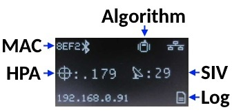
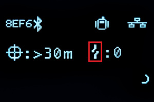

# Displays

<!--
Compatibility Icons
====================================================================================

:material-radiobox-marked:{ .support-full title="Feature Supported" }
:material-radiobox-indeterminate-variant:{ .support-partial title="Feature Partially Supported" }
:material-radiobox-blank:{ .support-none title="Feature Not Supported" }
-->

- EVK: :material-radiobox-marked:{ .support-full title="Feature Supported" }
- Facet mosaic: :material-radiobox-marked:{ .support-full title="Feature Supported" }
- Postcard: :material-radiobox-marked:{ .support-full title="Feature Supported" }
- Torch: :material-radiobox-blank:{ .support-none title="Feature Not Supported" }

A variety of RTK devices utilize a 0.96" or 1.3" high-contrast OLED display. While small, the display packs various situational data that can be helpful in the field. This section describes each possible display state.

<figure markdown>

<figcaption markdown>
Rover mode on the RTK EVK's 1.3" OLED display
</figcaption>
</figure>

## Power On/Off

<figure markdown>

<figcaption markdown>
RTK Facet Startup and Shutdown Screens
</figcaption>
</figure>

Press and hold the power button until the display illuminates to turn on the device. Similarly, press and hold the power button to turn off the device.

The device's firmware version is shown during the Power On display.

### Force Power Off

In the event that a device becomes unresponsive, the device can be completely powered off by holding the power button for 10 seconds or more. The force-power-off method is hardware-based and will therefore work regardless of what firmware the device may be running.

<figure markdown>

<figcaption markdown>
</figcaption>
</figure>

If the power state of a device is not known (for example, because a display may be malfunctioning) the device can be connected to USB. If one or more COM ports enumerate, the device is on (shown above). If no COM ports are seen, the device is fully powered off.

## Rover Fix

<figure markdown>

<figcaption markdown>
Rover with location fix
</figcaption>
</figure>

<figure markdown>

<figcaption markdown>
RTK EVK with location fix and Ethernet connected
</figcaption>
</figure>

Upon power up the device will enter either Rover mode or Base mode. Above, the Rover mode is displayed.

- **MAC:** The MAC address of the internal Bluetooth module. This is helpful knowledge when attempting to connect to the device from your phone. This will change to a Bluetooth symbol once connected.
- **HPA:** Horizontal positional accuracy is an estimate of how accurate the current positional readings are. This number will decrease rapidly after the first power-up and settle around 0.3m depending on your antenna and view of the sky. When RTK fix is achieved this icon will change to a double circle and the HPA number will decrease even further to as low as 0.014m.
- **SIV:** Satellites in view is the number of satellites used for the fix calculation. This symbol will blink before a location fix is generated and become solid when the device has a good location fix. SIV is a good indicator of how good of a view the antenna has. This number will vary but anything above 10 is adequate. We've seen as high as 31.
- **Model:** This icon will change depending on the selected dynamic model: Portable (default) Pedestrian, Sea, Bike, Stationary, etc.
- **Log:** This icon will remain animated while the log file is increasing. This is a good visual indication that you have an SD card inserted and RTK Facet can successfully record to it. There are three logging icons 
	- Standard (three lines) is shown when the standard 5 NMEA messages are being logged
	- PPP (capital P) is shown when the standard 5 NMEA + RAWX and SFRBX messages are recorded. This is most often used for post process positioning (PPP) and 12 to 24-hour logs for [fixed permanent bases](permanent_base.md).
	- Custom (capital C) is shown when a custom set of messages are being recorded (not standard, and not PPP).
- **IP Address:** On the RTK EVK 1.3" OLED, the full Ethernet or WiFi IP Address is shown at the bottom left of the display.

## Rover RTK Fix

<figure markdown>

<figcaption markdown>
Rover with RTK Fix and Bluetooth connected
</figcaption>
</figure>

<figure markdown>

<figcaption markdown>
RTK EVK with RTK Fix and Ethernet connected
</figcaption>
</figure>

Once NTRIP is enabled on your phone or RTCM data is being streamed into the **Radio** port the device will gain an RTK Fix. You should see the HPA drop to 14mm with a double circle bulls-eye as shown above.

## Base Survey-In

<figure markdown>

<figcaption markdown>
RTK device in Survey-In Mode
</figcaption>
</figure>

Pressing the Setup button will change the device to Base mode. If the device is configured for *Survey-In* base mode, a flag icon will be shown and the survey will begin. The mean standard deviation will be shown as well as the time elapsed. For most Survey-In setups, the survey will complete when both 60 seconds have elapsed *and* a mean of 5m or less is obtained.

## Base Transmitting

<figure markdown>

<figcaption markdown>
RTK Facet in Fixed Transmit Mode
</figcaption>
</figure>

Once the *survey-in* is complete the device enters RTCM Transmit mode. The number of RTCM transmissions is displayed. By default, this is one per second.

The *Fixed Base* mode is similar but uses a structure icon (shown above) to indicate a fixed base.

## Base Transmitting NTRIP

If the NTRIP server is enabled the device will first attempt to connect over WiFi. The WiFi icon will blink until a WiFi connection is obtained. If the WiFi icon continually blinks be sure to check your SSID and PW for the local WiFi.

<figure markdown>

<figcaption markdown>
RTK Facet in Transmit Mode with NTRIP
</figcaption>
</figure>

Once WiFi connects the device will attempt to connect to the NTRIP mount point. Once successful the display will show 'Casting' along with a solid WiFi icon. The number of successful RTCM transmissions will increase every second.

!!! note
	During NTRIP transmission WiFi is turned on and Bluetooth is turned off. You should not need to know the location information of the base so Bluetooth should not be needed. If necessary, USB can be connected to the USB port to view detailed location and ZED-F9P configuration information.

## L-Band

<!--
Compatibility Icons
====================================================================================

:material-radiobox-marked:{ .support-full title="Feature Supported" }
:material-radiobox-indeterminate-variant:{ .support-partial title="Feature Partially Supported" }
:material-radiobox-blank:{ .support-none title="Feature Not Supported" }
-->

- EVK: :material-radiobox-marked:{ .support-full title="Feature Supported" }
- Facet mosaic: :material-radiobox-marked:{ .support-full title="Feature Supported" }
- Postcard: :material-radiobox-blank:{ .support-none title="Feature Not Supported" }
- Torch: :material-radiobox-blank:{ .support-none title="Feature Not Supported" }

L-Band decryption keys are valid for a maximum of 56 days. During that time, the RTK Facet L-Band can operate normally without the need for WiFi access. However, when the keys are set to expire in 28 days or less, the RTK Facet L-Band will attempt to log in to the 'Home' WiFi at each power on. If WiFi is not available, it will continue normal operation.

<figure markdown>

<figcaption markdown>
Display showing 14 days until L-Band Keys Expire
</figcaption>
</figure>

The unit will display various messages to aid the user in obtaining keys as needed.

<figure markdown>

<figcaption markdown>
Three-pronged satellite dish indicating L-Band reception
</figcaption>
</figure>

<figure markdown>

<figcaption markdown>
Three-pronged satellite dish indicating L-Band reception on RTK EVK
</figcaption>
</figure>

Upon successful reception and decryption of L-Band corrections, the satellite dish icon will increase to a three-pronged icon. As the unit's fix increases the cross-hair will indicate a basic 3D solution, a double blinking cross-hair will indicate a floating RTK solution, and a solid double cross-hair will indicate a fixed RTK solution.

## Antenna Detection

<!--
Compatibility Icons
====================================================================================

:material-radiobox-marked:{ .support-full title="Feature Supported" }
:material-radiobox-indeterminate-variant:{ .support-partial title="Feature Partially Supported" }
:material-radiobox-blank:{ .support-none title="Feature Not Supported" }
-->

- EVK: :material-radiobox-marked:{ .support-full title="Feature Supported" }
- Facet mosaic: :material-radiobox-indeterminate-variant:{ .support-partial title="Feature Partially Supported" }
- Postcard: :material-radiobox-blank:{ .support-none title="Feature Not Supported" }
- Torch: :material-radiobox-blank:{ .support-none title="Feature Not Supported" }

On devices that support it, open circuit and short circuit detection is available on the GNSS antenna connection.

<figure markdown>

<figcaption markdown>
RTK EVK with the GNSS antenna disconnected (open circuit)
</figcaption>
</figure>

<figure markdown>

<figcaption markdown>
RTK EVK with a GNSS antenna cable fault (short circuit)
</figcaption>
</figure>

The RTK Facet mosaic hardware supports antenna detection, however, at the time of writing, the RTK Everywhere firmware does not. We plan to add this feature in the near future.

## Corrections Source Icons

The RTK Everywhere Firmware will display an additional icon to show which corrections source is currently providing RTK corrections. If multiple corrections sources are active, the icon shows which source has priority. Please see [Corrections Priorities](./menu_corrections_priorities.md) for more information on how to prioritise the corrections sources.

The corrections source icon will appear on the bottom row of the OLED display, just left of the logging icon.

In the screenshot below, RTK corrections are being delivered by PointPerfect:

<figure markdown>

<figcaption markdown>
RTK Everywhere - with PointPerfect corrections
</figcaption>
</figure>

Each corrections source has a unique icon:

From left to right: External Radio; ESP-Now; LoRa Radio; Bluetooth

<figure markdown>

<figcaption markdown>
RTK Everywhere corrections source icons
</figcaption>
</figure>

From left to right: USB Serial; TCP (NTRIP); L-Band; IP (PointPerfect/MQTT)

<figure markdown>

<figcaption markdown>
RTK Everywhere corrections source icons
</figcaption>
</figure>
