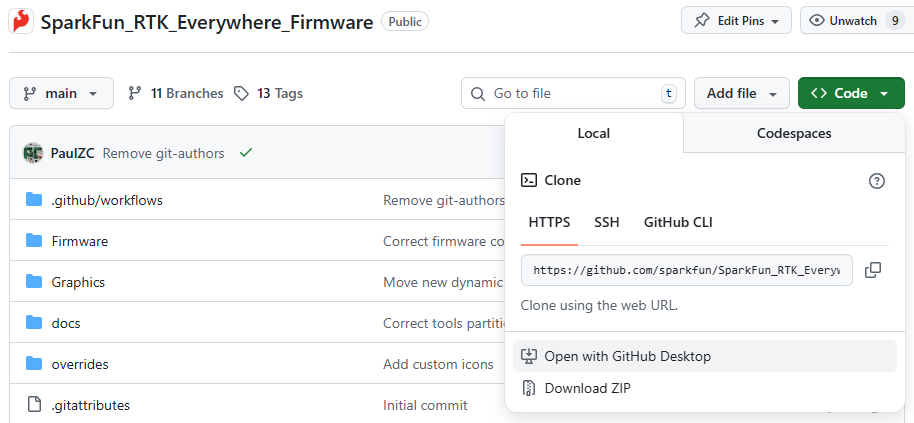
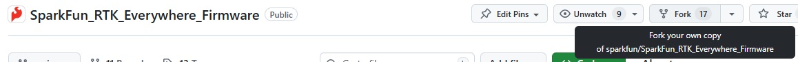
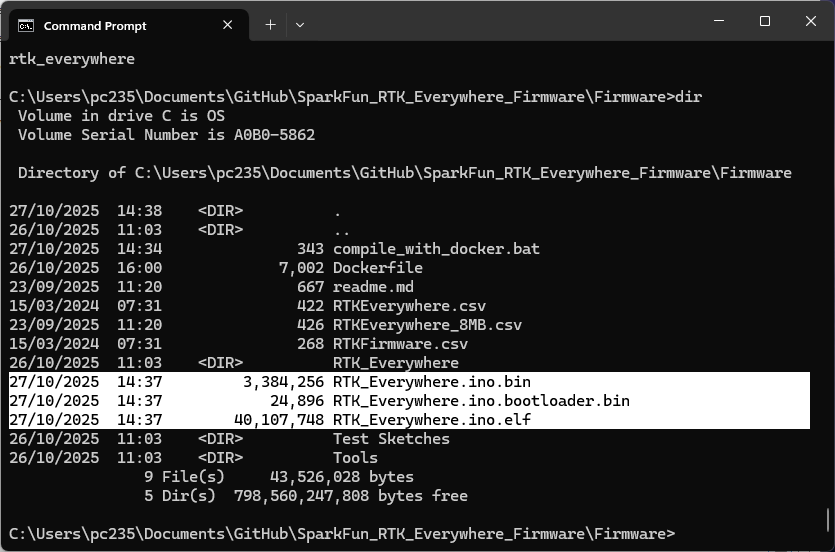
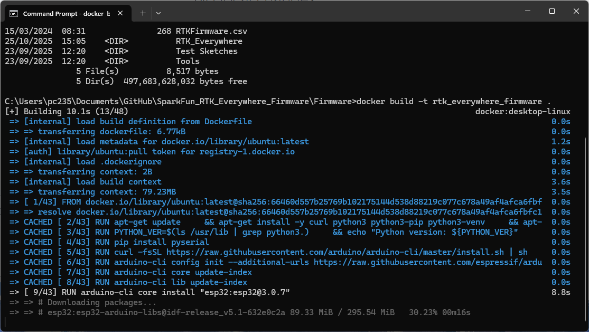
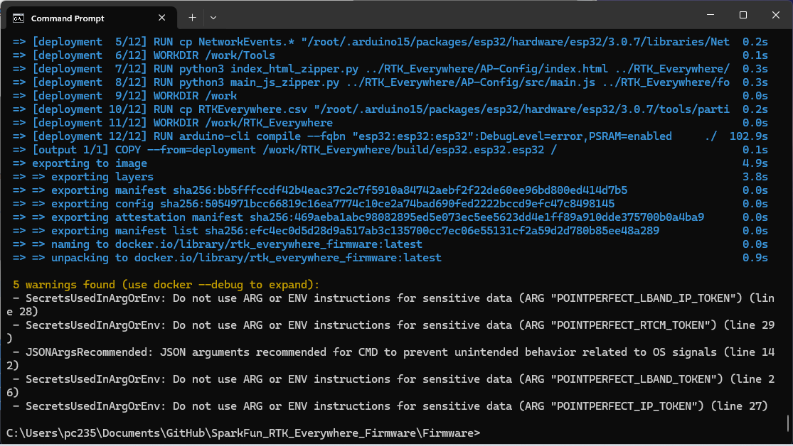
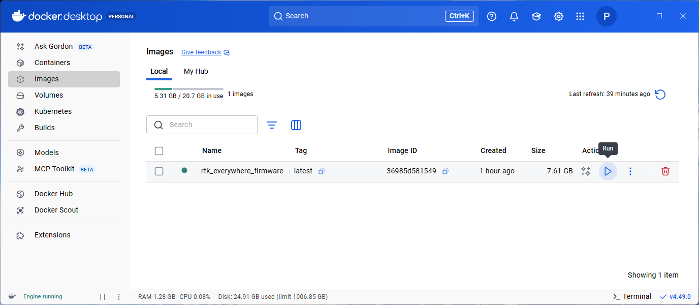
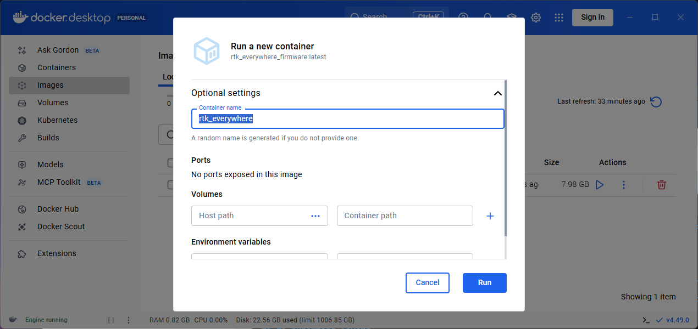
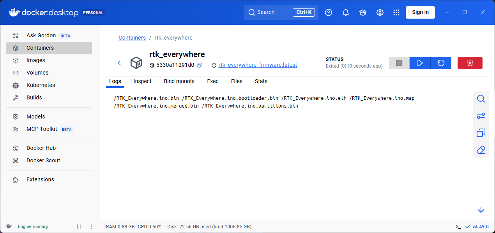

# Compiling Source

This is information about how to compile the RTK Everywhere firmware from source. This is for advanced users who would like to modify the functionality of the RTK products.

* [How SparkFun does it](#how-sparkfun-does-it)
* [Using Docker](#using-docker)
* [Compiling on Windows (Deprecated)](#compiling-on-windows-deprecated)

## How SparkFun does it

At SparkFun, we use GitHub Actions and a Workflow to compile each release of RTK Everywhere. We run the [compilation workflow](https://github.com/sparkfun/SparkFun_RTK_Everywhere_Firmware/blob/main/.github/workflows/compile-rtk-everywhere.yml) directly on GitHub. A virtual ubuntu machine installs the [Arduino CLI](https://github.com/arduino/arduino-cli/releases), installs the ESP32 Arduino core, patches the core in a couple of places, installs all the required libraries at the required version, converts the embedded HTML and Bootstrap JavaScript to binary zip format, and generates the firmware binary for the ESP32. That binary is either uploaded as an Artifact (by [non-release-build](https://github.com/sparkfun/SparkFun_RTK_Everywhere_Firmware/blob/main/.github/workflows/non-release-build.yml)) or pushed to the [SparkFun RTK Everywhere Firmware Binaries](https://github.com/sparkfun/SparkFun_RTK_Everywhere_Firmware_Binaries) repo (by [compilation workflow](https://github.com/sparkfun/SparkFun_RTK_Everywhere_Firmware/blob/main/.github/workflows/compile-rtk-everywhere.yml)).

You are welcome to clone or fork this repo and do the exact same thing yourself. But you may need a paid GitHub Pro account to run the GitHub Actions, especially if you keep your clone / fork private.

If you run the [compilation workflow](https://github.com/sparkfun/SparkFun_RTK_Everywhere_Firmware/blob/main/.github/workflows/compile-rtk-everywhere.yml), it will compile the firmware and attempt to push the binary to the Binaries repo. This will fail as your account won't have the right permissions. The [non-release-build](https://github.com/sparkfun/SparkFun_RTK_Everywhere_Firmware/blob/main/.github/workflows/non-release-build.yml) is the one for you. The firmware binary will be attached as an Artifact to the workflow run. Navigate to Actions \ Non-Release Build, select the latest run of Non-Release Build, the binary is in the Artifacts.

You can then use (e.g.) the [SparkFun RTK Firmware Uploader](https://github.com/sparkfun/SparkFun_RTK_Firmware_Uploader) to upload the binary onto the ESP32.

## Using Docker

Installing the correct version of the ESP32 core and of each required Arduino library, is tedious and error-prone. Especially on Windows. We've lost count of the number of times code compilation fails on our local machines, because we had the wrong ESP32 core installed, or forgot to patch libbt or libmbedcrypto... It is much easier to sandbox the firmware compilation using an environment like [Docker](https://www.docker.com/).

Docker is open-source. It is our new favourite thing!

Here is a step-by-step guide for how to install Docker and compile the firmware from scratch:

### Clone, fork or download the RTK Everywhere Firmware repo

To build the RTK Everywhere Firmware, you obviously need a copy of the source code.

If you are familiar with Git and GitHub Desktop, you can clone the RTK Everywhere Firmware repo directly into GitHub Desktop:



If you want to _contribute_ to RTK Everywhere, and already have a GitHub account, you can Fork the repo:



Clone your fork to your local machine, make changes, and send us a Pull Request. This is exactly what the SparkFun Team do when developing the code. Please use the `release_candidate` branch for any such changes. We are very unlikely to merge anything directly into `main`, unless it is (e.g.) docs corrections or improvements.

If you don't want to do either of those, you can simply Download a Zip copy of the repo instead. You will receive a complete copy as a Zip file. You can do this from the green **Code** button, or click on the icon below to download a copy of the main (released) branch:

[](https://github.com/sparkfun/SparkFun_RTK_Everywhere_Firmware/archive/refs/heads/main.zip "Download ZIP (main branch)")

For the real Wild West experience, you can also download a copy of the `release_candidate` code branch. This is where the team is actively changing and testing the code, before it becomes a full release. The code there will _usually_ compile and will _usually_ work, but we don't guarantee it! We may be part way through implementing some breaking changes at the time of your download...

[](https://github.com/sparkfun/SparkFun_RTK_Everywhere_Firmware/archive/refs/heads/release_candidate.zip "Download ZIP (release_candidate branch)")

### Install Docker Desktop

* **(Optional)** Head to [Docker](https://www.docker.com/) and create an account. A free "Personal" account will cover occasional compilations of the firmware
* Download and install [Docker Desktop](https://docs.docker.com/get-started/get-docker/) - there are versions for Mac, Windows and Linux. You may need to restart to complete the installation.
* Run the Desktop
    * You don't _need_ to have an account and you don't _need_ to be signed in
    * You only need to be signed in if you want to store or share your Container on Docker Hub
    * If you don't sign in, Docker Desktop will run in Personal mode - which will cover local compilations of the firmware
* On Windows, you may see an error saying "**WSL needs updating** Your version of Windows Subsystem for Linux (WSL) is too old". If you do:
    * Open a command prompt
	* Type `wsl --update` to update WSL. At the time of writing, this installs Windows Subsystem for Linux 2.6.1
	* Restart the Docker Desktop
* If you are using Docker for the first time, the "What is a container?" and "How do I run a container?" demos are useful - _but not essential_
    * On Windows, you may want to give Docker Desktop permission to access to your Network, so it can access (e.g.) HTML ports
	* You can Stop the container and Delete it when you are done
* You may want to prevent Docker from running when your machine starts up
    * Uncheck "Start Docker Desktop when you sign in to your computer" in the Desktop settings

### Using Docker to create the firmware binary

* **Make sure you have Docker Desktop running.** You don't need to be signed in, but it needs to be running.
* Open a Command Prompt and `cd` into the SparkFun_RTK_Everywhere_Firmware folder
* Check you are in the right place. Type `dir` and hit enter. You should see the following files and folders:

```
    .gitattributes
    .github
    .gitignore
    docs
    Firmware
    Graphics
    Issue_Template.md
    License.md
    README.md
```

* `cd Firmware` and then `dir` again. You should see:

```
    compile_with_docker.bat
    Dockerfile
    readme.md
    RTKEverywhere.csv
    RTKEverywhere_8MB.csv
    RTK_Everywhere
```

* The file that does most of the work is the `Dockerfile`

* But, if you're short on time, run `compile_with_docker.bat`. It does everything for you:



* Hey presto! You have your newly compiled firmware binary!

You can then use (e.g.) the [SparkFun RTK Firmware Uploader](https://github.com/sparkfun/SparkFun_RTK_Firmware_Uploader) to upload the binary onto the ESP32.

### Running the Dockerfile manually

If you want to see and understand what's going on under the hood with the Dockerfile, Image and Container:

Here is how to perform each step manually:

* To begin, run the Dockerfile. Type:

```
docker build -t rtk_everywhere_firmware .
```





* If you want to see the full build progress including the output of echo or ls, use:

```
docker build -t rtk_everywhere_firmware --progress=plain .
```

* If you want to rebuild the image completely from scratch, without using the cache, use:

```
docker build -t rtk_everywhere_firmware --progress=plain --no-cache .
```

Building the full Image from scratch is slow, taking several minutes. You should only need to do it once - unless you make any changes to the Dockerfile.

* **When you make changes to the source code and want to recompile, use:**

```
docker build -t rtk_everywhere_firmware --no-cache-filter deployment .
```

This uses the cache for the `upstream` stage and avoids recreating the full ubuntu machine. But it ignores the cache for the `deployment` stage, ensuring the code is recompiled.

### Access the firmware binary by running the Image

In Docker Desktop, in the Images tab, you should now be able to see an Image named `rtk_everywhere_firmware`. We now need to Run that Image to access the firmware binary. Click the triangular Run icon under Actions:



Running the Image will create a Container, through which we can access the output of the arduino-cli code compilation.

By default, the Container name is random. To avoid this, we define one in the **Optional settings** :



Run the Container and you should see:



In the Command Prompt, type the following :

```
docker cp rtk_everywhere:/RTK_Everywhere.ino.bin .
```

Hey presto! A file called `RTK_Everywhere.ino.bin` appears in the current directory. That's the firmware binary we are going to upload to the ESP32.


If you need the `.elf` file so you can debug code crashes with me-no-dev's [ESP ExceptionDecoder](https://github.com/me-no-dev/EspExceptionDecoder):

```
docker cp rtk_everywhere:/RTK_Everywhere.ino.elf .
```

If you need the `.bootloader.bin` file so you can upload it with esptool:

```
docker cp rtk_everywhere:/RTK_Everywhere.ino.bootloader.bin .
```

If you want the files to appear in a more convenient directory, replace the single `.` with a folder path.

Delete the `rtk_everywhere` container afterwards, to save disk space and so you can reuse the same container name next time. If you forget, you will see an error:

```Conflict. The container name "/rtk_everywhere" is already in use by container. You have to remove (or rename) that container to be able to reuse that name.```

* **Remember:** when you make changes to the source code and want to recompile, use:

```
docker build -t rtk_everywhere_firmware --no-cache-filter deployment .
```

#### Shortcut: compile_with_docker.bat

**Shortcut:** the `compile_with_docker.bat` batch file does everything for you:

```
docker build -t rtk_everywhere_firmware --no-cache-filter deployment .
docker create --name=rtk_everywhere rtk_everywhere_firmware:latest
docker cp rtk_everywhere:/RTK_Everywhere.ino.bin .
docker cp rtk_everywhere:/RTK_Everywhere.ino.elf .
docker cp rtk_everywhere:/RTK_Everywhere.ino.bootloader.bin .
docker container rm rtk_everywhere
```

#### Changing the build properties

**Changing the build properties:** if you want to change the build properties and (e.g.) include your own PointPerfect token, paste the following into a .bat file or shell script:

```
docker build -t rtk_everywhere_firmware --no-cache-filter deployment^
 --build-arg FIRMWARE_VERSION_MAJOR=99^
 --build-arg FIRMWARE_VERSION_MINOR=99^
 --build-arg POINTPERFECT_LBAND_TOKEN="0xAA,0xBB,<<=YOUR TOKEN IN C HEX FORMAT=>>,0x02,0x03"^
 --build-arg POINTPERFECT_IP_TOKEN="0xAA,0xBB,<<=YOUR TOKEN IN C HEX FORMAT=>>,0x02,0x03"^
 --build-arg POINTPERFECT_LBAND_IP_TOKEN="0xAA,0xBB,<<=YOUR TOKEN IN C HEX FORMAT=>>,0x02,0x03"^
 --build-arg POINTPERFECT_RTCM_TOKEN="0xAA,0xBB,<<=YOUR TOKEN IN C HEX FORMAT=>>,0x02,0x03"^
 --build-arg ENABLE_DEVELOPER=false^
 --build-arg DEBUG_LEVEL=none^
 .
docker create --name=rtk_everywhere rtk_everywhere_firmware:latest
docker cp rtk_everywhere:/RTK_Everywhere.ino.bin .
docker cp rtk_everywhere:/RTK_Everywhere.ino.elf .
docker cp rtk_everywhere:/RTK_Everywhere.ino.bootloader.bin .
docker container rm rtk_everywhere
```

## Compiling on Windows (Deprecated)

**Note: we recommend using the Docker method. It is far easier and much less error-prone...**

The SparkFun RTK Everywhere Firmware is compiled using Arduino CLI (currently [v1.0.4](https://github.com/arduino/arduino-cli/releases)). To compile:

1. Install [Arduino CLI](https://github.com/arduino/arduino-cli/releases).
2. Install the ESP32 core for Arduino:

		arduino-cli core install esp32:esp32@3.0.7

	!!! note
		Use v3.0.7 of the core.

	!!! note
		We use the 'ESP32 Dev Module' for pin numbering.

3. Obtain each of the libraries listed in [the workflow](https://github.com/sparkfun/SparkFun_RTK_Everywhere_Firmware/blob/main/.github/workflows/compile-rtk-everywhere.yml#L77) either by using git or the Arduino CLI [library manager](https://arduino.github.io/arduino-cli/0.21/commands/arduino-cli_lib_install/). Be sure to obtain the version of the library reflected in the [workflow](https://github.com/sparkfun/SparkFun_RTK_Everywhere_Firmware/blob/main/.github/workflows/compile-rtk-everywhere.yml#L77). Be sure to include the external libraries (You may have to enable external library support in the CLI).
4. RTK Everywhere uses a custom partition file. Download the [RTKEverywhere.csv](https://github.com/sparkfun/SparkFun_RTK_Everywhere_Firmware/blob/main/Firmware/RTKEverywhere.csv) or [RTKEverywhere_8MB.csv](https://github.com/sparkfun/SparkFun_RTK_Everywhere_Firmware/blob/main/Firmware/RTKEverywhere_8MB.csv) for the RTK Postcard.
5. Add *RTKEverywhere.csv* partition table to the Arduino partitions folder. It should look something like

		C:\Users\[user name]\AppData\Local\Arduino15\packages\esp32\hardware\esp32\3.0.7\tools\partitions\RTKEverywhere.csv

	This will increase the program partitions, as well as the SPIFFs partition to utilize the full 16MB of flash (8MB in the case of the Postcard).

6. Patch the core (libmbedtls, NetworkEvents and libbt) - as shown in the workflow

7. Update the web config `form.h` by running the two python scripts in the `Tools` folder:

```
python index_html_zipper.py ../RTK_Everywhere/AP-Config/index.html ../RTK_Everywhere/form.h
python main_js_zipper.py ../RTK_Everywhere/AP-Config/src/main.js ../RTK_Everywhere/form.h
```

8. Compile using the following command

```
		arduino-cli compile --fqbn "esp32:esp32:esp32":DebugLevel=none,PSRAM=enabled ./Firmware/RTK_Everywhere/RTK_Everywhere.ino --build-property build.partitions=RTKEverywhere --build-property upload.maximum_size=4055040 --build-property "compiler.cpp.extra_flags=-MMD -c" --export-binaries
```

9. Once compiled, upload to the device using the following two commands. Replace `COM4` with the COM port on which the RTK device is located.

```
		esptool.exe --chip esp32 --port \\.\COM4 --baud 460800 --before default_reset --after no_reset write_flash -z --flash_mode dio --flash_freq 80m --flash_size detect 0x1000 RTK_Surveyor.ino.bootloader.bin 0x8000 RTK_Surveyor_Partitions_16MB.bin 0xe000 boot_app0.bin 0x10000 RTK_Surveyor.ino.bin

        esptool.exe --chip esp32 --port \\.\COM4 --before default_reset run

```

If you are seeing the error:

> text section exceeds available space ...

You have either not replaced the partition file correctly or failed to include the 'upload.maximum_size' argument in your compile command. See steps 4 through 6 above.

!!! note
	There are a variety of compile guards (COMPILE_WIFI, COMPILE_AP, etc) at the top of RTK_Everywhere.ino that can be commented out to remove them from compilation. This will greatly reduce the firmware size and allow for faster development of functions that do not rely on these features (serial menus, system configuration, logging, etc).

