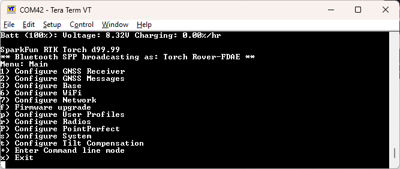
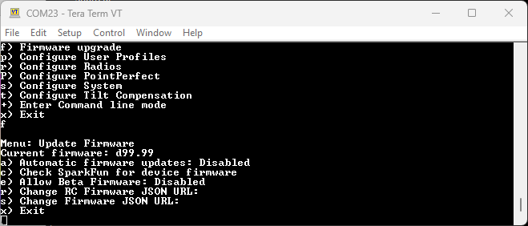

# Updating ESP32 Firmware

<!--
Compatibility Icons
====================================================================================

:material-radiobox-marked:{ .support-full title="Feature Supported" }
:material-radiobox-indeterminate-variant:{ .support-partial title="Feature Partially Supported" }
:material-radiobox-blank:{ .support-none title="Feature Not Supported" }
-->

<div class="grid cards fill" markdown>

- EVK: :material-radiobox-marked:{ .support-full title="Feature Supported" }
- Facet mosaic: [:material-radiobox-blank:{ .support-none }]( title ="Feature Partially Supported" )
- Postcard: :material-radiobox-marked:{ .support-full title="Feature Supported" }
- Torch: [:material-radiobox-blank:{ .support-none }]( title ="Feature Partially Supported" )

</div>

The ESP32 firmware is the main firmware in all RTK devices. The firmware version number is displayed in a variety of places:

- Power On (if a display is supported)
- Serial Config Menu
- WiFi Config

<figure markdown>

<figcaption markdown>
RTK Express with firmware v3.0
</figcaption>
</figure>

During power-on, on devices that have a display, the firmware version will be shown.

<figure markdown>

<figcaption markdown>
Main Menu showing RTK Firmware v1.0
</figcaption>
</figure>

The firmware is displayed when the main menu is opened over a serial connection.

<figure markdown>

<figcaption markdown>
WiFi Config page showing device firmware v2.7 and ZED-F9P firmware HPG 1.32
</figcaption>
</figure>

The firmware is shown at the top of the WiFi config page.

From time to time SparkFun will release new firmware for the RTK product line to add and improve functionality. For most users, firmware can be upgraded over WiFi using the OTA method.

- [OTA Method](#updating-firmware-over-the-air): Connect over WiFi to SparkFun to download the latest firmware *over-the-air*. This can be done using the serial menu or while in WiFi AP Config Mode. Requires a local WiFi network.
- [GUI Method](#updating-firmware-using-the-uploader-gui): Use the [Windows, Linux, MacOS or Python GUI](https://github.com/sparkfun/SparkFun_RTK_Firmware_Uploader) and a USB cable. (The Python package has been tested on Raspberry Pi)
- [SD Method](#updating-firmware-from-the-sd-card): Load the firmware on an SD card, then use a serial terminal with the *Firmware Upgrade* menu
- [WiFi Method](#updating-firmware-from-wifi): Load the firmware over WiFi when the device is in WiFi AP Config Mode
- [CLI Method](#updating-firmware-from-cli): Use the command line *batch_program.bat*

The OTA method is generally recommended. For more information see [here](#updating-firmware-over-the-air).

Remember, all SparkFun RTK devices are open source hardware meaning you have total access to the [firmware](https://github.com/sparkfun/SparkFun_RTK_Everywhere_Firmware) and [hardware](https://github.com/sparkfun/SparkFun_RTK_Facet). Be sure to check out each repo for the latest firmware and hardware information.

## Updating Firmware Over-The-Air

<div class="grid cards fill" markdown>

- EVK: :material-radiobox-marked:{ .support-full title="Feature Supported" }
- Facet mosaic: :material-radiobox-marked:{ .support-full title="Feature Supported" }
- Postcard: :material-radiobox-marked:{ .support-full title="Feature Supported" }
- Torch: :material-radiobox-marked:{ .support-full title="Feature Supported" }

</div>

<figure markdown>

<figcaption markdown>
Updating the firmware via WiFi config page
</figcaption>
</figure>

<figure markdown>

<figcaption markdown>
Updating the firmware via Firmware serial menu
</figcaption>
</figure>

Firmware can be updated in the System Configuration section of the WiFi Config page, or over the Firmware menu of the serial interface. This makes checking and upgrading a unit very easy.

Additionally, users may opt to check for Beta firmware. This is the latest firmware that may have new features and is meant for testing. Beta firmware is not recommended for units deployed into the field as it may not be stable.

Automatic release firmware update is supported over WiFi. Enabling this feature is done using the serial firmware menu. The polling period is specified in minutes and defaults to once a day. The automatic firmware update only checks for and installs the current SparkFun released firmware versions over top of any:

- Older released versions (continual upgrade)
- Beta firmware versions (newer or older, restore to released version)
- Locally built versions (newer or older, restore to released version)

## Updating Firmware Using The Uploader GUI

<div class="grid cards fill" markdown>

- EVK: :material-radiobox-marked:{ .support-full title="Feature Supported" }
- Facet mosaic: :material-radiobox-marked:{ .support-full title="Feature Supported" }
- Postcard: :material-radiobox-marked:{ .support-full title="Feature Supported" }
- Torch: :material-radiobox-marked:{ .support-full title="Feature Supported" }

</div>

<figure markdown>

<figcaption markdown>
RTK Firmware GUI
</figcaption>
</figure>

This GUI makes it easy to point and click your way through a firmware update. There are versions for Windows, Linux, MacOS and a Python package installer.

The latest GUI release can be downloaded [here](https://github.com/sparkfun/SparkFun_RTK_Firmware_Uploader/releases).

Download the latest RTK firmware binary file located on the [releases page](https://github.com/sparkfun/SparkFun_RTK_Everywhere_Firmware/releases) or from the [binaries repo](https://github.com/sparkfun/SparkFun_RTK_Everywhere_Firmware_Binaries).

**To Use**

- Attach the RTK device to your computer using a USB cable.
- Turn the RTK device on.
- On Windows, open the Device Manager to confirm which COM port the device is operating on. On other platforms, check ```/dev```.

	<figure markdown>
	
	<figcaption markdown>
	Device Manager showing 'USB-Serial CH340' port on COM27
	</figcaption>
	</figure>

- Get the latest binary file located on the [releases page](https://github.com/sparkfun/SparkFun_RTK_Everywhere_Firmware/releases) or from the [binaries repo](https://github.com/sparkfun/SparkFun_RTK_Everywhere_Firmware_Binaries).
- Run *RTKUploader.exe* (it takes a few seconds to start)
- Click *Browse* and select the binary file to upload
- Select the COM port previously seen in the Device Manager
- Click *Upload Firmware*

Once complete, the device will reset and power down.

If your RTK 'freezes' after the update, press ```Reset ESP32``` to get it going again.

## Updating Firmware From the SD Card

<!--
Compatibility Icons
====================================================================================

:material-radiobox-marked:{ .support-full title="Feature Supported" }
:material-radiobox-indeterminate-variant:{ .support-partial title="Feature Partially Supported" }
:material-radiobox-blank:{ .support-none title="Feature Not Supported" }
-->

<div class="grid cards fill" markdown>

- EVK: :material-radiobox-marked:{ .support-full title="Feature Supported" }
- Facet mosaic: [:material-radiobox-blank:{ .support-none }]( title ="Feature Not Supported" )
- Postcard: :material-radiobox-marked:{ .support-full title="Feature Supported" }
- Torch: [:material-radiobox-blank:{ .support-none }]( title ="Feature Not Supported" )

</div>

On devices that support it, the firmware can be loaded from an SD card.

<figure markdown>

<figcaption markdown>
Firmware update taking place
</figcaption>
</figure>

Download the latest binary file located on the [releases page](https://github.com/sparkfun/SparkFun_RTK_Everywhere_Firmware/releases) or from the [binaries repo](https://github.com/sparkfun/SparkFun_RTK_Everywhere_Firmware_Binaries).

The firmware upgrade menu will only display files that have the "RTK_Surveyor_Firmware*.bin" file name format so don't change the file names once loaded onto the SD card. Select the firmware you'd like to load and the system will proceed to load the new firmware, then reboot.

!!! note
	The firmware is called `RTK_Surveyor_Firmware_vXX.bin` even though there are various RTK products (Facet, Express, Surveyor, etc). We united the different platforms into one. The [RTK Firmware](https://github.com/sparkfun/SparkFun_RTK_Everywhere_Firmware) runs on all our RTK products.

### Force Firmware Loading

In the rare event that a unit is not staying on long enough for new firmware to be loaded into a COM port, the RTK Firmware (as of version 1.2) has an override function. If a file named *RTK_Surveyor_Firmware_Force.bin* is detected on the SD card at boot that file will be used to overwrite the current firmware, and then be deleted. This update path is generally not recommended. Use the [GUI](#updating-firmware-using-the-uploader-gui) or [WiFi OTA](#updating-firmware-from-wifi) methods as the first resort.

## Updating Firmware From WiFi

<figure markdown>

<figcaption markdown>
</figcaption>
</figure>

!!! note
	Firmware versions 1.1 to 1.9 have an issue that severely limits firmware upload over WiFi and is not recommended; use the [GUI](#updating-firmware-using-the-uploader-gui) method instead. Firmware versions v1.10 and beyond support direct firmware updates via WiFi.

Firmware may be uploaded to the unit by clicking on 'Upload BIN', selecting the binary such as 'RTK_Surveyor_Firmware_v3_x.bin' and pressing upload. The unit will automatically reset once the firmware upload is complete.

## Updating Firmware From CLI

<div class="grid cards fill" markdown>

- EVK: :material-radiobox-marked:{ .support-full title="Feature Supported" }
- Facet mosaic: :material-radiobox-marked:{ .support-full title="Feature Supported" }
- Postcard: :material-radiobox-marked:{ .support-full title="Feature Supported" }
- Torch: :material-radiobox-marked:{ .support-full title="Feature Supported" }

</div>

The command-line interface is also available. You’ll need to download the [RTK Firmware Binaries](https://github.com/sparkfun/SparkFun_RTK_Everywhere_Firmware_Binaries) repo. This repo contains the binaries but also various supporting tools including esptool.exe and the three binaries required along with the firmware (bootloader, partitions, and app0).

### Windows

Connect a USB A to C cable from your computer to the ESP32 port on the RTK device. Turn the unit on. Now identify the COM port the RTK enumerated at. The easiest way to do this is to open the Device Manager:

<figure markdown>

<figcaption markdown>
CH340 is on COM6 as shown in Device Manager
</figcaption>
</figure>

!!! tip
	If the COM port is not showing be sure the unit is turned **On**. If an unknown device is appearing, you’ll need to [install drivers for the CH340](https://learn.sparkfun.com/tutorials/how-to-install-ch340-drivers/all). Once you know the COM port, open a command prompt (Windows button + r then type ‘cmd’).

<figure markdown>

<figcaption markdown>
batch_program.bat running esptool
</figcaption>
</figure>

Once the correct COM is identified, run 'batch_program.bat' along with the binary file name and COM port. For example *batch_program.bat RTK_Surveyor_Firmware_v2_0.bin COM6*. COM6 should be replaced by the COM port you identified earlier.

The batch file runs the following commands:

```
esptool.exe --chip esp32 --port COM6 --baud 921600 --before default_reset --after hard_reset write_flash -z --flash_mode dio --flash_freq 80m --flash_size detect 0x1000 ./bin/RTK_Surveyor.ino.bootloader.bin 0x8000 ./bin/RTK_Surveyor_Partitions_16MB.bin 0xe000 ./bin/boot_app0.bin 0x10000 ./RTK_Surveyor_Firmware_vxx.bin
```

Where *COM6* is replaced with the COM port that the RTK product enumerated at and *RTK_Surveyor_Firmware_vxx.bin* is the firmware you would like to load.

!!! note
	Some users have reported the 921600bps baud rate does not work. Decrease this to 115200 as needed.

Upon completion, your RTK device will reset and power down.

### macOS / Linux

Get [esptool.py](https://github.com/espressif/esptool). Connect a USB A to C cable from your computer to the ESP32 port on the RTK device. Turn the unit on. Now identify the COM port the RTK enumerated at.

!!! tip
	If the COM port is not showing be sure the unit is turned **On**. If an unknown device is appearing, you’ll need to [install drivers for the CH340](https://learn.sparkfun.com/tutorials/how-to-install-ch340-drivers/all). Once you know the COM port, run the following command:

py esptool.py --chip esp32 --port /dev/ttyUSB0 --baud 921600 --before default_reset --after hard_reset write_flash -z --flash_mode dio --flash_freq 80m --flash_size detect 0x1000 ./bin/RTK_Surveyor.ino.bootloader.bin 0x8000 ./bin/RTK_Surveyor_Partitions_16MB.bin 0xe000 ./bin/boot_app0.bin 0x10000 ./RTK_Surveyor_Firmware_vxx.bin

Where */dev/ttyUSB0* is replaced with the port that the RTK product enumerated at and *RTK_Surveyor_Firmware_vxx.bin* is the firmware you would like to load.

!!! note
	Some users have reported the 921600bps baud rate does not work. Decrease this to 115200 as needed.

Upon completion, your RTK device will reset.
