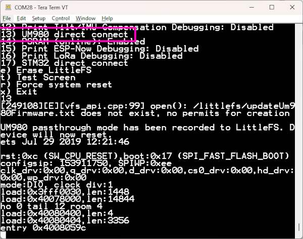
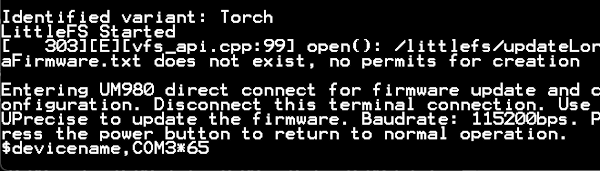
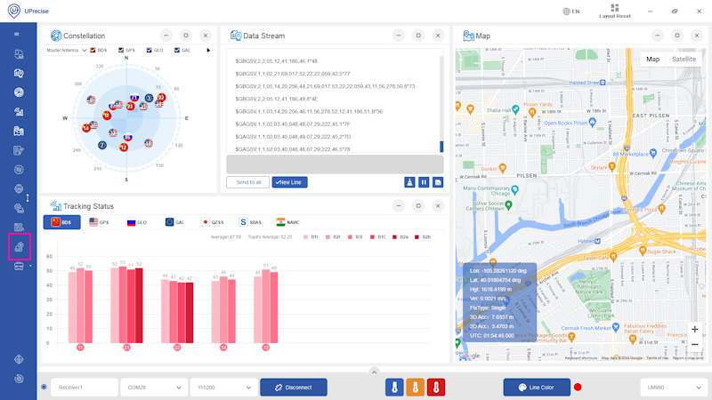
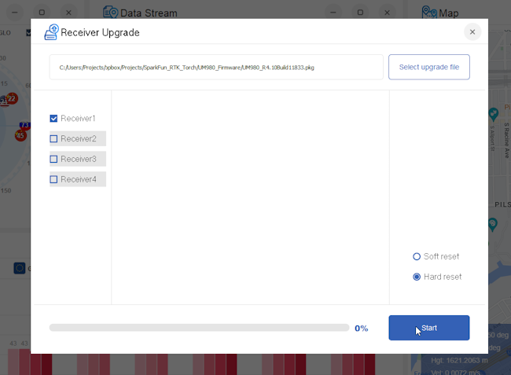
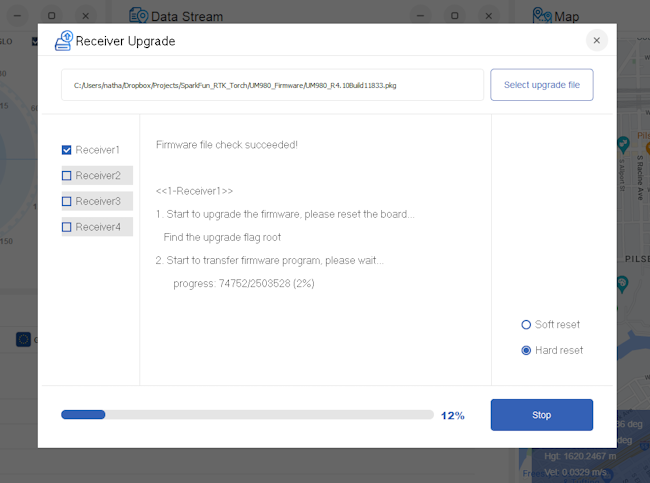
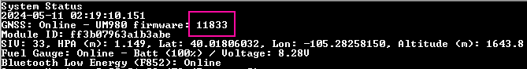

# Updating LG290P Firmware

<!--
Compatibility Icons
====================================================================================

:material-radiobox-marked:{ .support-full title="Feature Supported" }
:material-radiobox-indeterminate-variant:{ .support-partial title="Feature Partially Supported" }
:material-radiobox-blank:{ .support-none title="Feature Not Supported" }
-->

- EVK: [:material-radiobox-blank:{ .support-none }]( title ="Feature Not Supported" )
- Postcard: :material-radiobox-marked:{ .support-full title="Feature Supported" }
- Torch: [:material-radiobox-blank:{ .support-none }]( title ="Feature Not Supported" )

The LG290P is the GNSS receiver used on the RTK Postcard. The following describes how to update the firmware on the LG290P.

1. Download the latest LG290P firmware. As of writing, the LG290P firmware is [v4](https://raw.githubusercontent.com/SparkFun_RTK_Postcard/blob/main/Firmware/Quectel_LG290P_Firmware_Release_V0104S.zip). See the [RTK Postcard repo](https://github.com/sparkfun/SparkFun_RTK_Postcard/tree/main/Firmware) for the latest firmware.
2. Download and install [QGNSS](https://www.quectel.com/download/qgnss_v2-0_en/). QGNSS is the software created by Quectel to configure and view output from Quectel GNSS modules. 

	<figure markdown>
	
	<figcaption markdown>
	Entering direct connect via Serial Configuration
	</figcaption>
	</figure>

3. Put the device into passthrough mode. From the main menu navigate to System 's'->Hardware 'h'->LG290P Reset '13'. This will reset the device which will then respond to the request for update from QGNSS. Close the terminal connection so that UPrecise can connect to the COM port.

	<figure markdown>
	
	<figcaption markdown>
	Startup message showing passthrough mode
	</figcaption>
	</figure>

	!!! note
		The RTK device will stay in this passthrough mode until the external power button is pressed and released. The device will beep when exiting passthrough mode.

	<figure markdown>
	
	<figcaption markdown>
	Connect button and connection settings in UPrecise
	</figcaption>
	</figure>

4. Select the COM port and set the baud rate to 115200, then press 'Connect'

	<figure markdown>
	
	<figcaption markdown>
	Receiver Upgrade Button
	</figcaption>
	</figure>

5. Once connected, press the **Receiver Upgrade** button.

	<figure markdown>
	
	<figcaption markdown>
	Firmware selection window
	</figcaption>
	</figure>

6. Select the latest firmware file that was previously downloaded (See the [RTK Torch repo](https://github.com/sparkfun/SparkFun_RTK_Torch) for the latest firmware). Then press Start.

	<figure markdown>
	
	<figcaption markdown>
	Firmware update process
	</figcaption>
	</figure>

7. The update process can take multiple minutes. Once completed, close UPrecise, and power cycle the RTK Torch.

	<figure markdown>
	
	<figcaption markdown>
	UM980 Firmware version shown in System Menu
	</figcaption>
	</figure>

8. Upon power-up, the firmware will be updated. Open the System Menu to confirm the firmware version.
