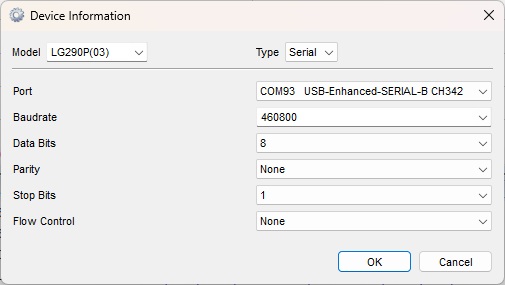
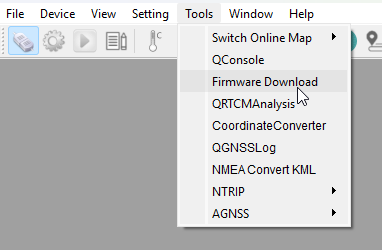
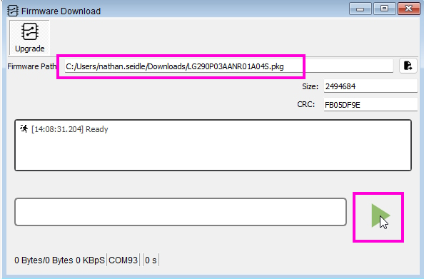
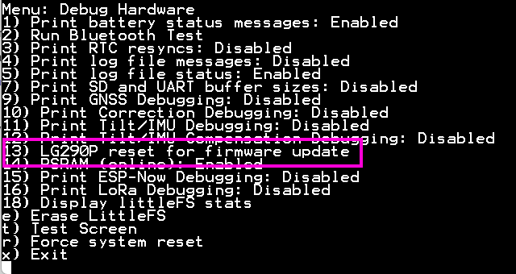
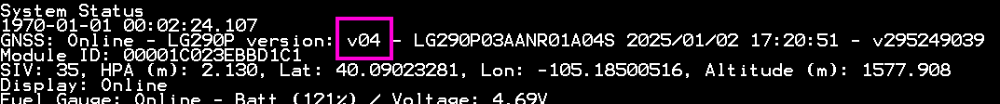

# Updating LG290P Firmware

<!--
Compatibility Icons
====================================================================================

:material-radiobox-marked:{ .support-full title="Feature Supported" }
:material-radiobox-indeterminate-variant:{ .support-partial title="Feature Partially Supported" }
:material-radiobox-blank:{ .support-none title="Feature Not Supported" }
-->

- EVK: [:material-radiobox-blank:{ .support-none }]( title ="Feature Not Supported" )
- Postcard: :material-radiobox-marked:{ .support-full title="Feature Supported" }
- Torch: [:material-radiobox-blank:{ .support-none }]( title ="Feature Not Supported" )

The LG290P is the GNSS receiver used on the RTK Postcard. The following describes how to update the firmware on the LG290P.

1. Download the latest LG290P firmware. As of writing, the LG290P firmware is [v4](https://raw.githubusercontent.com/SparkFun_RTK_Postcard/blob/main/Firmware/Quectel_LG290P_Firmware_Release_V0104S.zip). See the [RTK Postcard repo](https://github.com/sparkfun/SparkFun_RTK_Postcard/tree/main/Firmware) for the latest firmware.
2. Download and install [QGNSS](https://www.quectel.com/download/qgnss_v2-0_en/). QGNSS is the software created by Quectel to configure and view output from Quectel GNSS modules.

	<figure markdown>
	
	<figcaption markdown>
	Select the COM port and baud rate
	</figcaption>
	</figure>

3. Open QGNSS and select the COM port for **Port B** of the CH342 and set the baud rate to **460800**, then press 'OK'

	<figure markdown>
	
	<figcaption markdown>
	Open the Firmware Download window
	</figcaption>
	</figure>

	<figure markdown>
	
	<figcaption markdown>
	Starting the Firmware Update Process
	</figcaption>
	</figure>

4. Select the firmware to upload and press the start arrow. The update process will wait 20 seconds for the LG290P to be reset before timing out.

	<figure markdown>
	
	<figcaption markdown>
	Resetting LG290P
	</figcaption>
	</figure>

5. Reset the LG290P. From the main menu navigate to System 's'->Hardware 'h'->LG290P reset for firmware update '13'. This will reset the LG290P and allow the bootlader to begin. If more than 20 seconds have gone by, restart the upgrade process in QGNSS and then reset the LG290P again.

6. The update process takes a little over a minute. Once completed, close QGNSS and power cycle the RTK Postcard.

	<figure markdown>
	
	<figcaption markdown>
	Firmware version shown in System Menu
	</figcaption>
	</figure>

8. Upon power-up, the firmware will be updated. Open the System Menu to confirm the firmware version.
