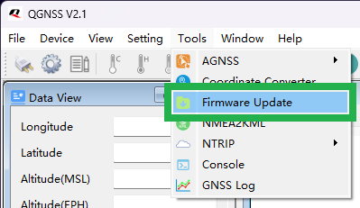
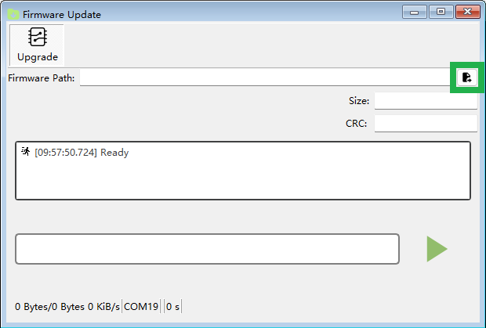
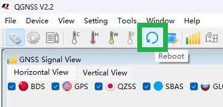
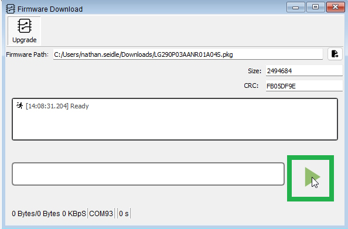

# Updating LG290P Firmware

<!--
Compatibility Icons
====================================================================================

:material-radiobox-marked:{ .support-full title="Feature Supported" }
:material-radiobox-indeterminate-variant:{ .support-partial title="Feature Partially Supported" }
:material-radiobox-blank:{ .support-none title="Feature Not Supported" }
-->

- EVK: :material-radiobox-blank:{ .support-none title="Feature Not Supported" }
- Facet mosaic: :material-radiobox-blank:{ .support-none title="Feature Not Supported" }
- Postcard: :material-radiobox-marked:{ .support-full title="Feature Supported" }
- Torch: :material-radiobox-blank:{ .support-none title="Feature Not Supported" }
- TX2: :material-radiobox-marked:{ .support-full title="Feature Supported" }

The LG290P is the GNSS receiver used on the RTK Postcard and TX2. The following describes how to update the firmware on the LG290P.

1. Download the latest LG290P firmware. As of writing, the LG290P firmware is [v2.01](https://github.com/sparkfun/SparkFun_RTK_Postcard/raw/refs/heads/main/Firmware/LG290P03AANR02A01S.zip). See the [RTK Postcard repo](https://github.com/sparkfun/SparkFun_RTK_Postcard/tree/main/Firmware) for the latest firmware.
2. Download and install [QGNSS](https://www.quectel.com/download/qgnss_v2-0_en/). QGNSS is the software created by Quectel to configure and view output from Quectel GNSS modules.
3. Open QGNSS and connect to your device by, selecting **LG290P(03)** from the drop-down menu for Model and selecting the COM port of the CH342 based on the device *(as listed below)*. Then, set the baud rate to **230400** and press 'OK'.

	- Postcard: **Port B**
	- TX2: **Port A**

	<figure markdown>
	
	<figcaption markdown>
	Select the model, COM port, and baud rate
	</figcaption>
	</figure>

	!!! tip
		If the baud rate doesn't work, users may need to factory reset the RTK everywhere firmware to reconfigure the baud rate of the LG290P to the default settings.

4. To upload firmware to the LG290P, navigate from the Tools drop-down menu and select the Firmware Update option *(**Tools** > **Firmware Update**)*.

	<figure markdown>
	
	<figcaption markdown>
	Open the Firmware Update tool
	</figcaption>
	</figure>

5. Select the firmware file to upload, by clicking on the button. *(This should be the `*.bin` file, located is inside the `*.zip` file that was downloaded in Step 1.)*

	<figure markdown>
	
	<figcaption markdown>
	Select the firmware file
	</figcaption>
	</figure>

6. Before the firmware can be uploaded, the LG290P must be reset to synchronize the module with the firmware upload process. Click on the reboot button in the toolbar.

	<figure markdown>
	
	<figcaption markdown>
	Reboot the LG290P
	</figcaption>
	</figure>

	!!! tip
		For the TX2, we recommend users relocate the **Firmware Update** window as close to the reboot button as possible. In our experience, the start button must be pressed immediately after pressing the reboot button; otherwise the process fails.

7. Press the start arrow in the **Firmware Update** window immediately after clicking the reboot button.

	<figure markdown>
	
	<figcaption markdown>
	Start the Firmware Update Process
	</figcaption>
	</figure>

	!!! tip
		If you are struggling to get the timing correct between the two buttons, here is an alternative solution. The firmware update process provides a 20 seconds to synchronize with the LG290P, given that you can reset the LG290P externally from the QGNSS application. Using the [serial configuration method](configure_with_serial.md), use the main menu navigate to System 's'->Hardware 'h'->LG290P reset for firmware update '13'. This will reset the LG290P and allow the bootloader to begin. If more than 20 seconds have gone by; click the start arrow in the **Firmware Update** window again, then reset the LG290P from the serial configuration menu.

		<figure markdown>
		
		<figcaption markdown>
		Resetting LG290P
		</figcaption>
		</figure>

8. The update process takes a little over a minute. Once completed, close QGNSS and power cycle the RTK Postcard.

	<figure markdown>
	
	<figcaption markdown>
	Firmware version shown in System Menu
	</figcaption>
	</figure>

9. Upon power-up, the firmware will be updated. Open the System Menu to confirm the firmware version.
