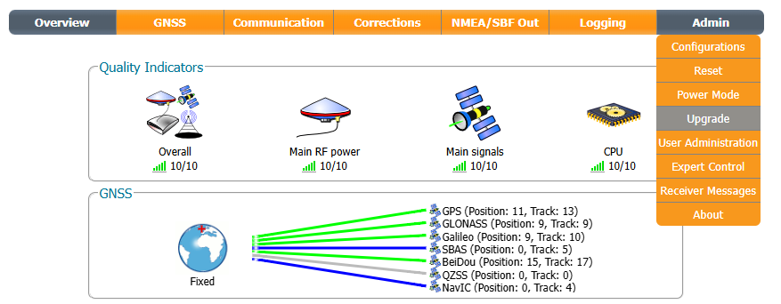
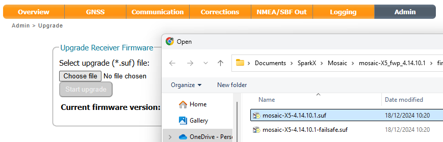
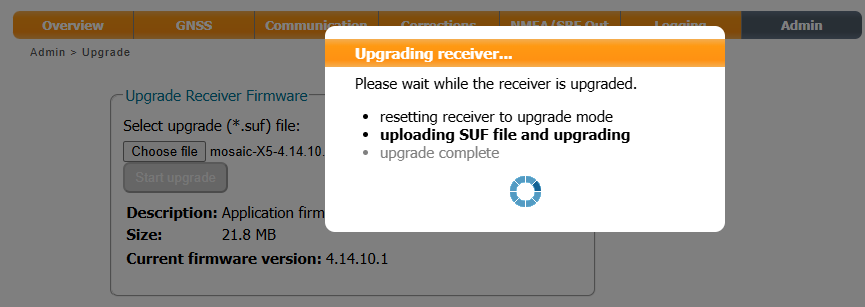
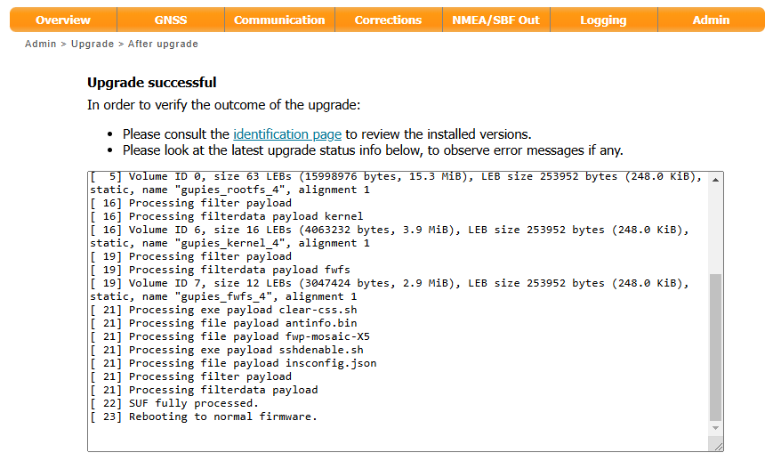

# Updating mosaic-X5 Firmware

<!--
Compatibility Icons
====================================================================================

:material-radiobox-marked:{ .support-full title="Feature Supported" }
:material-radiobox-indeterminate-variant:{ .support-partial title="Feature Partially Supported" }
:material-radiobox-blank:{ .support-none title="Feature Not Supported" }
-->

- EVK: [:material-radiobox-blank:{ .support-none }]( title ="Feature Not Supported" )
- Facet mosaic: :material-radiobox-marked:{ .support-full title="Feature Supported" }
- Postcard: [:material-radiobox-blank:{ .support-none }]( title ="Feature Not Supported" )
- Torch: [:material-radiobox-blank:{ .support-none }]( title ="Feature Not Supported" )

The Septentrio mosaic-X5 is the GNSS receiver inside the RTK Facet mosaic. The following describes how to update the firmware on the mosaic-X5.

1. Download the latest mosaic-X5 firmware [from Septentrio product page](https://www.septentrio.com/en/products/gnss-receivers/gnss-receiver-modules/mosaic-x5#resources). As of the time of writing, the latest mosaic-X5 firmware is v4.14.10.1.

2. Connect a USB-C cable between your computer and the RTK Facet mosaic.

3. Power on the Facet mosaic and allow ~10 seconds for the mosaic-X5 to start up.

4. On your computer, open a web browser and navigate to **192.168.3.1**. You are using Ethernet-over-USB to communicate with the mosaic-X5 directly. The X5's internal web page should appear.

5. Select the **Admin** tab and then **Upgrade**.

	<figure markdown>
	
	<figcaption markdown>
	The mosaic-X5 internal web page
	</figcaption>
	</figure>

6. Click on **Choose file** and select the firmware file you downloaded at step 1.

	<figure markdown>
	
	<figcaption markdown>
	Selecting the .SUF firmware file
	</figcaption>
	</figure>

7. Click **Start upgrade** to start the upgrade.

	<figure markdown>
	
	<figcaption markdown>
	Starting the firmware update
	</figcaption>
	</figure>

8. The upgrade will take approximately 30 seconds to complete. Check the web page dialog to ensure the firmware was updated successfully.

	<figure markdown>
	
	<figcaption markdown>
	Firmware update complete
	</figcaption>
	</figure>

