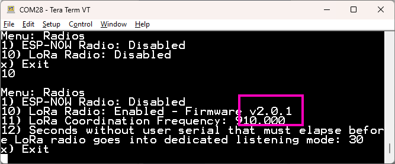
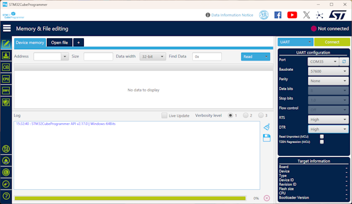
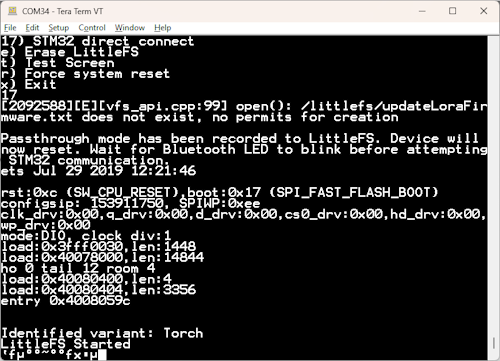
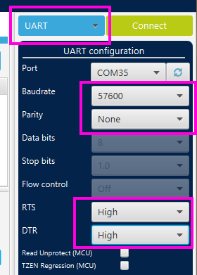

# Updating STM32 Firmware

<!--
Compatibility Icons
====================================================================================

:material-radiobox-marked:{ .support-full title="Feature Supported" }
:material-radiobox-indeterminate-variant:{ .support-partial title="Feature Partially Supported" }
:material-radiobox-blank:{ .support-none title="Feature Not Supported" }
-->

- EVK: [:material-radiobox-blank:{ .support-none }]( title ="Feature Not Supported" )
- Facet mosaic: [:material-radiobox-blank:{ .support-none }]( title ="Feature Not Supported" )
- Postcard: [:material-radiobox-blank:{ .support-none }]( title ="Feature Not Supported" )
- Torch: :material-radiobox-marked:{ .support-full title="Feature Supported" }

The STM32WLE firmware runs the 915MHz LoRa radio inside the RTK Torch.

<figure markdown>

<figcaption markdown>
RTK Torch LoRa radio firmware version 2.0.2
</figcaption>
</figure>

The firmware version number is displayed in the radio menu. If the device does not show this menu option the [ESP32 firmware](firmware_update_esp32.md) will need to be updated first.

Firmware updates to the STM32WLE can only be done over the serial interface. Follow these steps to update the LoRa radio firmware on the RTK Torch.

<figure markdown>

<figcaption markdown>
</figcaption>
</figure>

1. Download and install [STM32CubeProgrammer](https://www.st.com/en/development-tools/stm32cubeprog.html). While it *is* available for Windows/Linux/iOS, ST makes it rather difficult to get this software. We're sorry!
2. Download the latest STM32 LoRa binary from the [RTK Everywhere Firmware Binaries](https://github.com/sparkfun/SparkFun_RTK_Everywhere_Firmware_Binaries/tree/main/STM32_LoRa) repo. As of writing, this is **RTK_Torch_STM32_LoRa_v2_0_2.bin**.

	<figure markdown>
	
	<figcaption markdown>
	</figcaption>
	</figure>

3. Open the main menu and select System (**s**), Hardware Debug (**h**), STM32 direct connect (**17**).

	<figure markdown>
	
	<figcaption markdown>
	</figcaption>
	</figure>

4. The device will automatically reset and show instructions. The device is now operating in pass-through mode at 57600bps, and ready to be programmed. If needed, to exit this pass-through mode, press and release the main power button.
5. Close the terminal connection. This will likely cause the device to reset - that is ok.

	<figure markdown>
	
	<figcaption markdown>
	</figcaption>
	</figure>

6. Open STM32CubeProgrammer. Select UART (blue box) as the programming interface. Set the Baudrate to 57600, No parity, RTS and DTR set to high.

	<figure markdown>
	
	<figcaption markdown>
	</figcaption>
	</figure>

7. Avoid **Read Unprotected**. Do not enable. This setting writes to fuse bits and if there is a problem with serial communication, it can lead to an inoperable bootloader. The device can be repaired but only at SparkFun (we have to use an ST-Link to reprogram the fuse bits over the SWD interface).
8. Select the COM port associated with COM-B of the RTK device. Not sure? Read [here](https://docs.sparkfun.com/SparkFun_RTK_Everywhere_Firmware/configure_with_serial/#rtk-torch). Once selected, click **Connect**.

	<figure markdown>
	
	<figcaption markdown>
	</figcaption>
	</figure>

9. Once connected, select *Erasing & programming* on the left side menu.

	<figure markdown>
	
	<figcaption markdown>
	</figcaption>
	</figure>

10. Above, select the binary file and click *Start Programming*.

	<figure markdown>
	
	<figcaption markdown>
	</figcaption>
	</figure>

11. After a few seconds, programming will complete.

	<figure markdown>
	
	<figcaption markdown>
	</figcaption>
	</figure>

12. Click disconnect to close the port.
13. Now press and release the power button on the Torch. The device will beep indicating it has exited pass-through mode. You can now use your device normally.

	<figure markdown>
	
	<figcaption markdown>
	</figcaption>
	</figure>

14. To confirm the version, open the Radio menu and enable the radio. Above, version 2.0.2 is seen.
