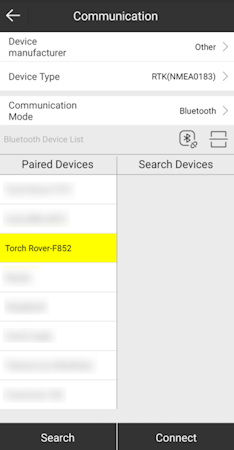
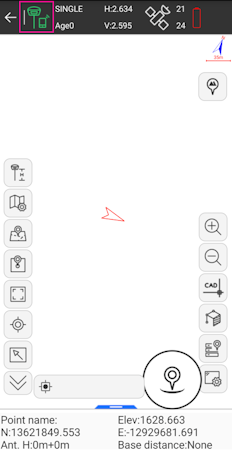
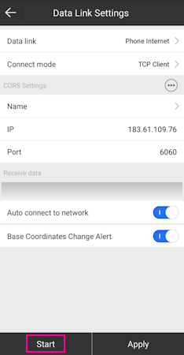
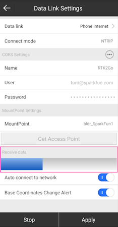
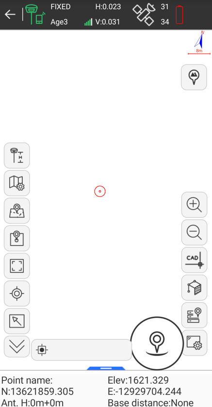

# Android

<!--
Compatibility Icons
====================================================================================

:material-radiobox-marked:{ .support-full title="Feature Supported" }
:material-radiobox-indeterminate-variant:{ .support-partial title="Feature Partially Supported" }
:material-radiobox-blank:{ .support-none title="Feature Not Supported" }
-->

- EVK: :material-radiobox-marked:{ .support-full title="Feature Supported" }
- Facet mosaic: :material-radiobox-marked:{ .support-full title="Feature Supported" }
- Postcard: :material-radiobox-marked:{ .support-full title="Feature Supported" }
- Torch: :material-radiobox-marked:{ .support-full title="Feature Supported" }
- TX2: :material-radiobox-marked:{ .support-full title="Feature Supported" }

While we recommend [SW Maps for Android](#sw-maps), there are a variety of 3rd party apps available for GIS and surveying for [Android](gis_software_android.md), [iOS](gis_software_ios.md), and [Windows](gis_software_windows.md). We will cover a few examples below that should give you an idea of how to get the incoming NMEA data into the software of your choice.

## ArcGIS Field Maps

[ArcGIS Field Maps](https://play.google.com/store/apps/details?id=com.esri.fieldmaps&hl=en_US) by Esri is a popular GIS app. Unfortunately it does not have a built in NTRIP Client to allow high precision corrections down to the RTK device. To enable high-precision, a [mock location](connecting_bluetooth.md/#enable-mock-location) and an intermediary app such as [GNSS Master](#gnss-master) or [Lefebure](#lefebure) is needed.

Once a [mock location](connecting_bluetooth.md/#enable-mock-location) provider is setup, open Field Maps.

<figure markdown>

<figcaption markdown>
</figcaption>
</figure>

Select **World Imagery**.

<figure markdown>

<figcaption markdown>
ArcGIS Field Maps with 12mm accuracy
</figcaption>
</figure>

Field Maps will use the device's internal location as its default location provider. With [GNSS Master](#gnss-master) or [Lefebure](#lefebure) providing the mock location to the phone, Field Maps will have a super precise GNSS location and data collection can begin.

## ArcGIS QuickCapture

[ArcGIS QuickCapture](https://play.google.com/store/apps/details?id=com.esri.arcgisquickcapture&hl=en_US) by Esri is a popular GIS app. Unfortunately it does not allow Bluetooth connections to 3rd party RTK devices. To enable a connection to a SparkFun RTK device, a [mock location](connecting_bluetooth.md/#enable-mock-location) and an intermediary app such as [GNSS Master](#gnss-master) or [Lefebure](#lefebure) is needed.

Once a [mock location](connecting_bluetooth.md/#enable-mock-location) provider is setup, open QuickCapture.

<figure markdown>

<figcaption markdown>
</figcaption>
</figure>

For the purposes of this demonstration, click *Continue without signing in*.

<figure markdown>

<figcaption markdown>
</figcaption>
</figure>

Select the **+** then **Browse Projects**.

<figure markdown>

<figcaption markdown>
</figcaption>
</figure>

Select a project.

<figure markdown>

<figcaption markdown>
</figcaption>
</figure>

From the BioBlitz project screen we can see we have a GPS accuracy of less than 1 ft. The RTK device has RTK fix and is providing extremely accurate (better than 20mm or 1") positional data.

Click the map icon in the upper right.

<figure markdown>

<figcaption markdown>
</figcaption>
</figure>

The location of the receiver is shown on a map. With [GNSS Master](#gnss-master) or [Lefebure](#lefebure) providing the mock location to the phone, QuickCapture will have a very precise GNSS location and data collection can begin.

## ArcGIS Survey123

[ArcGIS Survey123](https://play.google.com/store/apps/details?id=com.esri.survey123&hl=en_US) by Esri is a popular GIS app. Unfortunately it does not allow Bluetooth connections to 3rd party RTK devices. To enable a connection to a SparkFun RTK device, a [mock location](connecting_bluetooth.md/#enable-mock-location) and an intermediary app such as [GNSS Master](#gnss-master) or [Lefebure](#lefebure) is needed.

Once a [mock location](connecting_bluetooth.md/#enable-mock-location) provider is setup, open Survey123.

<figure markdown>

<figcaption markdown>
</figcaption>
</figure>

For the purposes of this demonstration, click *Continue without signing in*.

<figure markdown>

<figcaption markdown>
</figcaption>
</figure>

Select the satellite icon in the upper right corner.

<figure markdown>

<figcaption markdown>
</figcaption>
</figure>

If the mock location provider app is running, you should see the Lat/Lon/Alt from the RTK device. In the above image, RTK Fix is achieved with 0.033ft (10mm) accuracy. Click on the map icon.

<figure markdown>

<figcaption markdown>
</figcaption>
</figure>

The location of the receiver is shown on a map. With [GNSS Master](#gnss-master) or [Lefebure](#lefebure) providing the mock location to the phone, Survey123 will have a very precise GNSS location and data collection can begin.

## Diamond Maps

[Diamond Maps](https://diamondmaps.com/) is a great solution for utilities and municipalities. $20/month GIS software with many great features. Get the Android app [here](https://play.google.com/store/apps/details?id=com.diamondmaps.OfflineApp&hl=en_US).

Be sure your device is [paired over Bluetooth](connecting_bluetooth.md#android).

<figure markdown>

<figcaption markdown>
</figcaption>
</figure>

From the Home Screen, click on the 'hamburger' settings button in the top left corner.

<figure markdown>

<figcaption markdown>
</figcaption>
</figure>

Select **GPS Status**.

<figure markdown>

<figcaption markdown>
</figcaption>
</figure>

Click on the **Select a GPS Source** box and select the RTK device that was previously paired with.

<figure markdown>

<figcaption markdown>
</figcaption>
</figure>

Once a receiver is selected, its status will be shown in the GPS Setup window. Additionally, an NTRIP Client is available for corrections.

**NTRIP Client**

If you’re using a serial radio to connect a Base to a Rover for your correction data, or if you're using the RTK Facet L-Band with built-in corrections, you can skip this part.

<figure markdown>

<figcaption markdown>
</figcaption>
</figure>

From this window, an NTRIP Client can be configured. Enter your NTRIP Caster information then click on **START**. Click *Close* to exit out to the main window.

<figure markdown>

<figcaption markdown>
0.03ft accuracy shown in green
</figcaption>
</figure>

Closing the GPS Source window will show the map as well as the relative accuracy in feet.

## Field Genius

[Field Genius for Android](https://www.microsurvey.com/products/fieldgenius-for-android/) is another good solution, albeit a lot more expensive than free.

Be sure your device is [paired over Bluetooth](connecting_bluetooth.md#android).

<figure markdown>

<figcaption markdown>
</figcaption>
</figure>

From the Main Menu open `Select Instrument`.

<figure markdown>

<figcaption markdown>
</figcaption>
</figure>

Click the 'Add Profile' button.

<figure markdown>

<figcaption markdown>
</figcaption>
</figure>

Click `GNSS Rover` and select *NMEA* as the Make. Set your Profile Name to something memorable like 'SparkFun RTK' then click the 'Create' button.

<figure markdown>

<figcaption markdown>
</figcaption>
</figure>

Click on 'SET UP COMMUNICATION'.

<figure markdown>

<figcaption markdown>
</figcaption>
</figure>

From the Bluetooth communication page, click the 'Search' button.

<figure markdown>

<figcaption markdown>
</figcaption>
</figure>

You will be shown a list of paired devices. Select the RTK device you'd like to connect to then click 'Connect'. The RTK device will connect and the MAC address shown on the RTK device OLED will change to the Bluetooth icon indicating a link is open.

**NTRIP Client**

If you’re using a serial radio to connect a Base to a Rover for your correction data, or if you're using the RTK Facet L-Band with built-in corrections, you can skip this part.

<figure markdown>

<figcaption markdown>
</figcaption>
</figure>

We need to send RTCM correction data from the phone back to the RTK device so that it can improve its fix accuracy. Your phone can be the radio link! Click on 'SET UP CORRECTIONS'.

<figure markdown>

<figcaption markdown>
</figcaption>
</figure>

Click on 'RTK via Internet' then 'SET UP INTERNET', then 'Done'.

<figure markdown>

<figcaption markdown>
</figcaption>
</figure>

Click on 'SET UP DATA SOURCE'.

<figure markdown>

<figcaption markdown>
</figcaption>
</figure>

Click 'Add New Source'.

<figure markdown>

<figcaption markdown>
</figcaption>
</figure>

Enter your NTRIP Caster credentials and click 'DONE'.

What's an NTRIP Caster? In a nutshell, it's a server that is sending out correction data every second. There are thousands of sites around the globe that calculate the perturbations in the ionosphere and troposphere that decrease the accuracy of GNSS accuracy. Once the inaccuracies are known, correction values are encoded into data packets in the RTCM format. You, the user, don't need to know how to decode or deal with RTCM, you simply need to get RTCM from a source within 10km of your location into the RTK device. The NTRIP client logs into the server (also known as the NTRIP caster) and grabs that data, every second, and sends it over Bluetooth to the RTK device.

Don't have access to an NTRIP Caster? You can use a 2nd RTK product operating in Base mode to provide the correction data. Checkout [Creating a Permanent Base](permanent_base.md). If you're the DIY sort, you can create your own low-cost base station using an ESP32 and a ZED-F9P breakout board. Check out [How to](https://learn.sparkfun.com/tutorials/how-to-build-a-diy-gnss-reference-station) Build a DIY GNSS Reference Station](https://learn.sparkfun.com/tutorials/how-to-build-a-diy-gnss-reference-station). If you'd just like a service, [Syklark](https://www.swiftnav.com/skylark) provides RTCM coverage for $49 a month (as of writing) and is extremely easy to set up and use. Remember, you can always use a 2nd RTK device in *Base* mode to provide RTCM correction data but it will be less accurate than a fixed position caster.

<figure markdown>

<figcaption markdown>
</figcaption>
</figure>

Click 'My NTRIP1' then 'Done' and 'Connect'.

You will then be presented with a list of Mount Points. Select the mount point you'd like to use then click 'Select' then 'Confirm'.

Select 'Done' then from the main menu select 'Survey' to begin using the device.

<figure markdown>

<figcaption markdown>
</figcaption>
</figure>

Now you can begin using the SparkFun RTK device with Field Genius.

## GNSS Master

[GNSS Master](https://play.google.com/store/apps/details?id=com.gnssmaster&hl=en_US) is a great utility when a given GIS app does not have an NTRIP Client or a way to connect over Bluetooth. GNSS Master connects to a RTK device over Bluetooth (or Bluetooth BLE) as well as any correction source (NTRIP, PointPerfect, even USB Serial), and then acts as the phone's location using [Mock Location](connecting_bluetooth.md/#enable-mock-location).

!!! note
	Most GIS apps will not need GNSS Master or Mock Location enabled and this section can be skipped.

Read how to [Enable Mock Location](connecting_bluetooth.md/#enable-mock-location).

<figure markdown>

<figcaption markdown>
</figcaption>
</figure>

From the GNSS Master main screen, select **GNSS Receiver Connection**.

<figure markdown>

<figcaption markdown>
</figcaption>
</figure>

Pick the RTK device to connect to from the list, then click *Connect*. The **Data Rate** should increase indicating data flowing from the RTK device to the GNSS Master app. Click the back button to return to the main screen.

<figure markdown>

<figcaption markdown>
</figcaption>
</figure>

Select **Correction Input** to setup an NTRIP Client.

<figure markdown>

<figcaption markdown>
</figcaption>
</figure>

This is one of the powerful features of GNSS Master - multiple connections can be entered. This is helpful if you regularly switch between locations or NTRIP Casters and your GIS software only allows entry of a single NTRIP source. GNSS Master supports corrections from NTRIP Casters but also PointPerfect and a direct serial connection to a GNSS receiver. This can be really helpful in advanced setups.

<figure markdown>

<figcaption markdown>
</figcaption>
</figure>

Enter your NTRIP Client information then click **SAVE**.

<figure markdown>

<figcaption markdown>
</figcaption>
</figure>

Once connected the *Data Rate* should increase above 0 bytes per second. Return to the home screen by hitting the back button.

<figure markdown>

<figcaption markdown>
</figcaption>
</figure>

Enable mock location. If GNSS Master throws an error, re-enable GNSS Master as your [Mock Location provider](connecting_bluetooth.md/#enable-mock-location) in Developer Options.

Once enabled, any GIS app that selects 'Internal' or 'Phone Location' as its source will instead be fed the high precision NMEA being generated by the RTK device connected over Bluetooth.

## Lefebure

[Lefebure NTRIP Client](https://play.google.com/store/apps/details?id=com.lefebure.ntripclient&hl=en_US) is the *original* app for getting correction from an NTRIP caster and down over Bluetooth. It's an oldie but a goodie.

!!! note
	Most GIS apps will not need Lefebure or Mock Location enabled and this section can be skipped.

The problem is that if Lefebure is connected to the RTK device providing RTCM corrections over Bluetooth, then other GIS applications cannot use the same Bluetooth connection at the same time. That's where mock locations save the day. Lefebure can be setup to take over or 'mock' the GPS location being reported by the phone. Nearly all GIS apps can use the phone's GPS location. So if the phone's location is magically super precise, then Lefebure can be the NTRIP Client and data provide, and your GIS app is none the wiser, and uses the phone's location.

Read how to [Enable Mock Location](connecting_bluetooth.md/#enable-mock-location).

<figure markdown>

<figcaption markdown>
</figcaption>
</figure>

Once mock locations are enabled, click on the *Settings* gear in the top left corner.

<figure markdown>

<figcaption markdown>
</figcaption>
</figure>

If needed, an NTRIP Client can be setup to provide corrections over Bluetooth to the RTK device.

<figure markdown>

<figcaption markdown>
</figcaption>
</figure>

Enter the Caster information and hit the back button.

<figure markdown>

<figcaption markdown>
</figcaption>
</figure>

Select *Receiver Settings*.

<figure markdown>

<figcaption markdown>
</figcaption>
</figure>

Select the RTK device that has been paired over Bluetooth. Also enable Mock Locations. Hit the back button to return to the main screen.

<figure markdown>

<figcaption markdown>
</figcaption>
</figure>

Press the **Connect** button. The app will connect to the NTRIP Caster. Now, any GIS app that selects 'Internal' or 'Phone Location' as its source will instead be fed the high precision NMEA being generated by the RTK device connected over Bluetooth.

## QField

<figure markdown>

<figcaption markdown>
</figcaption>
</figure>

[QField](https://docs.qfield.org/get-started/) is a free GIS Android app that runs QGIS.

<figure markdown>

<figcaption markdown>
The 'Reset to Surveying Defaults' button
</figcaption>
</figure>

First, configure the RTK device to output *only* NMEA messages. QField currently does not correctly parse other messages such as RAWX or RTCM so these will interfere with communication if they are enabled.

These RTK device settings can be found under the [Messages menu](menu_messages.md) through the [WiFi config page](configure_with_wifi.md) or through the [Serial Config menu](configure_with_serial.md).

<figure markdown>

<figcaption markdown>
</figcaption>
</figure>

Create an account and project on [QFieldCloud](https://qfield.cloud/). This project will be synchronized and viewable on the QField app.

<figure markdown>

<figcaption markdown>
Refresh Projects button
</figcaption>
</figure>

Once the project is created, press the Refresh projects list button to update the list. Then select your project.

<figure markdown>

<figcaption markdown>
'Hamburger' menu in upper right corner
</figcaption>
</figure>

Press the icon in the top left corner of the app to open the project settings.

<figure markdown>

<figcaption markdown>
Project settings
</figcaption>
</figure>

From the project settings menu, press the gear icon to open the device settings dropdown menu.

<figure markdown>

<figcaption markdown>
Project settings submenu
</figcaption>
</figure>

From the submenu, select 'Settings'.

<figure markdown>

<figcaption markdown>
Positioning Menu
</figcaption>
</figure>

Select the Positioning Menu. Then, with your RTK device on and in normal mode (not AP Config) press the Scan button in the QField app to update the dropdown list of available Bluetooth devices. If your device is not detected, be sure you've [paired your cellphone or laptop with Bluetooth](connecting_bluetooth.md).

Once connected exit out of the menus and see position information within your project.

## Survey Master

[Survey Master](https://www.comnavtech.com/companyfile/4/) by ComNam / SinoGNSS is an Android-based option. The download location can vary so google 'Survey Master ComNav Download' if the link above fails. Download the zip file, send the APK file to a phone and install the program.

<figure markdown>

<figcaption markdown>
</figcaption>
</figure>

By default, a wizard will guide you through the setup. The Project step will ask you for the name of the project, the datum, etc.

<figure markdown>

<figcaption markdown>
</figcaption>
</figure>

Next select your connection.

<figure markdown>

<figcaption markdown>
</figcaption>
</figure>

For the Device Model select 'NMEA Device'.

<figure markdown>

<figcaption markdown>
</figcaption>
</figure>

If you are just getting started, use one of the default antenna types. If you are attempting to get sub-centimeter accuracy, enter the parameters of your antenna and add it. Above are the NGS-certified parameters for the [TOP106 antenna](https://www.sparkfun.com/products/17751).

<figure markdown>

<figcaption markdown>
</figcaption>
</figure>

Click the 'Target Device' option to get a list of available Bluetooth devices. Make sure your RTK product is on and you should see the device. In this example 'Express Rover-B022' was chosen.

To finish, click 'Connect'. You should see the Bluetooth MAC address on your RTK product change to the Bluetooth icon indicating a connection is established.

<figure markdown>

<figcaption markdown>
</figcaption>
</figure>

Next is configuring the 'Work mode' of the device. The step is where we set up our NTRIP correction source.

<figure markdown>

<figcaption markdown>
</figcaption>
</figure>

Click 'Add' to create a new work mode.

<figure markdown>

<figcaption markdown>
</figcaption>
</figure>

Shown above, we configure the NTRIP Client. Survey Master calls this the 'SinoGNSS' Protocol. Click on the three bars to the right of 'Server' to enter a new NTRIP connection.

<figure markdown>

<figcaption markdown>
</figcaption>
</figure>

Here you can add different NTRIP Caster providers. If you're using RTK2Go be sure to enter your contact email into the user name.

<figure markdown>

<figcaption markdown>
</figcaption>
</figure>

Return to the 'Datalink type' window and select the Server you just entered. Re-enter the server address and port for your NTRIP Caster. Once complete, click on the down-pointing arrow. This will ping the Caster and obtain the mount point table. Select your mount point.

<figure markdown>

<figcaption markdown>
</figcaption>
</figure>

Select the newly created work mode and press the 'Apply' button.

<figure markdown>

<figcaption markdown>
</figcaption>
</figure>

Survey Master will attempt to connect to your specified RTK corrections source (NTRIP Caster). Upon success, you will be located on the Project menu.

Survey Master expects many more NMEA sentences than most GIS software. We must enable some additional messages on the RTK device to correctly communicate with Survey Master.

<figure markdown>

<figcaption markdown>
</figcaption>
</figure>

Note above: There are 9 enabled messages and GSV is set to '1'.

Connect to the RTK device either over [WiFi AP config](configure_with_wifi.md) or via [Serial](configure_with_serial.md). Above is shown the serial method.

Open a terminal at 115200bps and press a key to open the serial configuration menu. Press '2' for GNSS Messages, press '1' for NMEA messages, now be sure to enable 9 messages to a rate of 1:

- GGA
- GLL
- GRS
- GSA
- GST
- GSV
- RMC
- VTG
- ZDA

Once complete, press x until you exit the serial menus. Now we may return to Survey Master.

<figure markdown>

<figcaption markdown>
</figcaption>
</figure>

Click on the 'Survey' menu and then 'Topo Survey'. Above we can see a device with RTK float, and 117mm horizontal positional accuracy.

!!! bug "Known Issue"

	Survey Master parses the GxGSV sentence improperly and will only indicate GPS satellites even though the fix solution is using all satellites.

	<figure markdown>
	
	<figcaption markdown>
	</figcaption>
	</figure>

	To verify the NMEA sentences are being delivered correctly, Survey Master has a built-in tool. Select the Device->Rover->More->'H-Terminal'.

## SurPad

[SurPad](https://surpadapp.com/) is an Android app available as a free trial for 30-days. It's loaded as an APK (rather than through Google Play).

Be sure your RTK device has been [paired over Bluetooth](connecting_bluetooth.md#android) to your phone.

<figure markdown>

<figcaption markdown>
SurPad Home Screen
</figcaption>
</figure>

Create a project and get to the home screen. Shown above, click on the GNSS receiver icon.

<figure markdown>

<figcaption markdown>
SurPad connecting over Bluetooth
</figcaption>
</figure>

Set the **Device manufacturer** to *Other*, **Device type** to *RTK(NMEA0183)*, and **Communication Mode** to *Bluetooth*. Select the SparkFun RTK device that you would like to connect to on the **Paired Devices** list and then click *Connect*.

Once connected to the device a *Debug* button will appear. This is one of the nice features of SurPad: Running debug will allow you to inspect the NMEA coming across the link.

Once done, press the back arrow (top left corner) to return to the home screen.

<figure markdown>

<figcaption markdown>
SurPad Point Survey map
</figcaption>
</figure>

Above: From the home screen press the **Survey** button at the bottom, then **Point Survey** to bring up the map.

In the top left corner, press the green hamburger + cell phone icon. This will open the NTRIP settings.

<figure markdown>

<figcaption markdown>
SurPad Data Link NTRIP Configuration
</figcaption>
</figure>

Change the **Connect Mode** from *TCP Client* to *NTRIP*. If you are unable to edit or change the **Connect Mode** from TCP Client be sure the TCP Client is stopped by pressing the *Stop* button in the lower left corner (located in the same spot as the highlighted *Start*).

<figure markdown>

<figcaption markdown>
SurPad NTRIP Connection
</figcaption>
</figure>

Enter the information for your NTRIP caster. In the above example, we are connected to the SparkFun base station on RTK2Go. For RTK2Go you will need to enter a valid email address for a user name but a password is not required.

Click on *Start* and you should see the 'Receive data' progress bar (highlighted above) increase each second indicating a connection. Once complete, press 'Apply' to return to the map.

<figure markdown>

<figcaption markdown>
SurPad with RTK Fix
</figcaption>
</figure>

Above: After a few moments, the RTK device should move to RTK Float, then RTK Fix. You can see the age of the RTCM data in the upper bar, along with the horizontal (23mm) and vertical (31mm) accuracy estimates. Now you can begin taking points.

## SW Maps

The best mobile app that we’ve found is the powerful, free, and easy-to-use [SW Maps](https://play.google.com/store/apps/details?id=np.com.softwel.swmaps) by Softwel. It is compatible with Android and iOS, either phone or tablet with Bluetooth. What makes SW Maps truly powerful is its built-in NTRIP client. This is a fancy way of saying that we’ll be showing you how to get RTCM correction data over the cellular network.

Be sure your device is [paired over Bluetooth](connecting_bluetooth.md#android).

<figure markdown>

<figcaption markdown>
List of available Bluetooth devices
</figcaption>
</figure>

From SW Map's main menu, select *Bluetooth GNSS*. This will display a list of available Bluetooth devices. Select the Rover or Base you just paired with. If you are taking height measurements (altitude) in addition to position (lat/long) be sure to enter the height of your antenna off the ground including any [ARP offsets](https://geodesy.noaa.gov/ANTCAL/FAQ.xhtml#faq4) of your antenna (this should be printed on the side).

Click on 'CONNECT' to open a Bluetooth connection. Assuming this process takes a few seconds, you should immediately have a location fix.

<figure markdown>

<figcaption markdown>
SW Maps with RTK Fix
</figcaption>
</figure>

You can open the GNSS Status sub-menu to view the current data.

**NTRIP Client**

If you’re using a serial radio to connect a Base to a Rover for your correction data, or if you're using the RTK Facet L-Band with built-in corrections, you can skip this part.

We need to send RTCM correction data from the phone back to the RTK device so that it can improve its fix accuracy. This is the amazing power of the SparkFun RTK products and SW Maps. Your phone can be the radio link! From the main SW Maps menu select NTRIP Client. Not there? Be sure the 'SparkFun RTK' instrument was automatically selected connecting. Disconnect and change the instrument to 'SparkFun RTK' to enable the NTRIP Connection option.

<figure markdown>

<figcaption markdown>
NTRIP Connection - Not there? Be sure to select 'SparkFun RTK' was selected as the instrument
</figcaption>
</figure>

<figure markdown>

<figcaption markdown>
Connecting to an NTRIP Caster
</figcaption>
</figure>

Enter your NTRIP Caster credentials and click connect. You will see bytes begin to transfer from your phone to the RTK device. Within a few seconds, the RTK device will go from ~300mm accuracy to 14mm. Pretty nifty, no?

Once you have a full RTK fix you'll notice the location bubble in SW Maps turns green. Just for fun, rock your rover monopole back and forth on a fixed point. You'll see your location accurately reflected in SW Maps. Millimeter location precision is a truly staggering thing.

## Vespucci

[Vespucci](https://play.google.com/store/apps/details?id=de.blau.android&hl=en_US&gl=US) is an Open Street Map editor for Android.

This software requires the RTK device to connect over TCP. Be sure you have a local WiFi network entered into the [WiFi Config menu](menu_wifi.md), have a TCP Client or Server enabled, and have noted the TCP port (it's 2947 by default).

<figure markdown>

<figcaption markdown>
</figcaption>
</figure>

With a map open, select the gear icon on the bottom bar.

<figure markdown>

<figcaption markdown>
</figcaption>
</figure>

From the Preferences menu, scroll to the bottom and select 'Advanced Preferences'.

<figure markdown>

<figcaption markdown>
</figcaption>
</figure>

Select **Location settings**.

<figure markdown>

<figcaption markdown>
</figcaption>
</figure>

Select **GPS/GNSS source**. Select **NMEA from TCP client**. TCP server is also supported.

<figure markdown>

<figcaption markdown>
</figcaption>
</figure>

Select **NMEA network source**. Enter the IP address and TCP port of the RTK device. The IP address can be found by opening a serial terminal while connected to WiFi (it is reported every few seconds). The TCP port is entered into the [WiFi Config menu](menu_wifi.md).

<figure markdown>

<figcaption markdown>
</figcaption>
</figure>

Close all menus and you should see your location within Vespucci.

## Other GIS Packages

Hopefully, these examples give you an idea of how to connect the RTK product line to most any GIS software. If there is other GIS software that you'd like to see configuration information about, please open an issue on the [RTK Firmware repo](https://github.com/sparkfun/SparkFun_RTK_Everywhere_Firmware/issues) and we'll add it.

## What's an NTRIP Caster?

In a nutshell, it's a server that is sending out correction data every second. There are thousands of sites around the globe that calculate the perturbations in the ionosphere and troposphere that decrease the accuracy of GNSS accuracy. Once the inaccuracies are known, correction values are encoded into data packets in the RTCM format. You, the user, don't need to know how to decode or deal with RTCM, you simply need to get RTCM from a source within 10km of your location into the RTK device. The NTRIP client logs into the server (also known as the NTRIP caster) and grabs that data, every second, and sends it over Bluetooth to the RTK device.

## Where do I get RTK Corrections?

Be sure to see [Correction Sources](correction_sources.md).

Don't have access to an NTRIP Caster or other RTCM correction source? There are a few options.

The [SparkFun RTK Facet L-Band](https://www.sparkfun.com/products/20000) gets corrections via an encrypted signal from geosynchronous satellites. This device gets RTK Fix without the need for a WiFi or cellular connection.

Also, you can use a 2nd RTK product operating in Base mode to provide the correction data. Check out [Creating a Permanent Base](permanent_base.md).

If you're the DIY sort, you can create your own low-cost base station using an ESP32 and a ZED-F9P breakout board. Check out [How to Build a DIY GNSS Reference Station](https://learn.sparkfun.com/tutorials/how-to-build-a-diy-gnss-reference-station).

There are services available as well. [Syklark](https://www.swiftnav.com/skylark) provides RTCM coverage for $49 a month (as of writing) and is extremely easy to set up and use. [Point One](https://app.pointonenav.com/trial?utm_source=sparkfun) also offers RTK NTRIP service with a free 14 day trial and easy to use front end.
