# iOS

<!--
Compatibility Icons
====================================================================================

:material-radiobox-marked:{ .support-full title="Feature Supported" }
:material-radiobox-indeterminate-variant:{ .support-partial title="Feature Partially Supported" }
:material-radiobox-blank:{ .support-none title="Feature Not Supported" }
-->

- EVK: :material-radiobox-marked:{ .support-full title="Feature Supported" }
- Facet mosaic: :material-radiobox-marked:{ .support-full title="Feature Supported" }
- Postcard: :material-radiobox-marked:{ .support-full title="Feature Supported" }
- Torch: :material-radiobox-marked:{ .support-full title="Feature Supported" }

There are a variety of 3rd party apps available for GIS and surveying for [Android](gis_software_android.md), [iOS](gis_software_ios.md), and [Windows](gis_software_windows.md). We will cover a few examples below that should give you an idea of how to get the incoming NMEA data into the software of your choice.

The software options for Apple iOS are much more limited because Apple products do not support Bluetooth SPP. That's ok! The SparkFun RTK products support additional connection options including TCP and Bluetooth Low Energy (BLE).

## ArcGIS Field Maps

For reasons unknown, Esri removed TCP support from Field Maps for iOS and is therefore not usable by SparkFun RTK devices at this time.

If you must use iOS, checkout [SW Maps](gis_software_ios.md/#sw-maps), [ArcGIS QuickCapture](gis_software_ios.md/#arcgis-quickcapture), or [ArcGIS Survey123](gis_software_ios.md/#arcgis-survey123).

[Field Maps for Android](gis_software_android.md/#arcgis-field-maps) is supported.

## ArcGIS QuickCapture

<figure markdown>

<figcaption markdown>
</figcaption>
</figure>

[ArcGIS QuickCapture](https://apps.apple.com/us/app/arcgis-quickcapture/id1451433781) is a popular offering from Esri that works well with SparkFun RTK products.

ArcGIS QuickCapture connects to the RTK device over TCP. In other words, the RTK device needs to be connected to the same WiFi network as the device running QuickCapture. Generally, this is an iPhone or iPad operating as a hotspot.

!!! note
	The iOS hotspot defaults to 5.5GHz. This must be changed to 2.4GHz. Please see [Hotspot Settings](gis_software_ios.md/#hotspot-settings).

<figure markdown>
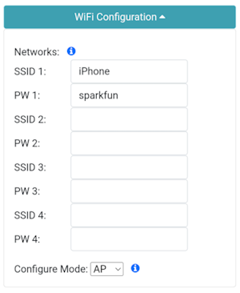
<figcaption markdown>
</figcaption>
</figure>

<figure markdown>
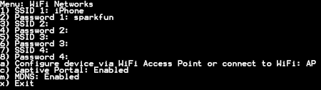
<figcaption markdown>
</figcaption>
</figure>

The RTK device must use WiFi to connect to the iPhone or iPad. In the above image, the device will attempt to connect to *iPhone* (a cell phone hotspot) when WiFi is needed.

<figure markdown>
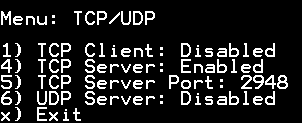
<figcaption markdown>
</figcaption>
</figure>

Next, the RTK device must be configured as a *TCP Server*. The default port of 2948 works well. See [TCP/UDP Menu](menu_tcp_udp.md) for more information.

<figure markdown>

<figcaption markdown>
</figcaption>
</figure>

Once the RTK device connects to the WiFi hotspot, its IP address can be found in the [System Menu](menu_system.md). This is the number that needs to be entered into QuickCapture. You can now proceed to the QuickCapture app to set up the software connection.

<figure markdown>

<figcaption markdown>
</figcaption>
</figure>

From the main screen, press the hamburger icon in the top left corner.

<figure markdown>

<figcaption markdown>
</figcaption>
</figure>

Press the **Settings** button.

<figure markdown>

<figcaption markdown>
</figcaption>
</figure>

Select the **Location Provider** option.

Select **Via Network**.

<figure markdown>

<figcaption markdown>
</figcaption>
</figure>

Enter the IP address and port previously obtained from the RTK device and click **ADD**.

<figure markdown>

<figcaption markdown>
</figcaption>
</figure>

That provider should now be shown connected.

<figure markdown>

<figcaption markdown>
</figcaption>
</figure>

From the main screen, click on the plus in the lower left corner and then **BROWSE PROJECTS**.

<figure markdown>

<figcaption markdown>
</figcaption>
</figure>

For this example, add the BioBlitz project.

<figure markdown>

<figcaption markdown>
</figcaption>
</figure>

Above, we can see the GPS accuracy is better than 1ft. Click on the map icon in the top right corner.

<figure markdown>

<figcaption markdown>
</figcaption>
</figure>

From the map view, we can see our location with very high accuracy. We can now begin gathering point information with millimeter accuracy.

## ArcGIS Survey123

<figure markdown>
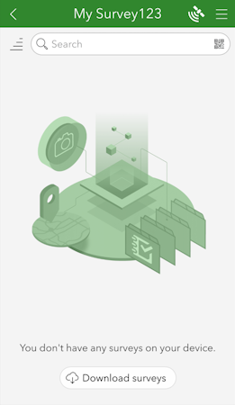
<figcaption markdown>
ArcGIS Survey123 Home Screen
</figcaption>
</figure>

[ArcGIS Survey123](https://apps.apple.com/us/app/arcgis-survey123/id993015031) is a popular offering from Esri that works well with SparkFun RTK products.

ArcGIS Survey123 connects to the RTK device over TCP. In other words, the RTK device needs to be connected to the same WiFi network as the device running ArcGIS. Generally, this is an iPhone or iPad.

!!! note
	The iOS hotspot defaults to 5.5GHz. This must be changed to 2.4GHz. Please see [Hotspot Settings](gis_software_ios.md/#hotspot-settings).

<figure markdown>

<figcaption markdown>
</figcaption>
</figure>

<figure markdown>

<figcaption markdown>
Adding WiFi network to settings
</figcaption>
</figure>

The RTK device must use WiFi to connect to the data collector. Using a cellular hotspot or cellphone is recommended. In the above image, the device will attempt to connect to *iPhone* (a cell phone hotspot) when WiFi is needed.

<figure markdown>

<figcaption markdown>
TCP Server Enabled on port 2948
</figcaption>
</figure>

Next, the RTK device must be configured as a *TCP Server*. The default port of 2948 works well. See [TCP/UDP Menu](menu_tcp_udp.md) for more information.

<figure markdown>
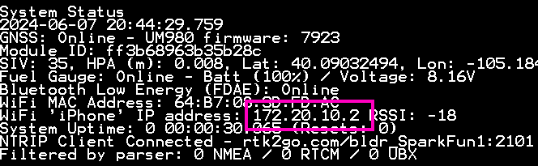
<figcaption markdown>
RTK device showing IP address
</figcaption>
</figure>

Once the RTK device connects to the WiFi hotspot, its IP address can be found in the [System Menu](menu_system.md). This is the number that needs to be entered into ArcGIS Survey123. You can now proceed to the ArcGIS Survey123 app to set up the software connection.

<figure markdown>

<figcaption markdown>
ArcGIS Survey123 Home Screen
</figcaption>
</figure>

From the home screen, click on the 'hamburger' icon in the upper right corner.

<figure markdown>
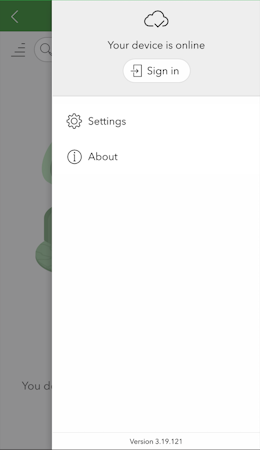
<figcaption markdown>
ArcGIS Survey123 Settings Menu
</figcaption>
</figure>

From the settings menu, click on the *Settings* gear.

<figure markdown>
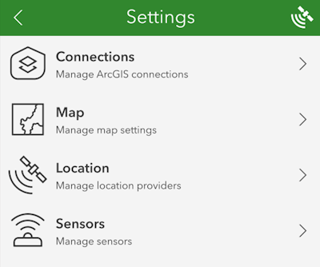
<figcaption markdown>
ArcGIS Survey123 Settings List
</figcaption>
</figure>

From the settings list, click on *Location*.

<figure markdown>
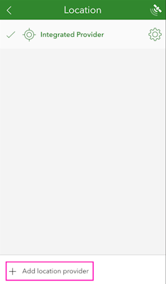
<figcaption markdown>
ArcGIS Survey123 List of Location Providers
</figcaption>
</figure>

Click on the *Add location provider*.

<figure markdown>
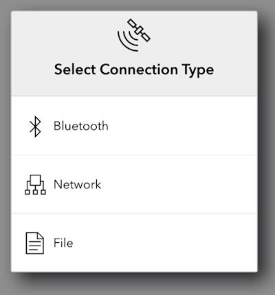
<figcaption markdown>
ArcGIS Survey123 Network Connection Type
</figcaption>
</figure>

Select *Network*.

<figure markdown>
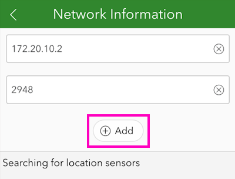
<figcaption markdown>
ArcGIS Survey123 TCP Connection Information
</figcaption>
</figure>

Enter the IP address previously found along with the TCP port. Once complete, click *Add*.

<figure markdown>
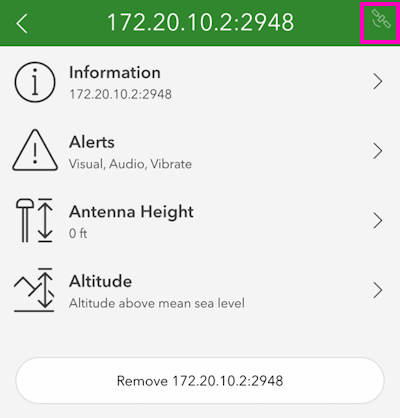
<figcaption markdown>
ArcGIS Survey123 Sensor Settings
</figcaption>
</figure>

You may enter various sensor-specific settings including antenna height, if desired. To view real-time sensor information, click on the satellite icon in the upper right corner.

<figure markdown>
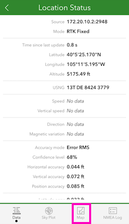
<figcaption markdown>
ArcGIS Survey123 Sensor Data
</figcaption>
</figure>

The SparkFun RTK device's data should now be seen. Click on the *Map* icon to return to the mapping interface.

<figure markdown>
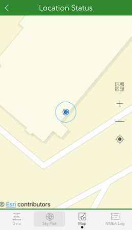
<figcaption markdown>
ArcGIS Survey123 Map Interface
</figcaption>
</figure>

Returning to the map view, we can now begin gathering point information with millimeter accuracy.

## Diamond Maps

Diamond Maps is *very* easy to use and setup for RTK work. Once the app is installed, open a project.

Above, select the hamburger icon to open the menu.

Press *GPS Status* to open the settings.

Press *Select* to open the GPS selection menu.

Press the *Scan for Bluetooth Devices* button.

Select the SparkPNT device to connect to.

Above, we can see that we have satellites in view, with ~0.82ft accuracy. Click *Setup* for the NTRIP Client.

Enter the NTRIP Client Credentials for your RTK network. Do you need access to corrections? SparkFun offers a $15/month service [here](https://www.sparkfun.com/pointperfect).

Double check that **Send GGA* is set correctly. Most services require GGA be sent every 10 to 30 seconds. Once the credentials are entered, press *Start*.

Return to the home screen and view the location. Note the accuracy is excellent at 0.03ft.

## Hotspot Settings

Apple released an iOS update in mid 2024 that changed the default hotspot frequency to 5.5GHz. The RTK product line uses 2.4GHz for WiFi and will not be able to communicate at this frequency. This can be fix by opening *Settings* then **Personal Hotspot**.

<figure markdown>

<figcaption markdown>
</figcaption>
</figure>

Be sure to enable *Maximize Compatibility*. This will force the hotspot to use 2.4GHz.

## QField

<figure markdown>
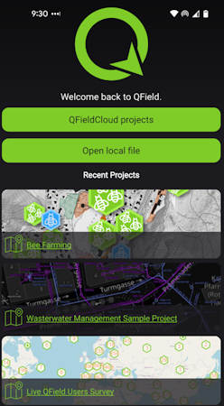
<figcaption markdown>
</figcaption>
</figure>

[QField](https://docs.qfield.org/get-started/) is a free iOS app that runs QGIS.

<figure markdown>
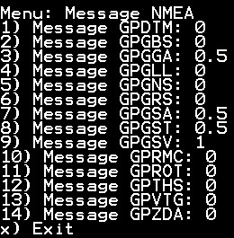
<figcaption markdown>
Modified NMEA messages on RTK Torch
</figcaption>
</figure>

First, configure the RTK device to output *only* the following NMEA messages:

- GPGGA
- GPGSA
- GPGST
- GPGSV

QField currently does not correctly parse other messages such as **GPRMC**, or **RTCM**. These messages will prevent communication if they are enabled.

These NMEA message settings can be found under the [Messages menu](menu_messages.md), using the [web config page](configure_with_wifi.md) or the [serial config interface](configure_with_serial.md).

<figure markdown>

<figcaption markdown>
</figcaption>
</figure>

<figure markdown>

<figcaption markdown>
Adding WiFi network to settings
</figcaption>
</figure>

QField connects to the RTK device over TCP. In other words, the RTK device needs to be connected to the same WiFi network as the device running ArcGIS. Generally, this is an iPhone or iPad. In the above image, the device will attempt to connect to *iPhone* (a cell phone hotspot) when WiFi is needed.

!!! note
	The iOS hotspot defaults to 5.5GHz. This must be changed to 2.4GHz. Please see [Hotspot Settings](gis_software_ios.md/#hotspot-settings).

<figure markdown>
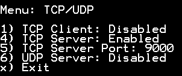
<figcaption markdown>
TCP Server Enabled on port 9000
</figcaption>
</figure>

Next, the RTK device must be configured as a *TCP Server*. QField uses a default port of 9000 so that is what we recommend using. See [TCP/UDP Menu](menu_tcp_udp.md) for more information.

<figure markdown>

<figcaption markdown>
RTK device showing IP address
</figcaption>
</figure>

Once the RTK device connects to the WiFi hotspot, its IP address can be found in the [System Menu](menu_system.md). This is the number that needs to be entered into QField. You can now proceed to the QField app to set up the software connection.

<figure markdown>

<figcaption markdown>
QField Opening Screen
</figcaption>
</figure>

Click on *QFieldCloud projects* to open your project that was previously created on the [QField Cloud](https://app.qfield.cloud/) or skip this step by using one of the default projects (*Bee Farming*, *Wastewater*, etc).

<figure markdown>
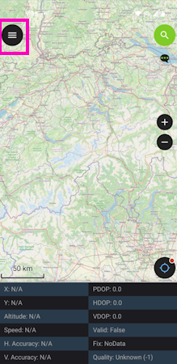
<figcaption markdown>
QField Main Map
</figcaption>
</figure>

From the main map, click on the 'hamburger' icon in the upper left corner.

<figure markdown>
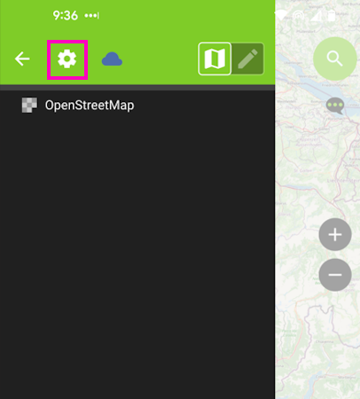
<figcaption markdown>
QField Settings Gear
</figcaption>
</figure>

Click on the gear to open settings.

<figure markdown>
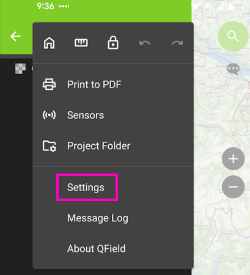
<figcaption markdown>
</figcaption>
</figure>

Click on the *Settings* menu.

<figure markdown>
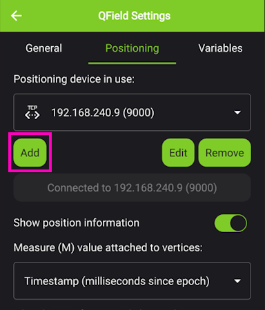
<figcaption markdown>
QField Positioning Menu
</figcaption>
</figure>

From the *Positioning* menu, click Add.

<figure markdown>
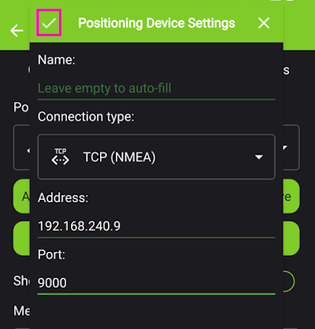
<figcaption markdown>
QField Entering TCP Information
</figcaption>
</figure>

Select TCP as the connection type. Enter the IP address of the RTK device and the port number. Finally, hit the small check box in the upper left corner (shown in pink above) to close the window.

Once this information is entered, QField will automatically attempt to connect to that IP and port.

<figure markdown>
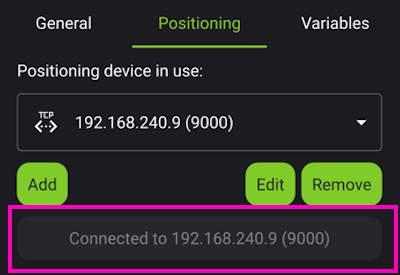
<figcaption markdown>
QField TCP Connected
</figcaption>
</figure>

Above, we see the port is successfully connected. Exit out of all menus.

<figure markdown>
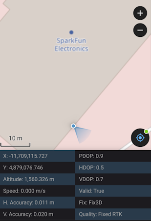
<figcaption markdown>
QField Connected via TCP with RTK Fix
</figcaption>
</figure>

Returning to the map view, we see an RTK Fix with 11mm positional accuracy.

## SW Maps

SWMaps is available for iOS [here](https://apps.apple.com/us/app/sw-maps/id6444248083).

Make sure your RTK device is switched on and operating in Rover mode.

Make sure Bluetooth is enabled on your iOS device Settings.

The RTK device will not appear in the _OTHER DEVICES_ list. That is OK.

<figure markdown>

<figcaption markdown>
iOS Settings Bluetooth
</figcaption>
</figure>

Open SWMaps.

Open or continue a Project if desired.

SWMaps will show your approximate location based on your iOS device's location.

<figure markdown>

<figcaption markdown>
iOS SWMaps Initial Location
</figcaption>
</figure>

Press the 'SWMaps' icon at the top left of the screen to open the menu.

<figure markdown>

<figcaption markdown>
iOS SWMaps Menu
</figcaption>
</figure>

Select Bluetooth GNSS.

<figure markdown>

<figcaption markdown>
iOS SWMaps Bluetooth Connection
</figcaption>
</figure>

Set the **Instrument Model** to **Generic NMEA (Bluetooth LE)**.

<figure markdown>

<figcaption markdown>
iOS SWMaps Instrument Model
</figcaption>
</figure>

Press 'Scan' and your RTK device should appear.

<figure markdown>

<figcaption markdown>
iOS SWMaps Bluetooth Scan
</figcaption>
</figure>

Select (tick) the RTK device and press 'Connect'.

<figure markdown>

<figcaption markdown>
iOS SWMaps Bluetooth Connected
</figcaption>
</figure>

Close the menu and your RTK location will be displayed on the map.

You can now use the other features of SWMaps, including the built-in NTRIP Client.

Re-open the menu and select 'NTRIP Client'.

Enter the details for your NTRIP Caster - as shown in the [SWMaps section above](#sw-maps).

<figure markdown>

<figcaption markdown>
iOS SWMaps NTRIP Client
</figcaption>
</figure>

Click 'Connect'

At this point, you should see a Bluetooth Pairing Request. Select 'Pair' to pair your RTK with your iOS device.

<figure markdown>

<figcaption markdown>
iOS Bluetooth Pairing
</figcaption>
</figure>

SWMaps will now receive NTRIP correction data from the caster and push it to your RTK over Bluetooth BLE.

From the SWMaps menu, open 'GNSS Status' to see your position, fix type and accuracy.

<figure markdown>

<figcaption markdown>
</figcaption>
</figure>

*iOS SWMaps GNSS Status*

If you return to the iOS Bluetooth Settings, you will see that your iOS and RTK devices are now paired.

<figure markdown>

<figcaption markdown>
iOS Settings Bluetooth - Paired
</figcaption>
</figure>

## Other GIS Packages

Hopefully, these examples give you an idea of how to connect the RTK product line to most any GIS software. If there is other GIS software that you'd like to see configuration information about, please open an issue on the [RTK Firmware repo](https://github.com/sparkfun/SparkFun_RTK_Everywhere_Firmware/issues) and we'll add it.

## What's an NTRIP Caster?

In a nutshell, it's a server that is sending out correction data every second. There are thousands of sites around the globe that calculate the perturbations in the ionosphere and troposphere that decrease the accuracy of GNSS accuracy. Once the inaccuracies are known, correction values are encoded into data packets in the RTCM format. You, the user, don't need to know how to decode or deal with RTCM, you simply need to get RTCM from a source within 10km of your location into the RTK device. The NTRIP client logs into the server (also known as the NTRIP caster) and grabs that data, every second, and sends it over Bluetooth to the RTK device.

## Where do I get RTK Corrections?

Be sure to see [Correction Sources](correction_sources.md).

Don't have access to an NTRIP Caster or other RTCM correction source? There are a few options.

The [SparkFun RTK Facet L-Band](https://www.sparkfun.com/products/20000) gets corrections via an encrypted signal from geosynchronous satellites. This device gets RTK Fix without the need for a WiFi or cellular connection.

Also, you can use a 2nd RTK product operating in Base mode to provide the correction data. Check out [Creating a Permanent Base](permanent_base.md).

If you're the DIY sort, you can create your own low-cost base station using an ESP32 and a ZED-F9P breakout board. Check out [How to Build a DIY GNSS Reference Station](https://learn.sparkfun.com/tutorials/how-to-build-a-diy-gnss-reference-station).

There are services available as well. [Syklark](https://www.swiftnav.com/skylark) provides RTCM coverage for $49 a month (as of writing) and is extremely easy to set up and use. [Point One](https://app.pointonenav.com/trial?utm_source=sparkfun) also offers RTK NTRIP service with a free 14 day trial and easy to use front end.
