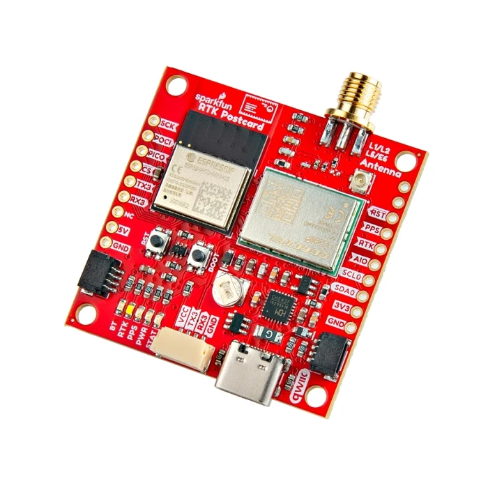

# Introduction

The SparkFun RTK Everywhere products are exceptional GNSS receivers out-of-box and can be used with little or no configuration. This RTK Everywhere Product Manual provides detailed descriptions of all the available features of the RTK products.

The line of RTK Everywhere products offered by SparkFun all run identical firmware. The [RTK Everywhere firmware](https://github.com/sparkfun/SparkFun_RTK_Everywhere_Firmware) and this guide cover the following products:

-   <figure markdown>
	
	<figcaption markdown>
	[SparkFun RTK EVK (GPS-24342)](https://www.sparkfun.com/products/24342)
	</figcaption>
	</figure>

	

	[Hookup Guide](https://docs.sparkfun.com/SparkFun_RTK_EVK/){ .md-button .md-button--primary }
	

-   <figure markdown>
	
	<figcaption markdown>
	[SparkFun RTK Postcard (GPS-26916)](https://www.sparkfun.com/sparkfun-rtk-postcard.html)
	</figcaption>
	</figure>

	

	[Hookup Guide](https://docs.sparkfun.com/SparkFun_RTK_Postcard/){ .md-button .md-button--primary }
	

-   <figure markdown>
	
	<figcaption markdown>
	[SparkFun RTK Torch (GPS-25662)](https://www.sparkfun.com/products/25662)
	</figcaption>
	</figure>

	

	[Quickstart Guide](https://docs.sparkfun.com/SparkFun_RTK_Everywhere_Firmware/quickstart-torch/){ .md-button .md-button--primary }
	

	
 

	

	[Hookup Guide](https://docs.sparkfun.com/SparkFun_RTK_Torch/){ .md-button .md-button--primary }
	

Depending on the hardware platform different features may or may not be supported. We will denote each product in each section so that you know what is supported.

There are multiple ways to configure an RTK product:

- [Bluetooth](configure_with_bluetooth.md) - Good for in-field changes
- [WiFi](configure_with_wifi.md) - Good for in-field changes
- [Serial Terminal](configure_with_serial.md) - Requires a computer but allows for all configuration settings
- [Settings File](configure_with_settings_file.md) - Used for configuring multiple RTK devices identically
- [Ethernet](configure_with_ethernet.md) - RTK EVK only

The Bluetooth or Serial Terminal methods are recommended for most advanced configurations. Most, but not all settings are also available over WiFi but can be tricky to input via mobile phone.

If you have an issue, feature request, bug report, or a general question about the RTK firmware specifically we encourage you to post your comments on the [firmware's repository](https://github.com/sparkfun/SparkFun_RTK_Everywhere_Firmware/issues). If you feel like bragging or showing off what you did with your RTK product, we'd be thrilled to hear about it on the issues list as well!

Things like how to attach an antenna or other hardware-specific topics are best read on the Hookup Guides for the individual products.
