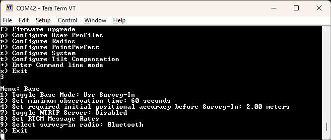
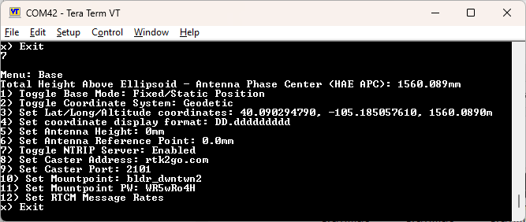
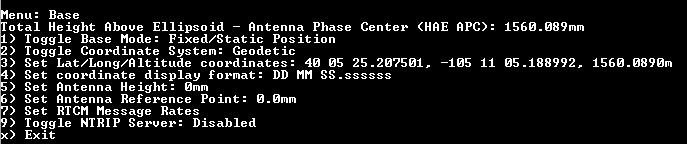
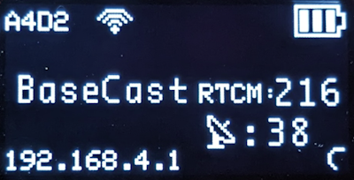
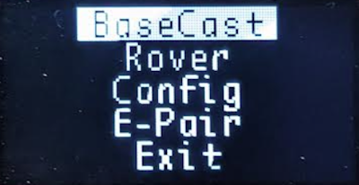

# Base Menu

<!--
Compatibility Icons
====================================================================================

:material-radiobox-marked:{ .support-full title="Feature Supported" }
:material-radiobox-indeterminate-variant:{ .support-partial title="Feature Partially Supported" }
:material-radiobox-blank:{ .support-none title="Feature Not Supported" }
-->

- EVK: :material-radiobox-marked:{ .support-full title="Feature Supported" }
- Postcard: :material-radiobox-marked:{ .support-full title="Feature Supported" }
- Torch: :material-radiobox-marked:{ .support-full title="Feature Supported" }

In addition to providing accurate local location fixes, SparkFun RTK devices can also serve as a correction source, also called a *Base*. The Base doesn't move and 'knows' where it is so it can calculate the discrepancies between the signals it is receiving and what it should be receiving. Said differently, the Base is told where it is, and that it's not moving. If the GPS signals say otherwise, the Base knows there was a disturbance in the ~~Force~~ ionosphere. These differences are the correction values passed to the Rover so that the Rover can have millimeter-level accuracy.

There are two types of bases: *Surveyed* and *Fixed*. A Surveyed Base is often a temporary base set up in the field. Called a **Survey-In**, this is less accurate but requires only 60 seconds to complete. A Fixed Base is much more accurate but the precise location at which the antenna is located must be known. A Fixed Base is often a structure with an antenna bolted to the side. Raw satellite signals are gathered for a few hours and then processed using Precision Point Position. We have a variety of tutorials that go into depth on these subjects but all you need to know is that all our RTK devices support both Survey-In and Fixed Base techniques.

Please see the following tutorials for more information:

-   <a href="https://learn.sparkfun.com/tutorials/813">
	<figure markdown>
	
	</figure>

	---

	**What is GPS RTK?**</a>

-   <a href="https://learn.sparkfun.com/tutorials/815">
	<figure markdown>
	
	</figure>

	---

	**Getting Started with u-center for u-blox**</a>

-   <a href="https://learn.sparkfun.com/tutorials/1362">
	<figure markdown>
	
	</figure>

	---

	**Setting up a Rover Base RTK System**</a>

-   <a href="https://learn.sparkfun.com/tutorials/1363">
	<figure markdown>
	
	</figure>

	---

	**How to Build a DIY GNSS Reference Station**</a>

## Mode

The Base Menu allows the user to select between Survey-In or Fixed Base setups.

<figure markdown>

<figcaption markdown>
Base Menu showing Survey-In Mode
</figcaption>
</figure>

In **Survey-In** mode, the minimum observation time can be set. The default is 60 seconds. The device will wait for the position accuracy to be better than 1 meter before a Survey-In is started. Don't be fooled; setting the observation time to 4 hours is not going to significantly improve the accuracy of the survey - use [PPP](https://learn.sparkfun.com/tutorials/how-to-build-a-diy-gnss-reference-station#gather-raw-gnss-data) instead.

<figure markdown>

<figcaption markdown>
Base Menu showing Fixed Base Mode with ECEF Coordinates
</figcaption>
</figure>

In **Fixed** mode, the coordinates of the antenna need to be set. These can be entered in ECEF or Geographic coordinates.

Once the device has been configured, a user enters Base mode by changing the mode in the [System Menu](menu_system.md).

If the device is configured for *Survey-In* base mode, the survey will begin. The mean standard deviation will be printed as well as the time elapsed. For most Survey-In setups, the survey will complete in around 60 seconds.

In *Fixed Base* mode the GNSS receiver will go into Base mode with the defined coordinates and immediately begin outputting RTCM correction data.

## NTRIP Server

**NTRIP** is where the real fun begins. The Base needs a method for getting the correction data to the Rover. This can be done using radios but that's limited to a few kilometers at best. If you've got WiFi reception, use the internet!

Enabling NTRIP will present a handful of new options seen below:

<figure markdown>

<figcaption markdown>
Settings for the NTRIP Servers
</figcaption>
</figure>

This is a powerful feature of the RTK line of products. The RTK device can be configured to transmit its RTCM directly over WiFi to up to **4 Casters**. This eliminates the need for a radio link between one Base and one Rover. Providing more than one caster is a unique RTK Everywhere feature that allows a single base installation to push corrections to a public Caster (such as RTK2Go) as well as payment-generating casters (such as [Onocoy](https://www.onocoy.com/) or [Geodnet](https://geodnet.com/)).

Once the NTRIP server is enabled you will need a handful of credentials:

- Local WiFi SSID and password
- A casting service such as [RTK2Go](http://www.rtk2go.com) or [Emlid](http://caster.emlid.com) (the port is almost always 2101)
- A mount point (required) and password (required)

If the NTRIP server is enabled the device will first attempt to connect to WiFi. Once WiFi connects the device will attempt to connect to the NTRIP mount point. Once connected, every second a few hundred bytes, up to ~2k, will be transmitted to your mount point.

The RTK device will monitor each NTRIP Server connection and automatically attempt to restart it if WiFi or if the Caster is disconnected.

## Commonly Use Coordinates

<figure markdown>

<figcaption markdown>
A list of common coordinates
</figcaption>
</figure>

For users who return to the same base position or monument, the coordinates can be saved to a 'Commonly Used Coordinates' list. A nickname and the X/Y/Z positions are saved to the list. Any record on the list can be loaded from the list into the X/Y/Z fields allowing quick switching without the need to hand record or re-enter coordinates from day-to-day repositioning of the base.

## RTCM Message Rates

<figure markdown>

<figcaption markdown>
</figcaption>
</figure>

When the device is in Base mode, the fix rate is set to 1Hz. This will override any Rover setting.

<figure markdown>

<figcaption markdown>
</figcaption>
</figure>

Additionally, RTCM messages are generated at a rate of 1Hz. If lower RTCM rates are desired the RTCM Rates menu can be used to modify the rates of any supported RTCM message. This can be helpful when using longer-range radios that have lower bandwidth.

## Supported Lat/Long Coordinate Formats

<figure markdown>

<figcaption markdown>
</figcaption>
</figure>

When entering coordinates for a fixed Base in Geodetic format, the following formats are supported:

- DD.ddddddddd (ie -105.184774720, 40.090335429)
- DDMM.mmmmmmm (ie -10511.0864832)
- DD MM.mmmmmmm (ie 40 05.42013)
- DD-MM.mmmmmmm (40-05.42013)
- DDMMSS.ssssss (-1051105.188992)
- DD MM SS.ssssss (-105 11 05.188992)
- DD-MM-SS.ssssss (40-05-25.2075)

<figure markdown>

<figcaption markdown>
Coordinates shown in DD MM SS.ssssss format
</figcaption>
</figure>

These coordinate formats are automatically detected and converted as needed. The coordinates are displayed in the format they are entered. If a different format is desired, the coordinate display format can be changed via the serial Base menu.

For more information about coordinate formats, check out this [online converter](https://www.earthpoint.us/convert.aspx).

## Base Cast

	<figure markdown>
	
	<figcaption markdown>
	SparkFun RTK EVK Mode Menu
	</figcaption>
	</figure>

Base Cast mode enables the following settings:

* Enables Base mode
* Enables NTRIP Caster mode
* Enables TCP on port 2101
* Enables WiFi AP mode on IP 192.168.4.1

This is helpful when using the RTK device in conjunction with a drone controller that expects connectivity to a near by Base over WiFi. All of these settings can be set manually; Base Cast mode just provides an easy and quick way to put the RTK device into the default mode compatible with most drone controllers.

	<figure markdown>
	
	<figcaption markdown>
	SparkFun RTK EVK Mode Menu
	</figcaption>
	</figure>

This mode can be entered from the [System Menu](menu_system.md), using the display menu (if a display is attached), or by setting the *System Initial State* to **BaseCast* via [Browser Config](configure_with_browswer).

## Assisted Base

An Assisted Base is where a temporary base is set up to Survey-In its location but is simultaneously provided RTCM corrections so that its Survey-In is done with very precise readings. An assisted base running a Survey-In removes much of the relative inaccuracies from a Rover-Base system. We've found an Assisted Base varies as little as 50mm RMS between intra-day tests, with accuracy within 65mm of a PPP of the same location, same day.

To set up an assisted base the RTK device should be located in a good reception area and provided with RTCM corrections. Let it obtain RTK Fix from a fixed position (on a tripod, for example) in *Rover* mode. Once an RTK fix is achieved, change the device to temporary *Base* mode (also called Survey-In). The device will take 60 seconds of positional readings, at which point the fixed position of the base will be set using RTK augmented coordinates. At this point, corrections provided to the base can be discontinued. The Base will begin outputting very accurate RTCM corrections that can be relayed to a rover that is in a less optimal reception setting.

Similarly, the RTK Facet L-Band can be set up as a relay: the L-Band device can be located in a good reception area, and then transmit very accurate corrections to a rover via Radio or internet link. Because the RTK Facet L-Band can generate its own corrections, you do not need to provide them during Survey-In. To set up an assisted base, set up an RTK Facet L-Band unit with a clear view of the sky, and let it obtain RTK Fix from a fixed position in *Rover* mode. Once an RTK fix is achieved, change the device to temporary *Base* mode. The device will take 60 seconds of positional readings, at which point the fixed position will be set using RTK fixed coordinates. The RTK Facet L-Band will then output very accurate RTCM corrections that can be relayed to a rover that is in a less optimal reception setting.
