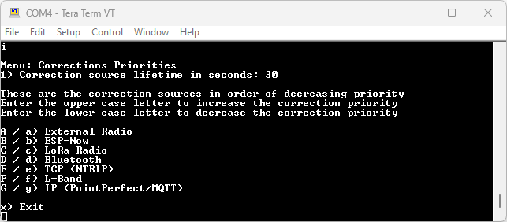

# Corrections Priorities

<!--
Compatibility Icons
====================================================================================

:material-radiobox-marked:{ .support-full title="Feature Supported" }
:material-radiobox-indeterminate-variant:{ .support-partial title="Feature Partially Supported" }
:material-radiobox-blank:{ .support-none title="Feature Not Supported" }
-->

- EVK: :material-radiobox-marked:{ .support-full title="Feature Supported" }
- Facet mosaic: :material-radiobox-marked:{ .support-full title="Feature Supported" }
- Postcard: :material-radiobox-marked:{ .support-full title="Feature Supported" }
- Torch: :material-radiobox-marked:{ .support-full title="Feature Supported" }

<figure markdown>

<figcaption markdown>
RTK Corrections Priorities Menu
</figcaption>
</figure>

To achieve an RTK Fix, SparkFun RTK products must be provided with a correction source. An RTK device can obtain corrections from a variety of sources. Below is the list of possible sources (not all platforms support all sources) and their default priorities. These defaults generally follow the rule that a shorter baseline between Rover and Base leads to more accurate, and therefore more valuable, correction data:

- External Radio (100m [OSR](https://docs.sparkfun.com/SparkFun_RTK_Everywhere_Firmware/correction_sources/#osr-vs-ssr) Baseline) - Two packet radios communicating directly between a Rover and Base
- ESP-Now (100m OSR Baseline) - Two RTK devices communicating directly between a Rover and Base over the built-in 2.4GHz radios
- LoRa Radio (1km OSR Baseline) - Two RTK devices communicating directly between a Rover and Base over the built-in LoRa radios (RTK Torch only)
- Bluetooth (10+km OSR/SSR Baseline) - A Rover obtaining corrections over Bluetooth to a phone/tablet that has an NTRIP Client
- USB (10+km OSR/SSR Baseline) - A Rover obtaining corrections over USB to a phone/tablet that has an NTRIP Client
- TCP (NTRIP) (10+km OSR/SSR Baseline) - A Rover obtaining corrections over WiFi to a NTRIP Caster
- L-Band (100km SSR Baseline) - A Rover obtaining corrections from a geosynchronous satellite
- IP (PointPerfect/MQTT) (100+km SSR Baseline) - A Rover obtaining corrections from an SSR type correction service over WiFi or cellular

The *Corrections Priorities* menu allows a user to specify which correction source should be given priority. For example, if corrections are provided through ESP-NOW and IP PointPerfect simultaneously, the corrections from IP PointPerfect will be discarded because the ESP-NOW source has a higher priority. This prevents the RTK engine from receiving potentially mixed correction signals.

<figure markdown>

<figcaption markdown>
</figcaption>
</figure>

In the serial terminal menu, pressing a letter will increase or decrease the position of a priority. For example, in the image above, pressing **G** will raise the `L-Band` priority above `TCP (NTRIP)`.

Additionally, this menu gives visibility into which corrections are currently being received and utilized (marked with the *) by the RTK engine.

The *Correction source lifetime in seconds* setting dictates how many seconds an active source must be silent before it is marked as inactive.

In the web config page:

- Clicking a source increases its priority
- Clicking the highest priority source makes it the lowest priority
- Clicking 'Reset to Defaults' will restore the priorities to their default setting
- Click 'Save Configuration', then 'Exit and Reset' to save the changes

<figure markdown>

<figcaption markdown>
</figcaption>
</figure>

Please see [Correction Sources](correction_sources.md) for a description of where to obtain corrections.

Please also see [Corrections Source Icons](./displays.md#corrections-source-icons) for details of the corrections source icon displayed on the OLED.
