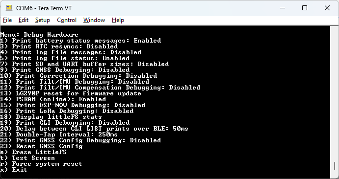

# Hardware

<!--
Compatibility Icons
====================================================================================

:material-radiobox-marked:{ .support-full title="Feature Supported" }
:material-radiobox-indeterminate-variant:{ .support-partial title="Feature Partially Supported" }
:material-radiobox-blank:{ .support-none title="Feature Not Supported" }
-->

- EVK: :material-radiobox-marked:{ .support-full title="Feature Supported" }
- Facet mosaic: :material-radiobox-marked:{ .support-full title="Feature Supported" }
- Postcard: :material-radiobox-marked:{ .support-full title="Feature Supported" }
- Torch: :material-radiobox-marked:{ .support-full title="Feature Supported" }
- TX2: :material-radiobox-marked:{ .support-full title="Feature Supported" }

!!! note
	The debug menus are meant for debugging and development, and not for regular configuration. The unit will not be damaged if these settings are modified, but support is limited. 

<figure markdown>

<figcaption markdown>
Hardware Debug Menu
</figcaption>
</figure>

From the System Menu, pressing 'h' will enter the Hardware Debug Menu. This menu controls various advanced settings, mostly used to enable the printing of verbose debugging messages.

- 1 - Turn on/off the regular battery status message over serial config.
- 3 - Turn on/off the display of TP time sync information.
- 4 - Turn on/off the debug messages associated with log files, including the parsing results of NMEA and other messages.
- 5 - Turn on/off the regular logging size status message over serial config.
- 7 - Display the movement of bytes through the GNSS circular buffer to consumers including the SD logging buffer.
- 9 - Turn on/off verbose GNSS library messages.
- 10 - Turn on/off the display of interactions with the PointPerfect ZTP interface.
- 11 - Turn on/off debug messages associated with the set up of the Tilt/IMU sensor.
- 12 - Turn on/off debug messages when NMEA messages are modified with Tilt information.
- 13 - Used for upgrading the GNSS receiver.
- 14 - Enable/disable the use of PSRAM.
- 15 - Turn on/off debug messages when the ESP-NOW radio is active.
- 16 - Turn on/off debug messages when the LoRa radio is active.
- 18 - Display how many bytes are being used by littleFS.
- 19 - Display verbose messages while the CLI is being used.
- 20 - Set the amount of time between each LIST message being sent over the UART.
- 21 - Set the amount of time required between button presses to signify a double-tap.
- 22 - Turn on/off debug messages during the GNSS is configuration process.
- 23 - Erase the GNSS configuration to force a re-configuration.
- e - Format the littleFS file system.
- t - Display test screen.
- r - Restart the device.