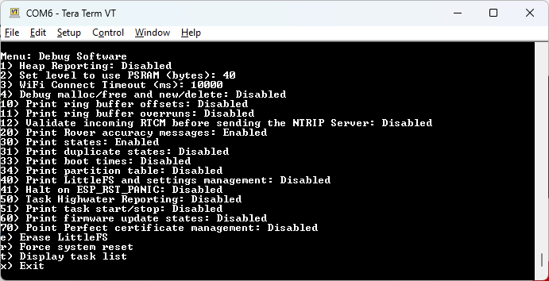

# Software

<!--
Compatibility Icons
====================================================================================

:material-radiobox-marked:{ .support-full title="Feature Supported" }
:material-radiobox-indeterminate-variant:{ .support-partial title="Feature Partially Supported" }
:material-radiobox-blank:{ .support-none title="Feature Not Supported" }
-->

- EVK: :material-radiobox-marked:{ .support-full title="Feature Supported" }
- Facet mosaic: :material-radiobox-marked:{ .support-full title="Feature Supported" }
- Postcard: :material-radiobox-marked:{ .support-full title="Feature Supported" }
- Torch: :material-radiobox-marked:{ .support-full title="Feature Supported" }
- TX2: :material-radiobox-marked:{ .support-full title="Feature Supported" }

!!! note
	The debug menus are meant for debugging and development, and not for regular configuration. The unit will not be damaged if these settings are modified, but support is limited. 

<figure markdown>

<figcaption markdown>
Software Debug Menu
</figcaption>
</figure>

From the System Menu, pressing 'd' will enter the Software Debug Menu. This menu controls various advanced settings, mostly used to enable the printing of verbose debugging messages.

- 1 - 