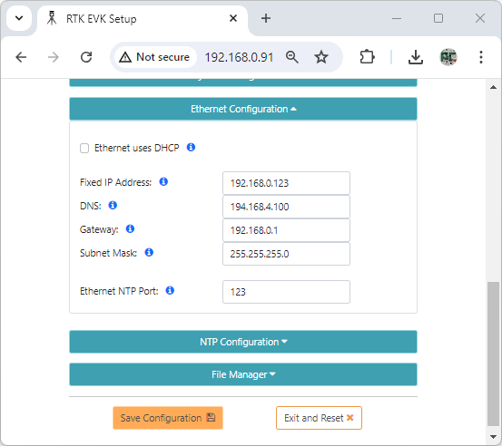

# Ethernet Menu

<!--
Compatibility Icons
====================================================================================

:material-radiobox-marked:{ .support-full title="Feature Supported" }
:material-radiobox-indeterminate-variant:{ .support-partial title="Feature Partially Supported" }
:material-radiobox-blank:{ .support-none title="Feature Not Supported" }
-->

- EVK: :material-radiobox-marked:{ .support-full title="Feature Supported" }
- Postcard: [:material-radiobox-blank:{ .support-none }]( title ="Feature Not Supported" )
- Torch: [:material-radiobox-blank:{ .support-none }]( title ="Feature Not Supported" )

An Ethernet-equipped RTK device sends and receives NTRIP correction data via Ethernet. It can also send NMEA and RTCM navigation messages to an external TCP Server via Ethernet. It also has a dedicated Configure-Via-Ethernet (*Cfg Eth*) mode which is accessed via the MODE button and OLED display.

By default, the RTK device will use DHCP to request an IP Address from the network Gateway. But you can optionally configure it with a fixed IP Address.

When enabled, the "Ethernet / WiFi Failover" option allows the firmware to automatically switch from Ethernet to WiFi should Ethernet become unavailable. Should WiFi become unavailable, the firmware will reconnect to Ethernet if it is now available.

<figure markdown>

<figcaption markdown>
The RTK EVK Ethernet menu - with DHCP selected
</figcaption>
</figure>

<figure markdown>

<figcaption markdown>
The RTK EVK Ethernet menu - with a fixed IP address selected
</figcaption>
</figure>

<figure markdown>

<figcaption markdown>
The RTK EVK Web Config page - Ethernet configuration with fixed IP address
</figcaption>
</figure>
