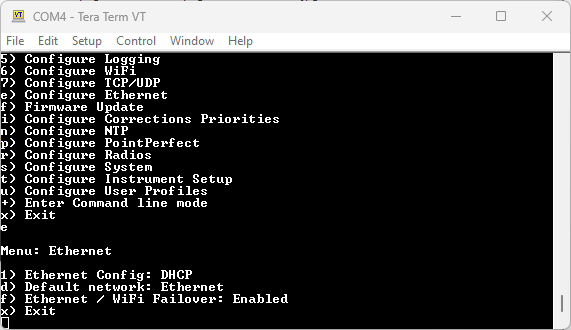

# Ethernet Menu

Torch:  

An Ethernet-equipped RTK device sends and receives NTRIP correction data via Ethernet. It can also send NMEA and RTCM navigation messages to an external TCP Server via Ethernet. It also has a dedicated Configure-Via-Ethernet (*Cfg Eth*) mode which is accessed via the MODE button and OLED display.

By default, the RTK device will use DHCP to request an IP Address from the network Gateway. But you can optionally configure it with a fixed IP Address.

*The Reference Station Ethernet menu - with DHCP selected*

*The Reference Station Ethernet menu - with a fixed IP address selected*

## Ethernet TCP Client

Ethernet-equipped RTK devices can act as an Ethernet TCP Client, sending NMEA and / or UBX data to a remote TCP Server. This is similar to the WiFi TCP Client mode on our other RTK products, but the data can be sent to any server based on its IP Address or URL. E.g. to connect to a local machine via its IP Address, select option "c" and then enter the IP Address using option "h"

The above animation was generated using [TCP_Server.py](https://github.com/sparkfun/SparkFun_RTK_Everywhere_Firmware/blob/main/Firmware/Tools/TCP_Server.py).