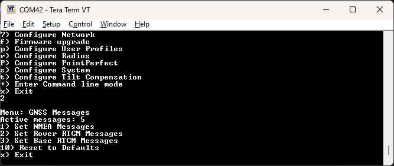
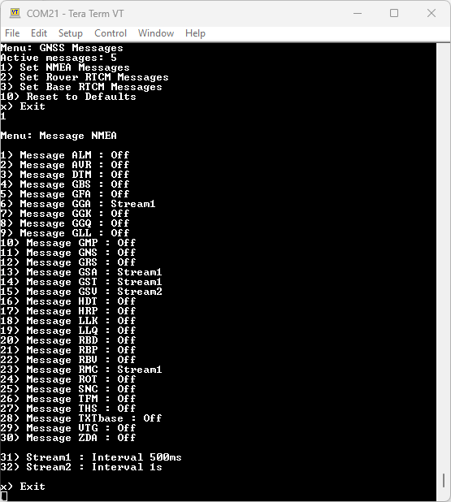
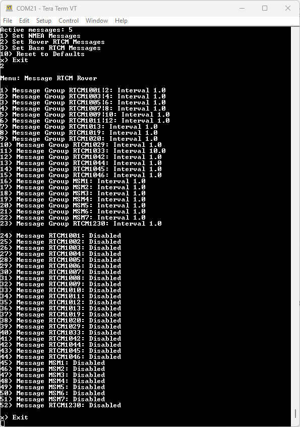

# Messages Menu

<!--
Compatibility Icons
====================================================================================

:material-radiobox-marked:{ .support-full title="Feature Supported" }
:material-radiobox-indeterminate-variant:{ .support-partial title="Feature Partially Supported" }
:material-radiobox-blank:{ .support-none title="Feature Not Supported" }
-->

- EVK: :material-radiobox-marked:{ .support-full title="Feature Supported" }
- Facet mosaic: :material-radiobox-marked:{ .support-full title="Feature Supported" }
- Postcard: :material-radiobox-marked:{ .support-full title="Feature Supported" }
- Torch: :material-radiobox-marked:{ .support-full title="Feature Supported" }

!!! note
	Do you have a RTK Facet mosaic? Skip to the dedicated [RTK Facet mosaic](#rtk-facet-mosaic) section below as the menu options are different.

<figure markdown>

<figcaption markdown>
The messages configuration menu
</figcaption>
</figure>

From this menu, a user can control the output of various NMEA, RTCM, and other messages. Any enabled message will be broadcast over Bluetooth *and* recorded to SD (if available).

Because of the large number of configurations possible, we provide a few common settings:

- Reset to Defaults

RTCM can also be enabled in both Rover and Base modes.

## Reset to Defaults

This will turn off all messages and enable the following messages:

- NMEA-GGA, NMEA-GSA, NMEA-GST, NMEA-GSV, NMEA-RMC

These five NMEA sentences are commonly used with SW Maps for general surveying.

## Individual Messages

<figure markdown>

<figcaption markdown>
Configuring the NMEA messages
</figcaption>
</figure>

There are a large number of messages supported (listed below). Each message sub-menu will present the user with the ability to set the message report rate.

Each message rate input controls which messages are disabled (0) and how often the message is reported (1 = one message reported per 1 fix, 5 = one report every 5 fixes). The message rate range is 0 to 20.

!!! note
	The message report rate is the *number of fixes* between message reports. In the image above, with GSV set to 4, the NMEA GSV message will be produced once every 4 fixes. Because the device defaults to a 4Hz fix rate, the GSV message will appear once per second.

The following messages are supported for Bluetooth output and logging (if available):

- NMEA-DTM
- NMEA-GBS
- NMEA-GGA
- NMEA-GLL
- NMEA-GNS
- NMEA-GRS
- NMEA-GSA
- NMEA-GST
- NMEA-GSV
- NMEA-RMC
- NMEA-ROT
- NMEA-THS
- NMEA-VTG
- NMEA-ZDA

- RTCM3x-1001
- RTCM3x-1002
- RTCM3x-1003
- RTCM3x-1004
- RTCM3x-1005
- RTCM3x-1006
- RTCM3x-1007
- RTCM3x-1009
- RTCM3x-1010
- RTCM3x-1011
- RTCM3x-1012
- RTCM3x-1013
- RTCM3x-1019
- RTCM3x-1020
- RTCM3x-1033
- RTCM3x-1042
- RTCM3x-1044
- RTCM3x-1045
- RTCM3x-1046

- RTCM3x-1071
- RTCM3x-1072
- RTCM3x-1073
- RTCM3x-1074
- RTCM3x-1075
- RTCM3x-1076
- RTCM3x-1077
- RTCM3x-1081
- RTCM3x-1082
- RTCM3x-1083
- RTCM3x-1084
- RTCM3x-1085
- RTCM3x-1086
- RTCM3x-1087
- RTCM3x-1091
- RTCM3x-1092
- RTCM3x-1093
- RTCM3x-1094

- RTCM3x-1095
- RTCM3x-1096
- RTCM3x-1097
- RTCM3x-1104
- RTCM3x-1111
- RTCM3x-1112
- RTCM3x-1113
- RTCM3x-1114
- RTCM3x-1115
- RTCM3x-1116
- RTCM3x-1117
- RTCM3x-1121
- RTCM3x-1122
- RTCM3x-1123
- RTCM3x-1124
- RTCM3x-1125
- RTCM3x-1126
- RTCM3x-1127

## RTK Facet mosaic

The GNSS Messages menu on the RTK Facet mosaic is different, due to the way message streams and itervals need to be configured.

### RTK Facet mosaic NMEA Messages

Opening the _Configure GNSS Messages \ Set NMEA Messages_ menu produces:

<figure markdown>

<figcaption markdown>
The NMEA messages configuration menu on RTK Facet mosaic
</figcaption>
</figure>

The available NMEA messages are:

- NMEA-ALM (GPS Almanac Data)
- NMEA-AVR (Trimble Navigation proprietary sentence)
- NMEA-DTM (Datum Reference)
- NMEA-GBS (GNSS Satellite Fault Detection)
- NMEA-GFA (GNSS Fix Accuracy and Integrity)
- NMEA-GGA (GPS Fix Data)
- NMEA-GGK (Trimble Navigation proprietary sentence)
- NMEA-GGQ (Leica Real-Time Position with CQ)
- NMEA-GLL (Geographic Position - Latitude/Longitude)
- NMEA-GMP (GNSS Map Projection Fix Data)
- NMEA-GNS (GNSS Fix Data)
- NMEA-GRS (GNSS Range Residuals)
- NMEA-GSA (GNSS DOP and Active Satellites)
- NMEA-GST (GNSS Pseudorange Error Statistics)
- NMEA-GSV (GNSS Satellites in View)
- NMEA-HDT (Heading, True)
- NMEA-HRP (Heading, Roll, Pitch)
- NMEA-LLK (Leica Local Position and GDOP)
- NMEA-LLQ (Leica Local Position and Quality)
- NMEA-RBD (Rover-Base Direction)
- NMEA-RBP (Rover-Base Position)
- NMEA-RBV (Rover-Base Velocity)
- NMEA-RMC (Recommended Minimum Specific GNSS Data)
- NMEA-ROT (Rate of Turn)
- NMEA-SNC (NTRIP Client Status)
- NMEA-TFM (Used Coordinate Transformation Messages)
- NMEA-THS (True Heading and Status)
- NMEA-TXTbase (RTCM 1029 Text Transmission)
- NMEA-VTG (Course Over Ground and Ground Speed)
- NMEA-ZDA (Time and Date)

To output and log a message, set its Stream to _Stream1_ or _Stream2_. To disable a message, set its Stream to _Off_.

E.g. for the ALM message, select "1" to change the Stream from _Off_ to _Stream1_. Select "1" again to select _Stream2_. Select "1" again to return to _Off_.

Menu options 31 and 32 can be used to set the interval of _Stream1_ and _Stream2_. The interval can be adjusted between 10 milliseconds and 60 seconds. Be careful when setting the interval to less than 200 milliseconds, the load on the X5 CPU and the SD card will increase significantly.

### RTK Facet mosaic RTCM Messages

Opening the _Configure GNSS Messages \ Set Rover RTCM Messages_ menu produces:

<figure markdown>

<figcaption markdown>
The Rover RTCM messages configuration menu on RTK Facet mosaic
</figcaption>
</figure>

RTCM messages are configured differently compared to NMEA. It is necessary to first set the message interval for the message group, then enable / disable the individual message. Streams do not apply to RTCM messages.

E.g. to set the RTCM1230 message to an interval of 10 seconds:

- Use menu option 23 to set an interval of 10.0
- Use menu option 52 to toggle RTCM1230 to Enabled

The interval can be adjusted between 0.1 and 600.0 seconds.

Enabling the MSM7 message group causes the Multiple Signal Message - Type 7 to be output: RTCM1077 + RTCM1087 + RTCM1097 + RTCM1107 + RTCM1117 + RTCM1127 + RTCM1137
