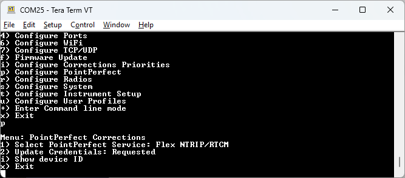
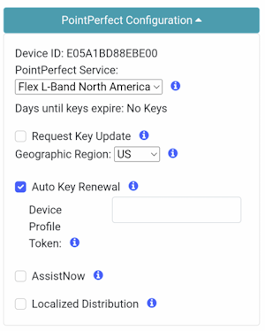
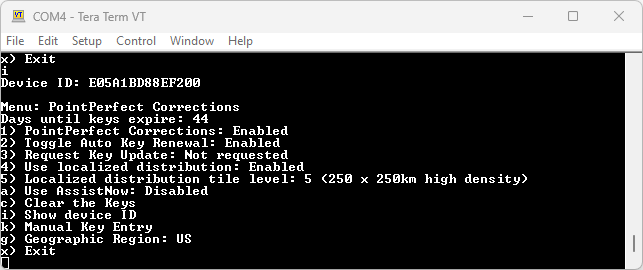
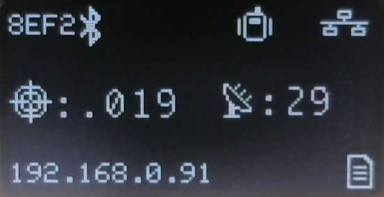

# PointPerfect Menu

<!--
Compatibility Icons
====================================================================================

:material-radiobox-marked:{ .support-full title="Feature Supported" }
:material-radiobox-indeterminate-variant:{ .support-partial title="Feature Partially Supported" }
:material-radiobox-blank:{ .support-none title="Feature Not Supported" }
-->

- EVK: :material-radiobox-marked:{ .support-full title="Feature Supported" }
- Facet mosaic: :material-radiobox-marked:{ .support-full title="Feature Supported" }
- Postcard: :material-radiobox-marked:{ .support-full title="Feature Supported" }
- Torch: :material-radiobox-marked:{ .support-full title="Feature Supported" }

<figure markdown>

<figcaption markdown>
Configuring PointPerfect settings over serial
</figcaption>
</figure>

<figure markdown>

<figcaption markdown>
PointPerfect Configuration Menu
</figcaption>
</figure>

## Coverage

[<figure markdown>
](https://www.u-blox.com/en/pointperfect-service-coverage)
<figcaption markdown>
PointPerfect Coverage map including L-Band and IP delivery methods
</figcaption>
</figure>

SparkFun RTK devices are equipped to get corrections from a service called PointPerfect.

PointPerfect has the following benefits and challenges:

- Most SparkFun RTK devices come with either a pre-paid subscription or one month of free access to PointPerfect. Please see the product details for your device. [Go here for RTK Torch](https://www.sparkfun.com/rtk_torch_registration) to enable or renew your subscription. [Go here for RTK EVK](https://www.sparkfun.com/rtk_evk_registration) subscriptions.
- A SparkFun RTK device can obtain RTK Fix anywhere there is [coverage](https://www.u-blox.com/en/pointperfect-service-coverage). This includes the US contiguous 48 states, the EU, Korea, as well as parts of Australia, Brazil, and Canada.

	!!! note
		 L-Band coverage is not available in some of these areas.

- You don't need to be near a base station - the PPP-RTK model covers entire continents.
- Because PointPerfect uses a model instead of a dedicated base station, it is cheaper. However, the RTK Fix is not as accurate (3-6cm) as compared to getting corrections from a dedicated base station (2cm or better but depends on the baseline distance).
- Because PointPerfect uses a model instead of a dedicated base station, convergence times (the time to get to RTK Fix) can vary widely. Expect to wait multiple minutes for an RTK Fix, as opposed to corrections from a dedicated that can provide an RTK Fix in seconds.

PointPerfect corrections are obtained by two methods:

- **L-Band**: Corrections are transmitted from a geosynchronous satellite. Coverage is limited to the US contiguous 48 states. This delivery method requires special equipment (see the [RTK EVK](https://www.sparkfun.com/products/24342) and [RTK Facet mosaic](https://www.sparkfun.com/sparkpnt-rtk-facet-mosaic-l-band.html) for more information). No cellular or internet connection is required.
    - Sadly, u-blox are suspending the EU L-Band service with effect from March 10th 2025. The L-Band service will only be available in the contiguous USA from that date.
- **IP**: Corrections are transmitted over the internet. The RTK device will need access to a WiFi or Ethernet network. For WiFi, this is most commonly a hotspot on a cell phone so this delivery method is generally confined to areas with cellular and/or other WiFi coverage.

!!! note
	It is important that you set your Geographic Region correctly, via the menu or web config page, as this determines both the IP correction distribution topic and the L-Band frequency (on L-Band-capable products).

## Localized Corrections

The u-blox PointPerfect Localized correction service via MQTT (IP) offers quick delivery of high precision accuracy by providing your device only the SPARTN corrections applicable to your location. This feature offers several advantages over the traditional continental streams, including significantly reduced bandwidth requirements and seamless transition between regions.

- **Reduced bandwidth requirements:** PointPerfect Localized can reduce bandwidth requirements by up to 80%. This is a significant advantage for applications sensitive to bandwidth constraints, such as those that operate in remote areas or use low-power devices.
- **Retained Privacy:** PointPerfect Localized retains user privacy by not sending the device's precise location to the service to receive correction data. This is done by using a general node-based location system.

PointPerfect Localized works by dividing the coverage area into a grid of tiles. Each tile contains a set of nodes that are relevant to a user located within that tile. Unlike the continental level approach where a device subscribes to the continental level topic, in the localized approach a device subscribes to the localized node topic based on its location. This ensures that the device receives only the correction data that is relevant to its location, greatly reducing the required bandwidth.

<figure markdown>

<figcaption markdown>
Comparison of PointPerfect Localized node density
</figcaption>
</figure>

The above image shows the Localized tiles for Level 2 (250 x 250km sparse, ~90-100km separation) vs. Level 5 (250 x 250km high density, ~30km separation).

Localized distribution can be enabled via the serial menu (PointPerfect menu - option 'p'), or the web config page. On serial, option '4' will enable or disable localized distribution; option '5' selects the tile level.

<figure markdown>

<figcaption markdown>
Configuring PointPerfect settings over serial
</figcaption>
</figure>

## Registration

All SparkFun RTK products can operate in RTK mode out-of-the-box using corrections from a local base or a RTCM provider (see [Correction Sources](correction_sources.md)). If you wish to use PointPerfect corrections, the device must be registered before it is allowed on the PointPerfect network. To facilitate this, please [obtain your device ID](https://docs.sparkfun.com/SparkFun_RTK_Everywhere_Firmware/menu_pointperfect/#obtaining-the-device-id) through the software interface and visit the registration page associated with your device:

- **RTK EVK:** please visit the [RTK EVK registration page](https://www.sparkfun.com/rtk_evk_registration)
- **RTK Facet mosaic:** please visit the [RTK Facet mosaic registration page](https://www.sparkfun.com/rtk_facet_mosaic_registration)
- **RTK Postcard:** please visit the [RTK Postcard registration page](https://www.sparkfun.com/rtk_postcard_registration)
- **RTK Torch:** please visit the [RTK Torch registration page](https://www.sparkfun.com/rtk_torch_registration)

## Keys

Once registered, to gain access to the PointPerfect system, the device must be given WiFi. The RTK device will automatically obtain **keys**. These keys allow the decryption of corrections.

PointPerfect keys are valid for a maximum of 56 days. During that time, the RTK device can operate normally without the need to update keys. However, when the keys are set to expire in 28 days or less, the RTK device will attempt to log in to WiFi at each power on. If WiFi is not available, it will continue normal operation.

On RTK L-Band equipped devices, if the keys fully expire, the device will continue to receive the L-Band signal but will be unable to decrypt the signal. The RTK EVK will continue to have extraordinary accuracy (we've seen better than 0.15m HPA) but not the centimeter-level accuracy that comes with RTK.

!!! note
	All RTK devices (including those equipped with L-Band) are capable of receiving RTCM corrections over traditional means including NTRIP data over Bluetooth or a serial radio, WiFi or Ethernet (depending on model).

<figure markdown>

<figcaption markdown>
Display showing 14 days until keys expire
</figcaption>
</figure>

On devices that have a display, the unit will display various prompts to aid the user in obtaining keys as needed.

## PointPerfect Serial Menu

<figure markdown>

<figcaption markdown>
PointPerfect Menu
</figcaption>
</figure>

The *Days until keys expire* inform the user how many days the unit has until it needs to connect to WiFi or Ethernet to obtain new keys.

- **1** - Enable / disable the use of PointPerfect corrections.
- **2** - Enable / disable the automatic attempts at WiFi / Ethernet connections when key expiry is in less than 28 days.
- **3** - Trigger an immediate attempt to connect over WiFi / Ethernet and provision the device (if no keys are available) or update the keys (if provisioning has already been completed). Depending on which RTK product you have and which interfaces are connected, it may be necessary to exit the menus for the provisioning / update to take place.
- **4** - Enable / disable [localized distribution](#localized-corrections)
- **5** - When localized distribution is enabled, option 5 can be used to select the tile level. The default is Level 5 - 250 x 250km tiles, high density.
- **c** - Clear the current keys.
- **i** - Display the Device ID. This is needed when a SparkFun RTK device needs to be added to the PointPerfect system. This is needed when first registering the device, or modifying a subscription. [Go here for RTK Torch](https://www.sparkfun.com/rtk_torch_registration) to enable or renew your subscription. [Go here for RTK EVK](https://www.sparkfun.com/rtk_evk_registration) subscriptions.
- **k** - Bring up the Manual Key Entry menu.
- **g** - Set the Geographic Region. The default is US; but EU, Australia, Korea and Japan can also be selected. This is an important setting since it sets both the IP correction distribution topic (MQTT, IP) and the L-Band frequency (on L-Band-capable models (RTK EVK)).

## Obtaining the Device ID

The device ID is unique to each RTK device and must be entered by SparkFun into the PointPerfect network.

<figure markdown>

<figcaption markdown>
Device ID within the serial menu
</figcaption>
</figure>

<figure markdown>

<figcaption markdown>
Device ID within the WiFi Config page
</figcaption>
</figure>

This ID can be obtained by using option **i** from the *PointPerfect* menu or by opening the PointPerfect section within the [WiFi Config](https://docs.sparkfun.com/SparkFun_RTK_Everywhere_Firmware/configure_with_wifi/) interface in the PointPerfect Configuration section.

## Manual Key Entry

<figure markdown>

<figcaption markdown>
Manual Key Entry Menu
</figcaption>
</figure>

Because of the length and complexity of the keys, we do not recommend you manually enter them. This menu is most helpful for displaying the current keys.

Option '1' will allow a user to enter their Device Profile Token. This is the token that is used to provision a device on a PointPerfect account. By default, users may use the SparkFun token but must pay SparkFun for the annual service fee. If an organization would like to administer its own devices, the token can be changed here.

## L-Band Decryption Icon

<figure markdown>

<figcaption markdown>
Three-pronged satellite dish indicating L-Band reception
</figcaption>
</figure>

<figure markdown>

<figcaption markdown>
Three-pronged satellite dish indicating L-Band reception on EVK
</figcaption>
</figure>

On devices that have a display, upon successful reception and decryption of PointPerfect corrections delivered over L-Band, the satellite dish icon will increase to a three-pronged icon. As the unit's fix increases the cross-hair will indicate a basic 3D solution, a double blinking cross-hair will indicate a floating RTK solution, and a solid double cross-hair will indicate a fixed RTK solution.

## Error Messages

There are various messages that may be reported by the device. Here is a list of explanations and resolutions.

### No SSIDs

	Error: Please enter at least one SSID before getting keys

This message is seen when no WiFi network credentials (SSID and password) have been entered. The device needs WiFi to obtain the keys to decrypt the packets provided by PointPerfect. Enter your home/office/cellular hotspot WiFi SSID and password and try again.

### Not Whitelisted

	This device is not whitelisted. Please contact support@sparkfun.com to get your subscription activated. Please reference device ID: [device ID]

This message is seen whenever the PointPerfect service is not aware of the given device. Please use the subscription form or contact support@sparkfun.com with your device ID (see [Obtaining the Device ID](#obtaining-the-device-id) above). [Go here for RTK Torch](https://www.sparkfun.com/rtk_torch_registration) subscriptions. [Go here for RTK EVK](https://www.sparkfun.com/rtk_evk_registration) subscriptions.

### Device Deactivated

	This device has been deactivated. Please contact support@sparkfun.com to renew the PointPerfect subscription. Please reference device ID: [device ID]

This message is seen whenever the device's subscription has lapsed. [Go here for RTK Torch](https://www.sparkfun.com/rtk_torch_registration) subscriptions. [Go here for RTK EVK](https://www.sparkfun.com/rtk_evk_registration) subscriptions. Alternatively contact support@sparkfun.com with your device ID (see [Obtaining the Device ID](menu_pointperfect.md#obtaining-the-device-id) above).

### HTTP response error -11 - Read Timeout

The connection to PointPerfect did not respond. Please try again or try a different WiFi network or access point (AP).
