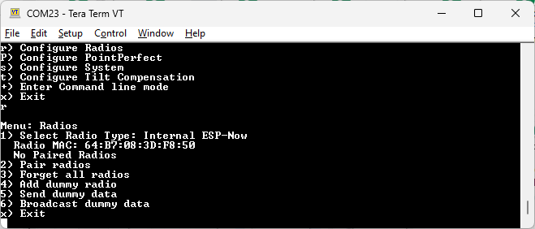
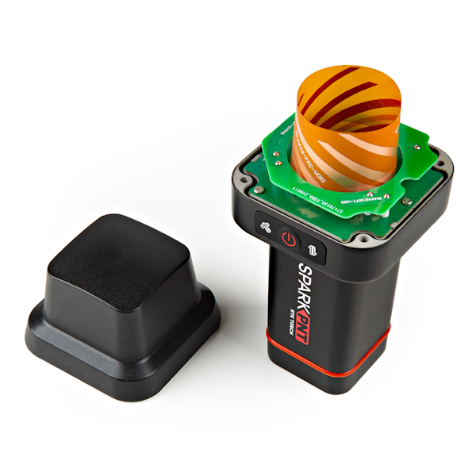
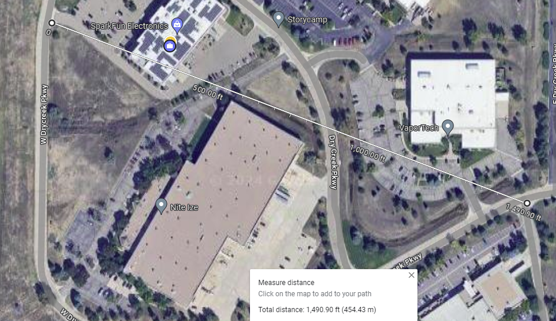
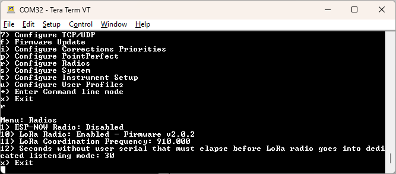

# Radios Menu

Pressing 'r' from the main menu will open the Configure Radios menu. This allows a user to configure various radios that are available on a given RTK platform.

## ESP-NOW

<!--
Compatibility Icons
====================================================================================

:material-radiobox-marked:{ .support-full title="Feature Supported" }
:material-radiobox-indeterminate-variant:{ .support-partial title="Feature Partially Supported" }
:material-radiobox-blank:{ .support-none title="Feature Not Supported" }
-->

- EVK: :material-radiobox-marked:{ .support-full title="Feature Supported" }
- Facet mosaic: :material-radiobox-marked:{ .support-full title="Feature Supported" }
- Postcard: :material-radiobox-marked:{ .support-full title="Feature Supported" }
- Torch: :material-radiobox-marked:{ .support-full title="Feature Supported" }

Note: All SparkFun RTK devices contain a radio capable of direct Rover-Base communication over 2.4GHz called ESP-NOW. The RTK Torch is currently the only RTK device with a built-in Long Range (LoRa) radio. 

<figure markdown>

<figcaption markdown>
Radio menu showing ESP-NOW
</figcaption>
</figure>

ESP-NOW is a 2.4GHz protocol that is built into the internal ESP32 microcontroller; the same microcontroller that provides Bluetooth and WiFi. ESP-NOW does not require WiFi or an Access Point. This is most useful for connecting a Base to Rover (or multiple Rovers) without the need for an external radio. Simply turn two SparkFun RTK products on, enable their radios, and data will be passed between units. Additionally, ESP-NOW supports point-to-multipoint transmissions. This means a Base can transmit to multiple Rovers simultaneously.

ESP-NOW is a free radio included in every RTK product and works well, but it has a few limitations:

<figure markdown>

<figcaption markdown>
</figcaption>
</figure>

1. Limited range. You can expect two RTK devices to be able to communicate approximately 250m (845 ft) line of sight but any trees, buildings, or objects between the Base and Rover will degrade reception. This range is useful for many applications but may not be acceptable for some applications. We recommend using ESP-NOW as a quick, free, and easy way to get started with Base/Rover setups. If your application needs longer RF distances consider cellular NTRIP, WiFi NTRIP, or an external serial telemetry radio plugged into the **RADIO** port.
2. ESP-NOW can co-exist with WiFi, but both the receiver and transmitter must be on the same [WiFi channel](https://docs.sparkfun.com/SparkFun_RTK_Everywhere_Firmware/menu_radios/#setting-the-wifi-channel).

### Pairing

<figure markdown>

<figcaption markdown>
</figcaption>
</figure>

For most setups, pairing is not needed. By default, any device that has ESP-NOW enabled will receive communication from any other device that has ESP-NOW enabled. This allows a Base to communicate with dozens of Rovers without further configuration, simply enable ESP-NOW and enter Base mode. However, if you are in an environment where other Base units may be setup and broadcasting using the ESP-NOW radios, then devices can be paired to each other to limit communication to only paired devices.

!!! note
	A Base can be paired with multiple Rovers. This allows multipoint or multicasting of corrections to multiple Rovers.

On devices that have a display, clicking the Mode button will display the various submenus. Double-clicking on E-Pair will put the unit into ESP-NOW pairing mode. If another RTK device is detected nearby in pairing mode, they will exchange MAC addresses and pair with each other. Multiple Rover units can be paired to a Base in the same fashion.

<figure markdown>

<figcaption markdown>
Radio configuration through WiFi
</figcaption>
</figure>

The radio system can be configured over WiFi. The radio subsystem is disabled by default. Enabling the radio to ESP-NOW will expose the above options. The unit's radio MAC can be seen as well as a button to forget all paired radios. This button is disabled until the 'Enable Forget All Radios' checkbox is checked. If a Base device has no paired radios, it will broadcast its correction data to any listening Rover by default.

<figure markdown>

<figcaption markdown>
Radio menu showing ESP-NOW
</figcaption>
</figure>

A serial menu is also available. This menu allows users to enter pairing mode, change the channel (ie, set of frequencies) used for communication, view the unit's current Radio MAC, the MAC addresses of any paired radios, as well as the ability to remove all paired radios from memory.

### Setting the WiFi Channel

<figure markdown>

<figcaption markdown>
Radio menu showing channel 11
</figcaption>
</figure>

All devices must be on the same WiFi channel to communicate over ESP-NOW. Option **4 - Current channel** shows the current channel and allows a user to select a new one. Allowable channel numbers are 1 to 14. By default, devices will communicate on Channel 1. A user may select any channel they prefer.

!!! note
	ESP-NOW can operate at the same time as WiFi but the user should be aware of the channel numbers of the devices. When a device connects to a WiFi network, the ESP-NOW channel number may be altered by the WiFi radio so that the RTK device can communicate with the WiFi Access Point.

Using a single device to communicate corrections to multiple devices (no WiFi involved) is the most common use case for ESP-NOW.

Using WiFi on one of the devices in an ESP-NOW network is possible. Take the example of a Base that needs to communicate corrections over ESP-NOW and will also be pushing the corrections to a Caster over NTRIP using WiFi: The Base is started, WiFi is activated, and the channel is overwritten to 9 (for example) when the device connects to the Access Point. All Rovers in the area who wish to obtain corrections over ESP-NOW also need to have their channels set to 9.

Using multiple devices on *different* WiFi networks, while attempting to use them in an ESP-NOW network, is likely impossible because the device's channel numbers will be modified to match the different channels of the Access Points.

## LoRa

<!--
Compatibility Icons
====================================================================================

:material-radiobox-marked:{ .support-full title="Feature Supported" }
:material-radiobox-indeterminate-variant:{ .support-partial title="Feature Partially Supported" }
:material-radiobox-blank:{ .support-none title="Feature Not Supported" }
-->

- EVK: :material-radiobox-blank:{ .support-none title="Feature Not Supported" }
- Facet mosaic: :material-radiobox-blank:{ .support-none title="Feature Not Supported" }
- Postcard: :material-radiobox-blank:{ .support-none title="Feature Not Supported" }
- Torch: :material-radiobox-marked:{ .support-full title="Feature Supported" }

<figure markdown>

<figcaption markdown>
RTK Torch's combination GNSS, 2.4GHz, and 915MHz antenna
</figcaption>
</figure>

The RTK Torch has a built-in 1W LoRa radio that allows Base to Rover communication. This radio is based on the STM32WLE5CC which contains a microcontroller and a LoRa radio. Attached to this radio is a 1W power amplifier. The radio transmits in the ISM band from 902 to 928MHz and is legal to use in North America and South America. The radio implements frequency hopping spread spectrum (FHSS) techniques as well as LoRa modulation to maximize transmission distance while switching frequencies to abide by FCC requirements. Additionally, the LoRa system supports multipoint allowing one Base to communicate with dozens of Rovers.

!!! note
	RTK Torch LoRa radio uses a different frequency hopping algorithm from other radios that SparkFun sells. Therefore, RTK Torches are currently only compatible with each other and cannot be used interoperably with other LoRa or 915MHz radios.

<figure markdown>

<figcaption markdown>
1500ft (450m) range between Base and Rover using LoRa radios
</figcaption>
</figure>

The RTK Torch has an internal planar 915MHz antenna allowing good reception in harsh environments. Above is shown a non-line-of-sight test between a Base setup on a tripod on the ground transmitting to a Rover that was able to achieve RTK Fix using corrections over the LoRa radio. This test included multiple large commercial buildings blocking or partially blocking the transmission as well as multiple trees and berms.

<figure markdown>

<figcaption markdown>
1.83 mile (2.95km) range between Base and Rover using LoRa radios
</figcaption>
</figure>

The 1 Watt power output of the radio allows for long range transmissions when obstacles are fewer. Above is a line-of-sight test using a Base unit with line-of-sight to a near by hill-top measuring approximately (ok, with great accuracy) 1.83 miles (2.95km) away.

### Configuration

<figure markdown>

<figcaption markdown>
Configuring the LoRa radio
</figcaption>
</figure>

From the radios menu, the LoRa radio can be enabled and configured.

!!! tip "Don't see a LoRa menu?"
	Support was added starting in version v1.4. Please upgrade the [ESP32 firmware](firmware_update_esp32.md) on your device. Additionally, you may need to update the firmware on the [LoRa radio firmware](firmware_update_stm32.md).

The *LoRa Coordination Frequency* must be the same between all Base and Rovers. The default is usually sufficient but if other RTK Torches are operating LoRa radios in the area, switching frequencies will allow multiple networks to operate simultaneously.

The *Seconds without user serial that must elapse before LoRa radio goes into dedicated listening mode* is our longest user setting name to date! Because of hardware limitations, the device cannot communicate over USB at the same time it communicates with the LoRa radio. For normal Rover operation in the field where a device is usually connected over Bluetooth or other wireless protocols, LoRa operation happens seamlessly and this setting can be ignored. But if a device is connected over USB, and no serial input is received over USB for 30 seconds (default), the USB connection will be severed and LoRa communication will be prioritized. A user may want to increase this timeout if a system is communicating with the device over USB, or decrease it if a device is connected to USB (ie, for charging) and LoRa communication should initiate as quickly as possible.

!!! note
	If a timeout has occurred, USB communication can be restored by unplugging and plugging the cable back in.
