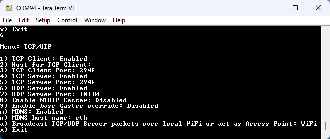

# TCP/UDP Menu

<!--
Compatibility Icons
====================================================================================

:material-radiobox-marked:{ .support-full title="Feature Supported" }
:material-radiobox-indeterminate-variant:{ .support-partial title="Feature Partially Supported" }
:material-radiobox-blank:{ .support-none title="Feature Not Supported" }
-->

- Torch: :material-radiobox-marked:{ .support-full title="Feature Supported" }
- EVK: :material-radiobox-marked:{ .support-full title="Feature Supported" }

NMEA data is generally consumed by a GIS application or Data Collector. These messages can be transmitted over a variety of transport methods. This section focuses on the delivery of NMEA messages via TCP and UDP.

<figure markdown>

<figcaption markdown>
TCP/UDP Menu showing various Client and Server options
</figcaption>
</figure>

## TCP Client and Server

The RTK device supports connection over TCP. The TCP Client sits on top of the network layer (WiFi or Ethernet) and sends position data to one or more computers or cell phones for display. Some Data Collector software (such as [Vespucci](gis_software.md#vespucci)) requires that the SparkFun RTK device connect as a TCP Client. Other software (such as [QGIS](gis_software.md#qgis)) requires that the SparkFun RTK device acts as a TCP Server. Both are supported.

!!! note
	Currently for WiFi: TCP is only supported while connected to local WiFi, not AP mode. This means the device will need to be connected to a WiFi network, such as a mobile hotspot, before TCP connections can occur.

<figure markdown>

<figcaption markdown>
</figcaption>
</figure>

If either Client or Server is enabled, a port can be designated. By default, the port is 2947 (registered as [*GPS Daemon request/response*](https://tcp-udp-ports.com/port-2948.htm)) but any port 0 to 65535 is supported.

<figure markdown>

<figcaption markdown>
</figcaption>
</figure>

The above animation was generated using [TCP_Server.py](https://github.com/sparkfun/SparkFun_RTK_Everywhere_Firmware/blob/main/Firmware/Tools/TCP_Server.py).

## UDP Server

NMEA messages can also be broadcast via UDP on Ethernet and WiFi, rather than TCP. If enabled, the UDP Server will begin broadcasting NMEA data over the specific port (default 10110).
