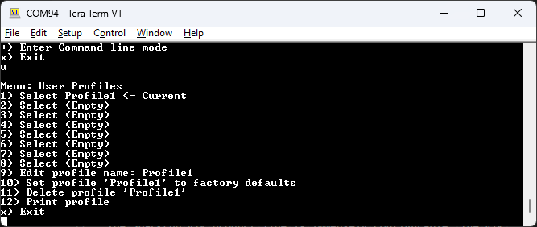

# User Profiles Menu

<!--
Compatibility Icons
====================================================================================

:material-radiobox-marked:{ .support-full title="Feature Supported" }
:material-radiobox-indeterminate-variant:{ .support-partial title="Feature Partially Supported" }
:material-radiobox-blank:{ .support-none title="Feature Not Supported" }
-->

- Torch: :material-radiobox-marked:{ .support-full title="Feature Supported" }
- EVK: :material-radiobox-marked:{ .support-full title="Feature Supported" }

<figure markdown>

<figcaption markdown>
User Profiles Menu
</figcaption>
</figure>

Profiles are a very powerful feature. A profile is a complete copy of all the settings on the RTK product. Switching profiles changes all the settings in one step. This is handy for creating a complex setup for surveying, and a different setup for an NTRIP-enabled base station. Rather than changing the variety of parameters, a user can simply switch profiles.

Profiles can be selected, renamed, reset to defaults, and completely erased from the **User Profiles** menu.

## User Profile Selection via Display

<figure markdown>

<figcaption markdown>
Multiple Profiles on Menu
</figcaption>
</figure>

On devices that have a display, if more than one profile is defined, the profiles will be displayed and selectable by using the **Power/Setup** button. Only the first 7 characters of a profile's name will be shown on the menu. Once a profile has been selected, the device will reboot using that profile.
