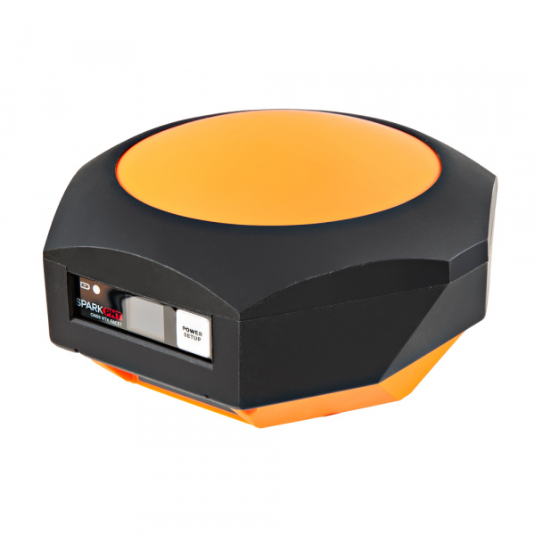
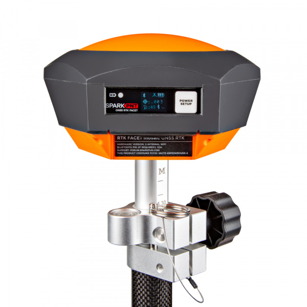
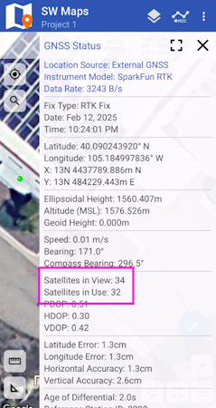
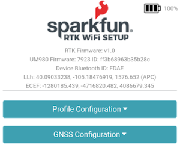
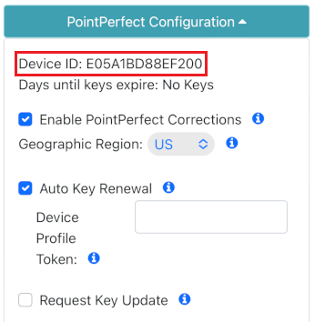
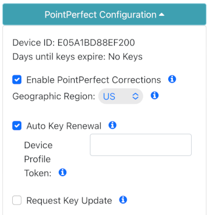
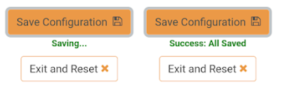
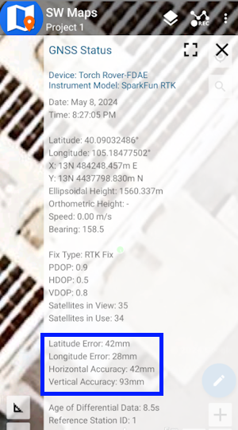

# Quick Start - RTK Facet mosaic

<figure markdown>

<figcaption markdown>
</figcaption>
</figure>

This quick start guide will get you started in 10 minutes or less. For the full product manual, please proceed to the [**Introduction**](index.md).

Are you using [Android](#android) or [iOS](#ios)?

## Android

1. Download [SW Maps](https://play.google.com/store/apps/details?id=np.com.softwel.swmaps). This may not be the GIS software you intend to do your data collection, but SW Maps is free and makes sure everything is working correctly out of the box.

	<figure markdown>
	
	<figcaption markdown>
	Download SW Maps for Android
	</figcaption>
	</figure>

2. Mount the hardware:

	- For RTK Facet mosaic: Attach the RTK to a 5/8" 11-TPI standard surveying pole or to a [monopole](https://www.sparkfun.com/telescopic-surveying-pole.html) using the included [thread adapter](https://www.sparkfun.com/products/17546) if needed (Figure 1).

	<figure markdown>
	
	<figcaption markdown>
	Figure 1
	</figcaption>
	</figure>

3. Turn on the RTK Facet mosaic device by pressing the Power button for 3 to 4 seconds until the OLED display illuminates.

4. From your cell phone, open Bluetooth settings and pair it with a new device. You will see a list of available Bluetooth devices. Select the ‘Facet mosaicX5 Rover-3AF1’. The '3AF1' is the last four digits of the device's MAC address and will vary depending on the device (Figure 3).

	<figure markdown>
	
	<figcaption markdown>
	Figure 3
	</figcaption>
	</figure>

5. Once paired, open SW Maps. Select ‘New Project’ and give your project a name like ‘RTK Project’.

6. Press the SW Maps icon in the top left corner of the home screen and select **External GNSS Connection**. You should see the ‘Facet mosaicX5 Rover-3AF1’ in the list. Select it. Confirm that the *Instrument Model* is **SparkFun RTK**, then press the ‘Connect’ button in the bottom right corner (Figure 4). SW Maps will show a warning that the instrument height is 0m. That’s ok.

	<figure markdown>
	
	<figcaption markdown>
	Figure 4
	</figcaption>
	</figure>

7. Once connected, you should see the Bluetooth icon on the RTK device OLED display.

8. Now put the device outside with a clear view of the sky. GNSS doesn’t work indoors or near windows. Press the SW Maps icon in the top left corner of the home screen and select **GNSS Status**. Within about 30 seconds you should see 10 or more satellites in view (SIV) (Figure 5). More SIV is better. We regularly see 30 or more SIV. The horizontal positional accuracy (HPA) will start at around 10 meters and begin to decrease. The lower the HPA the more accurate your position. This accuracy should be below 1m in normal mode.

	<figure markdown>
	
	<figcaption markdown>
	Figure 5
	</figcaption>
	</figure>

Press the target icon in the top-left corner of the map to view your position.

You can now use your RTK device to measure points with good (meter) accuracy. If you need extreme accuracy (down to 8mm) continue reading the [RTK Crash Course](#rtk-crash-course).

## iOS

The software options for Apple iOS are much more limited because Apple products do not support Bluetooth SPP. That's ok! The SparkFun RTK products support Bluetooth Low Energy (BLE) which *does* work with iOS.

1. Download [SW Maps for iOS](https://apps.apple.com/us/app/sw-maps/id6444248083). This may not be the GIS software you intend to do your data collection, but SW Maps is free and makes sure everything is working correctly out of the box.

	<figure markdown>
	
	<figcaption markdown>
	Download SW Maps for iOS
	</figcaption>
	</figure>

2. Mount the hardware:

	- For RTK Facet mosaic: Attach the RTK to a 5/8" 11-TPI standard surveying pole or to a [monopole](https://www.sparkfun.com/telescopic-surveying-pole.html) using the included [thread adapter](https://www.sparkfun.com/products/17546) if needed (Figure 1).

	<figure markdown>
	
	<figcaption markdown>
	Figure 1
	</figcaption>
	</figure>

3. Turn on the RTK Facet mosaic device by pressing the Power button for 3 to 4 seconds until the OLED display illuminates.

4. Open SW Maps. Select ‘New Project’ and give your project a name like ‘RTK Project’.

5. Press the SW Maps icon in the top left corner of the home screen and select Bluetooth GNSS. You will need to agree to allow a Bluetooth connection. Set the *Instrument Model* to **Generic NMEA (Bluetooth LE)**. Press 'Scan' and your RTK device should appear. Select it then press the ‘Connect’ button in the bottom right corner.

6. Once connected, you should see the Bluetooth icon on the RTK device OLED display.

7. Now put the device outside with a clear view of the sky. GNSS doesn’t work indoors or near windows. Press the SW Maps icon in the top left corner of the home screen and select **GNSS Status**. Within about 30 seconds you should see 10 or more satellites in view (SIV) (Figure 3). More SIV is better. We regularly see 30 or more SIV. The horizontal positional accuracy (HPA) will start at around 10 meters and begin to decrease. The lower the HPA the more accurate your position. This accuracy should be below 1m in normal mode.

	<figure markdown>
	
	<figcaption markdown>
	Figure 3
	</figcaption>
	</figure>

You can now use your RTK device to measure points with good (meter) accuracy. If you need extreme accuracy (down to 8mm) continue reading the [RTK Crash Course](#rtk-crash-course).

## RTK Crash Course

To get millimeter accuracy we need to provide the RTK unit with correction values. Corrections, often called RTCM, help the RTK unit refine its position calculations. RTCM (Radio Technical Commission for Maritime Services) can be obtained from a variety of sources but they fall into three buckets: Commercial, Public, and Civilian Reference Stations.

See [Corrections Sources](correction_sources.md) for a breakdown of the options and the pros and cons of each. For this quickstart, we'll be showing two examples: using PointPerfect L-Band for $50 a month (a little less accurate but nation-wide coverage) and PointOne Nav for $50 a month (maximum accuracy, gaps in the coverage area).

## PointPerfect Corrections

One of the great features of the RTK Facet mosaic is that it has the ability to get corrections from PointPerfect over L-Band. No need for NTRIP credentials! [Contact SparkFun](https://www.sparkfun.com/rtk_facet_mosaic_registration) with your device ID, pay a monthly fee of $50 per month (as of this writing) and your device will obtain credentials and start receiving corrections anywhere in the contiguous USA.

[<figure markdown>
](./img/PointPerfect/pointperfect_coverage_l-band.jpg)
<figcaption markdown>
PointPerfect L-Band coverage map
</figcaption>
</figure>

Steps to use PointPerfect:

1. Power on the RTK Facet mosaic device by pressing the Power button for 3 to 4 seconds until the OLED display illuminates.

2. Put the RTK Facet mosaic into WiFi config mode by first tapping the power button. The OLED display will show a menu of choices. Tap the power button until **Config** is highlighted, then give the power button a quick double-tap to select config mode. Detailed instructions are available in [Configure with Browser](./configure_with_browser.md).

3. From your phone, connect to the WiFi network *RTK Config*. You should be redirected to the WiFi Config page. If you are not, open a browser (Chrome is preferred) and type **rtk.local** or **192.168.4.1** into the address bar.

	<figure markdown>
	
	<figcaption markdown>
	SparkFun RTK WiFi Configuration Interface
	</figcaption>
	</figure>

4. Under the [*PointPerfect Configuration* menu](menu_pointperfect.md), make a note of your Device ID.

	<figure markdown>
	
	<figcaption markdown>
	PointPerfect Configuration Menu
	</figcaption>
	</figure>

5. [Contact SparkFun](https://www.sparkfun.com/rtk_facet_mosaic_registration) with your Device ID and pay a monthly fee of $50 per month (as of this writing). It can take up to two business days for registration to complete. For now, press **Exit and Reset** and enjoy your RTK Facet mosaic without corrections.

6. Once your Device ID resitration is complete, put the RTK Facet mosaic back into WiFi config mode by tapping the power button. The OLED display will show a menu of choices. Tap the power button until **Config** is highlighted, then give the power button a quick double-tap to select config mode.

7. From your phone, connect to the WiFi network *RTK Config*. You should be redirected to the WiFi Config page. If you are not, open a browser (Chrome is preferred) and type **rtk.local** or **192.168.4.1** into the address bar.

	<figure markdown>
	
	<figcaption markdown>
	SparkFun RTK WiFi Configuration Interface
	</figcaption>
	</figure>

8. Under the *WiFi Configuration* menu, give the device WiFi credentials for your local WiFi. This can be the cellphone hotspot if local WiFi is not available.

	<figure markdown>
	
	<figcaption markdown>
	WiFi Menu containing one network
	</figcaption>
	</figure>

9. Under the [*PointPerfect Configuration* menu](menu_pointperfect.md), **Enable PointPefect Corrections** and select your **Geographic Region**.

	<figure markdown>
	
	<figcaption markdown>
	PointPerfect Configuration Menu
	</figcaption>
	</figure>

	!!! note
		It is important that you set your Geographic Region correctly, via the menu or web config page, as this determines both the IP correction distribution topic and the L-Band frequency (on L-Band-capable products). Sadly, u-blox are suspending their EU L-Band service on March 10th 2025. L-Band coverage will only be available in the contiguous USA from that date.

10. Click **Save Configuration**. The device will record all settings in a few seconds. Then press **Exit and Reset**. The unit will now reboot.

	<figure markdown>
	
	<figcaption markdown>
	Saving... then All Saved
	</figcaption>
	</figure>

After the reboot, the device will connect to WiFi, obtain keys, and begin applying corrections. Assuming you are outside, after a few minutes of receiving PointPerfect corrections to the device, connect to the RTK Facet mosaic over SW Maps (or other) and the device will enter RTK Float, then RTK Fix (usually under 3 minutes). You can now take positional readings with millimeter accuracy!

<figure markdown>

<figcaption markdown>
SW Maps showing positional accuracy
</figcaption>
</figure>

## NTRIP Example

If you decide to use a service that provides NTRIP (as opposed to PointPerfect) we need to feed that data into your SparkFun RTK device. In this example, we will use PointOneNav and SW Maps.

1. Create an account on [PointOneNav](https://app.pointonenav.com/trial?src=sparkfun).

	!!! note
		This service costs $50 per month at the time of writing.

2. Open SW Maps and connect to the RTK device over Bluetooth.

3. Once connected, open the SW Maps menu again (top left corner) and you will see a new option; click on ‘NTRIP Client'.

4. Enter the credentials provided by PointOneNav and click Connect (Figure 1). Verify that *Send NMEA GGA* is checked.

	<figure markdown>
	
	<figcaption markdown>
	Figure 1
	</figcaption>
	</figure>

5. Corrections will be downloaded every second from PointOneNav using your phone’s cellular connection and then sent down to the RTK device over Bluetooth. You don't need a very fast internet connection or a lot of data; it's only about 530 bytes per second.

Assuming you are outside, as soon as corrections are sent to the device, the bubble in SW Maps will turn Orange (RTK Float). Once RTK Fix is achieved (usually under 30 seconds) the bubble will turn Green and the HPA will be below 20mm (Figure 2). You can now take positional readings with millimeter accuracy!

<figure markdown>

<figcaption markdown>
Figure 2
</figcaption>
</figure>

In SW Maps, the position bubble will turn from Blue (regular GNSS fix), then to Orange (RTK Float), then to Green (RTK Fix) (Figure 3).

<figure markdown>

<figcaption markdown>
Figure 3
</figcaption>
</figure>

RTK Fix will be maintained as long as there is a clear view of the sky and corrections are delivered to the device every few seconds.

## Common Gotchas

- High-precision GNSS works best with a clear view of the sky; it does not work indoors or near a window. GNSS performance is generally *not* affected by clouds or storms. Trees and buildings *can* degrade performance but usually only in very thick canopies or very near tall building walls. GNSS reception is very possible in dense urban centers with skyscrapers but high-precision RTK may be impossible.
- The location reported by the RTK device is the location of the antenna element; it's *not* the location of the pointy end of the stick. Lat and Long are fairly easy to obtain but if you're capturing altitude be sure to do additional reading on ARPs (antenna reference points) and how to account for the antenna height in your data collection software.
- An internet connection is required for most types of RTK. RTCM corrections can be transmitted over other types of connections (such as serial telemetry radios). See [Correction Transport](correction_transport.md) for more details.
