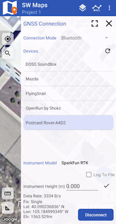
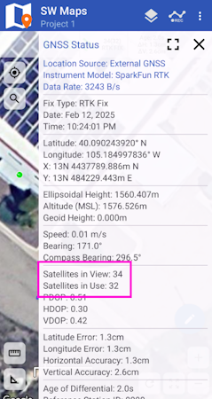

# Quick Start - RTK Postcard

<figure markdown>

<figcaption markdown>
</figcaption>
</figure>

This quick start guide will get you started in 10 minutes or less. For the full product manual, please proceed to the [**Introduction**](index.md).

Are you using [Android](#android) or [iOS](#ios)?

## Android

1. Download [SW Maps](https://play.google.com/store/apps/details?id=np.com.softwel.swmaps). This may not be the GIS software you intend to do your data collection, but SW Maps is free and makes sure everything is working correctly out of the box.

	<figure markdown>
	
	<figcaption markdown>
	Download SW Maps for Android
	</figcaption>
	</figure>

2. Connect the antenna.

	- The RTK Postcard has its own [hookup guide](http://docs.sparkfun.com/SparkFun_RTK_Postcard/). At a minimum you will need to attach a L1/L2/L5 GNSS antenna. The screw on [helical](https://www.sparkfun.com/gnss-multi-band-l1-l2-l5-helical-antenna-sma.html) antenna works very well or [UFO](https://www.sparkfun.com/gnss-multi-band-l1-l2-l5-surveying-antenna-tnc-spk6618h.html) with a TNC cable for greater reception but with greater weight will work. Then head outside with a clear view of the sky.

3. Provide power.

	- Power the Postcard with USB or (optionally) the [Portability Shield](https://www.sparkfun.com/sparkfun-portability-shield.html) with an attached battery.

		<figure markdown>
		
		<figcaption markdown>
		Figure 2
		</figcaption>
		</figure>

4. From your cell phone, open Bluetooth settings and pair it with a new device. You will see a list of available Bluetooth devices. Select the ‘Postcard Rover-3AF1’. The '3AF1' is the last four digits of the device's MAC address and will vary depending on the device (Figure 3).

	<figure markdown>
	
	<figcaption markdown>
	Figure 3
	</figcaption>
	</figure>

5. Once paired, open SW Maps. Select ‘New Project’ and give your project a name like ‘RTK Project’.

6. Press the SW Maps icon in the top left corner of the home screen and select **Bluetooth GNSS**. You should see the ‘Postcard Rover-3AF1’ in the list. Select it. Confirm that the *Instrument Model* is **SparkFun RTK**, then press the ‘Connect’ button in the bottom right corner (Figure 4). SW Maps will show a warning that the instrument height is 0m. That’s ok.

	<figure markdown>
	
	<figcaption markdown>
	Figure 4
	</figcaption>
	</figure>

7. Make sure the GNSS antenna is outside with a clear view of the sky. GNSS doesn’t work indoors or near windows. Press the SW Maps icon in the top left corner of the home screen and select **GNSS Status**. Within about 30 seconds you should see 10 or more satellites in view (SIV) (Figure 5). More SIV is better. We regularly see 30 or more SIV. The horizontal positional accuracy (HPA) will decrease as more satellites are acquired. The lower the HPA the more accurate your position.

	<figure markdown>
	
	<figcaption markdown>
	Figure 5
	</figcaption>
	</figure>

To improve the accuracy (down to 10mm), you now need to provide the device with corrections. Continue reading the [RTK Crash Course](#rtk-crash-course).

## iOS

The software options for Apple iOS are much more limited because Apple products do not support Bluetooth SPP. That's ok! The SparkFun RTK products support Bluetooth Low Energy (BLE) which *does* work with iOS.

1. Download [SW Maps for iOS](https://apps.apple.com/us/app/sw-maps/id6444248083). This may not be the GIS software you intend to do your data collection, but SW Maps is free and makes sure everything is working correctly out of the box.

	<figure markdown>
	
	<figcaption markdown>
	Download SW Maps for iOS
	</figcaption>
	</figure>

2. Connect the antenna.

	- The RTK Postcard has its own [hookup guide](http://docs.sparkfun.com/SparkFun_RTK_Postcard/). At a minimum you will need to attach a L1/L2/L5 GNSS antenna. The screw on [helical](https://www.sparkfun.com/gnss-multi-band-l1-l2-l5-helical-antenna-sma.html) antenna works very well or [UFO](https://www.sparkfun.com/gnss-multi-band-l1-l2-l5-surveying-antenna-tnc-spk6618h.html) with a TNC cable for greater reception but with greater weight will work. Then head outside with a clear view of the sky.

3. Provide power.

	- Power the Postcard with USB or (optionally) the Portability Shield with an attached battery.

		<figure markdown>
		
		<figcaption markdown>
		Figure 2
		</figcaption>
		</figure>

4. Open SW Maps. Select ‘New Project’ and give your project a name like ‘RTK Project’.

5. Press the SW Maps icon in the top left corner of the home screen and select *Bluetooth GNSS*. You will need to agree to allow a Bluetooth connection. Set the *Instrument Model* to **Generic NMEA (Bluetooth LE)**. Press 'Scan' and your RTK device should appear.

	<figure markdown>
	
	<figcaption markdown>
	Figure 3
	</figcaption>
	</figure>

6. Select it then press the ‘Connect’ button in the bottom right corner.

	<figure markdown>
	
	<figcaption markdown>
	Figure 4
	</figcaption>
	</figure>

7. Make sure the GNSS antenna is outside with a clear view of the sky. GNSS doesn’t work indoors or near windows. Press the SW Maps icon in the top left corner of the home screen and select **GNSS Status**. Within about 30 seconds you should see 10 or more satellites in view (SIV) (Figure 5). More SIV is better. We regularly see 30 or more SIV. The horizontal positional accuracy (HPA) will decrease as more satellites are acquired. The lower the HPA the more accurate your position.

	<figure markdown>
	
	<figcaption markdown>
	Figure 5
	</figcaption>
	</figure>

To improve the accuracy (down to 10mm), you now need to provide the device with corrections. Continue reading the [RTK Crash Course](#rtk-crash-course).

## RTK Crash Course

To get millimeter accuracy we need to provide the RTK unit with correction values. Corrections, often called RTCM, help the RTK unit refine its position calculations. RTCM (Radio Technical Commission for Maritime Services) can be obtained from a variety of sources but they fall into three buckets: Commercial, Public, and Civilian Reference Stations.

See [Corrections Sources](correction_sources.md) for a breakdown of the options and the pros and cons of each. For this quickstart, we'll be showing you how to enable corrections using a monthly service called PointOneNav.

## NTRIP Example

1. Create an account on [PointOneNav](https://app.pointonenav.com/trial?src=sparkfun).

	!!! note
		This service costs $50 per month at the time of writing.

2. Open SW Maps and connect to the RTK device over Bluetooth.

3. Once connected, open the SW Maps menu again (top left corner) and you will see a new option; click on ‘NTRIP Client'.

4. Enter the credentials provided by PointOneNav and click Connect (Figure 1). Verify that *Send NMEA GGA* is checked.

	<figure markdown>
	
	<figcaption markdown>
	Figure 1
	</figcaption>
	</figure>

5. Corrections will be downloaded every second from PointOneNav using your phone’s cellular connection and then sent down to the RTK device over Bluetooth. You don't need a very fast internet connection or a lot of data; it's only about 530 bytes per second.

Assuming you are outside, as soon as corrections are sent to the device, the bubble in SW Maps will turn Orange (RTK Float). Once RTK Fix is achieved (usually under 30 seconds) the bubble will turn Green and the HPA will be below 20mm (Figure 2). You can now take positional readings with millimeter accuracy!

<figure markdown>

<figcaption markdown>
Figure 2
</figcaption>
</figure>

In SW Maps, the position bubble will turn from Blue (regular GNSS fix), then to Orange (RTK Float), then to Green (RTK Fix) (Figure 3).

<figure markdown>

<figcaption markdown>
Figure 3
</figcaption>
</figure>

RTK Fix will be maintained as long as there is a clear view of the sky and corrections are delivered to the device every few seconds.

## Common Gotchas

- High-precision GNSS works best with a clear view of the sky; it does not work indoors or near a window. GNSS performance is generally *not* affected by clouds or storms. Trees and buildings *can* degrade performance but usually only in very thick canopies or very near tall building walls. GNSS reception is very possible in dense urban centers with skyscrapers but high-precision RTK may be impossible.
- The location reported by the RTK device is the location of the antenna element. Lat and Long are fairly easy to obtain but if you're capturing altitude be sure to do additional reading on ARPs (antenna reference points) and how to account for the antenna height in your data collection software.
- An internet connection is required for most types of RTK. RTCM corrections can be transmitted over other types of connections (such as serial telemetry radios). The RTK EVK also supports PointPerfect L-Band geostationary satellite corrections through the built-in NEO-D9S corrections receiver. The L-Band corrections are encrypted and keys are required but, once your unit has them, corrections will be available for up to eight weeks. See [Correction Transport](correction_transport.md) for more details.
