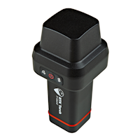

# Quick Start - RTK Torch

This quick start guide will get you started in 10 minutes or less. For the full product manual, please proceed to the [**Introduction**](index.md).

Are you using [Android](https://docs.sparkfun.com/SparkFun_RTK_Everywhere_Firmware/intro/#android) or [iOS](https://docs.sparkfun.com/SparkFun_RTK_Everywhere_Firmware/intro/#ios)?

## Android

1. Download [SW Maps](https://play.google.com/store/apps/details?id=np.com.softwel.swmaps). This may not be the GIS software you intend to do your data collection, but SW Maps is free and makes sure everything is working correctly out of the box.

    

    *Download SW Maps for Android*

2. Mount the hardware:

    * For RTK Torch: Attach the Torch to a 5/8" 11-TPI standard surveying pole or to a [monopole](https://www.amazon.com/AmazonBasics-WT1003-67-Inch-Monopod/dp/B00FAYL1YU) using the included [thread adapter](https://www.sparkfun.com/products/17546) (Figure 1).

    

    *Figure 1*

3. Turn on the RTK Torch device by pressing the Power button for 3 to 4 seconds until the two front LEDs illuminate (Figure 2). 

    

    *Figure 2*

5. From your cell phone, open Bluetooth settings and pair it with a new device. You will see a list of available Bluetooth devices. Select the ‘Torch Rover-3AF1’. The '3AF1' is the last four digits of the device's MAC address and will vary depending on the device (Figure 4).

    

    *Figure 4*

6. Once paired, open SW Maps. Select ‘New Project’ and give your project a name like ‘RTK Project’. 

7. Press the SW Maps icon in the top left corner of the home screen and select **Bluetooth GNSS**. You should see the Torch Rover-3AF1’ in the list. Select it. Confirm that the *Instrument Model* is **SparkFun RTK**, then press the ‘Connect’ button in the bottom left corner (Figure 5). SW Maps will show a warning that the instrument height is 0m. That’s ok. 

    

    *Figure 5*
8. Once connected, have a look at the Bluetooth LED on the RTK device. You should see the LED turn solid. You’re connected!

9. Now put the device outside with a clear view of the sky. GNSS doesn’t work indoors or near windows. Press the SW Maps icon in the top left corner of the home screen and select **Bluetooth GNSS**. Within about 30 seconds you should see 10 or more satellites in view (SIV) (Figure 7). More SIV is better. We regularly see 30 or more SIV. The horizontal positional accuracy (HPA) will start at around 10 meters and begin to decrease. The lower the HPA the more accurate your position. This accuracy is around 2m in normal mode.

    

    *Figure 7*

You can now use your RTK device to measure points with good (meter) accuracy. If you need extreme accuracy (down to 8mm) continue reading the [RTK Crash Course](https://docs.sparkfun.com/SparkFun_RTK_Everywhere_Firmware/intro/#rtk-crash-course).

## iOS

The software options for Apple iOS are much more limited because Apple products do not support Bluetooth SPP. That's ok! The SparkFun RTK products support Bluetooth Low Energy (BLE) which *does* work with iOS.

1. Download [SW Maps for iOS](https://apps.apple.com/us/app/sw-maps/id6444248083). This may not be the GIS software you intend to do your data collection, but SW Maps is free and makes sure everything is working correctly out of the box.

    

    *Download SW Maps for iOS*

2. Mount the hardware:

    * For RTK Torch: Attach the Torch to a 5/8" 11-TPI standard surveying pole or to a [monopole](https://www.amazon.com/AmazonBasics-WT1003-67-Inch-Monopod/dp/B00FAYL1YU) using the included [thread adapter](https://www.sparkfun.com/products/17546) (Figure 1).

    

    *Figure 1*

3. Turn on the RTK Torch device by pressing the Power button for 3 to 4 seconds until the two front LEDs illuminate (Figure 2). 

    

    *Figure 2*

9. Open SW Maps. Select ‘New Project’ and give your project a name like ‘RTK Project’. 

10. Press the SW Maps icon in the top left corner of the home screen and select Bluetooth GNSS. You will need to agree to allow a Bluetooth connection. Set the *Instrument Model* to **Generic NMEA (Bluetooth LE)**. Press 'Scan' and your RTK device should appear. Select it then press the ‘Connect’ button in the bottom left corner.

11. Once connected, have a look at the display on the RTK device. You should see the MAC address disappear and be replaced by the Bluetooth icon (Figure 6). You’re connected!

    

    *Figure 6*

12. Now put the device outside with a clear view of the sky. GNSS doesn’t work indoors or near windows. Within about 30 seconds you should see 10 or more satellites in view (SIV) (Figure 7). More SIV is better. We regularly see 30 or more SIV. The horizontal positional accuracy (HPA) will start at around 10 meters and begin to decrease. The lower the HPA the more accurate your position. If you wait a few moments, this will drop dramatically to around 0.3 meters (300mm = 1ft) or better. 

    

    *Figure 7*

You can now use your RTK device to measure points with very good (sub-meter) accuracy. If you need extreme accuracy (down to 10mm) continue reading the [RTK Crash Course](https://docs.sparkfun.com/SparkFun_RTK_Everywhere_Firmware/intro/#rtk-crash-course).

## RTK Crash Course

To get millimeter accuracy we need to provide the RTK unit with correction values. Corrections, often called RTCM, help the RTK unit refine its position calculations. RTCM (Radio Technical Commission for Maritime Services) can be obtained from a variety of sources but they fall into three buckets: Commercial, Public, and Civilian Reference Stations.

**Commercial Reference Networks**

These companies set up a large number of reference stations that cover entire regions and countries, but charge a monthly fee. They are often easy to use but can be expensive.

* [PointOneNav](https://app.pointonenav.com/trial?src=sparkfun) ($50/month) - US, EU, Australia, South Korea
* [Skylark](https://www.swiftnav.com/skylark) ($29 to $69/month) - US, EU, Japan, Australia
* [SensorCloud RTK](https://rtk.sensorcloud.com/pricing/) ($100/month) partial US, EU
* [Premium Positioning](https://www.premium-positioning.com) (~$315/month) partial EU
* [KeyNetGPS](https://www.keypre.com/KeynetGPS) ($375/month) North Eastern US
* [Hexagon/Leica](https://hxgnsmartnet.com/en-US) ($500/month) - partial US, EU

**Public Reference Stations**

 

*State Wide Network of Continuously Operating Reference Stations (CORS)*

Be sure to check if your state or country provides corrections for free. Many do! Currently, there are 21 states in the USA that provide this for free as a department of transportation service. Search ‘Wisconsin CORS’ as an example. Similarly, in France, check out [CentipedeRTK](https://docs.centipede.fr/). There are several public networks across the globe, be sure to google around!

**Civilian Reference Stations**

*The base station at SparkFun*

You can set up your own correction source. This is done with a 2nd GNSS receiver that is stationary, often called a Base Station. There is just the one-time upfront cost of the Base Station hardware. See the [Creating a Permanent Base](https://docs.sparkfun.com/SparkFun_RTK_Everywhere_Firmware/permanent_base/) document for more information.

## NTRIP Example

Once you have decided on a correction source we need to feed that data into your SparkFun RTK device. In this example, we will use PointOneNav and SW Maps.

1. Create an account on [PointOneNav](https://app.pointonenav.com/trial?src=sparkfun). **Note:** This service costs $50 per month at the time of writing.

2. Open SW Maps and connect to the RTK device over Bluetooth.

3. Once connected, open the SW Maps menu again (top left corner) and you will see a new option; click on ‘NTRIP Client'.

4. Enter the credentials provided by PointOneNav and click Connect (Figure 1). Verify that *Send NMEA GGA* is checked.

    

    *Figure 1*

5. Corrections will be downloaded every second from PointOneNav using your phone’s cellular connection and then sent down to the RTK device over Bluetooth. You don't need a very fast internet connection or a lot of data; it's only about 530 bytes per second.

Assuming you are outside, as soon as corrections are sent to the device, the bubble in SW Maps will turn Orange (RTK Float). Once RTK Fix is achieved (usually under 30 seconds) the bubble will turn Green and the HPA will be below 20mm (Figure 2). You can now take positional readings with millimeter accuracy!

*Figure 2*

In SW Maps, the position bubble will turn from Blue (regular GNSS fix), then to Orange (RTK Float), then to Green (RTK Fix) (Figure 3).

*Figure 3*

RTK Fix will be maintained as long as there is a clear view of the sky and corrections are delivered to the device every few seconds.

## Common Gotchas

* High-precision GNSS works best with a clear view of the sky; it does not work indoors or near a window. GNSS performance is generally *not* affected by clouds or storms. Trees and buildings *can* degrade performance but usually only in very thick canopies or very near tall building walls. GNSS reception is very possible in dense urban centers with skyscrapers but high-precision RTK may be impossible.

* The location reported by the RTK device is the location of the antenna element; it's *not* the location of the pointy end of the stick. Lat and Long are fairly easy to obtain but if you're capturing altitude be sure to do additional reading on ARPs (antenna reference points) and how to account for the antenna height in your data collection software. Note: This rule does not apply when tilt compensation is activated. Go here for more information.

* An internet connection is required for most types of RTK. RTCM corrections can be transmitted over other types of connections (such as serial telemetry radios). See [Correction Transport](correction_transport.md) for more details.

## RTK Torch PointPerfect Keys

The RTK Torch has the ability to get corrections from PointPerfect.

Facet L-Band is unique in that it must obtain keys to decrypt the signal from a geosynchronous satellite. Here are the steps to do so:

1. Turn on your RTK Facet L-Band by pressing the POWER button until the display shows ‘SparkFun RTK' then you can release it (Figure 1). 

    

    *Figure 1*

2. Put the RTK device into configuration mode by tapping the POWER button multiple times until the Config menu is highlighted (Figure 2).

    
    
    *Figure 2*

3. From your phone or laptop, connect to the WiFi network *RTK Config*.

4. Open a browser (Chrome is preferred) and type **rtk.local** into the address bar. Note: Devices with older firmware may still need to enter **192.168.4.1**.

5. Under the *WiFi Configuration* menu, enter the SSID and password for your local WiFi network (Figure 3). You can enter up to four. This can be a home,   office, cellular hotspot, or any other WiFi network. The unit will attempt to connect to the internet periodically to obtain new keys, including this first day. Then click **Save Configuration** and then **Exit and Reset**. The unit will now reboot.

    

    *Figure 3*

6. After reboot, the device will connect to WiFi and obtain keys. You should see a series of displays indicating the automatic process (Figure 4).

    

    *Figure 4* 

    Keys are valid for a minimum of 29 days and a maximum of 60. The device will automatically attempt to connect to WiFi to obtain new keys. If WiFi is not available during that period the keys will expire. The device will continue to operate with expired keys, with ~0.3m accuracy but not be able to obtain RTK Fix mode.

7. Now put the device outside with a clear view of the sky. GNSS doesn’t work indoors or near windows. Within about 30 seconds you should see 10 or more satellites in view (SIV). More SIV is better. We regularly see 30 or more SIV. The horizontal positional accuracy (HPA) will start at around 10 meters and begin to decrease. The lower the HPA the more accurate your position. 

    

    *Figure 5*

    Upon successful reception and decryption of L-Band corrections, the satellite dish icon will increase to a three-pronged icon (Figure 5). As the unit's accuracy increases a normal cross-hair will turn to a double blinking cross-hair indicating a floating RTK solution, and a solid double cross-hair will indicate a fixed RTK solution. The HPA will be below 0.030 (30mm) or better once RTK Fix is achieved.

You can now use your RTK device to measure points with millimeter accuracy. Please see [Android](https://docs.sparkfun.com/SparkFun_RTK_Everywhere_Firmware/intro/#android) or [iOS](https://docs.sparkfun.com/SparkFun_RTK_Everywhere_Firmware/intro/#ios) for guidance on getting the RTK device connected to GIS software over Bluetooth.
