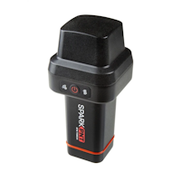
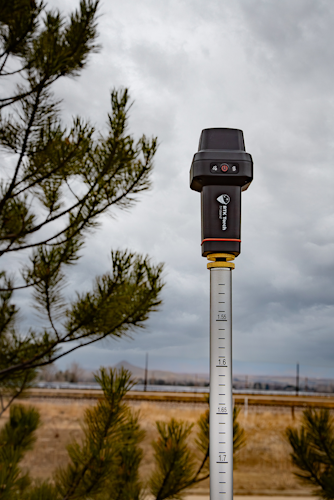
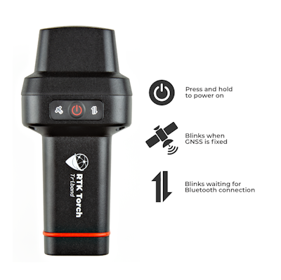
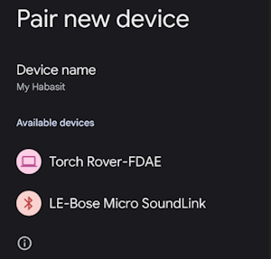
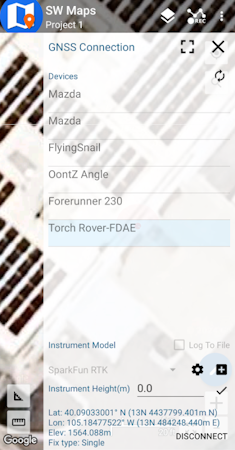
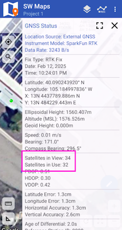

# Quick Start - RTK Torch

<figure markdown>

<figcaption markdown>
</figcaption>
</figure>

This quick start guide will get you started in 10 minutes or less. For the full product manual, please proceed to the [**Introduction**](index.md).

Are you using [Android](#android) or [iOS](#ios)?

## Android

1. Download [SW Maps](https://play.google.com/store/apps/details?id=np.com.softwel.swmaps). This may not be the GIS software you intend to do your data collection, but SW Maps is free and makes sure everything is working correctly out of the box.

	<figure markdown>
	
	<figcaption markdown>
	Download SW Maps for Android
	</figcaption>
	</figure>

2. Mount the hardware:

	- For RTK Torch: Attach the Torch to a 5/8" 11-TPI standard surveying pole or to a [monopole](https://www.sparkfun.com/telescopic-surveying-pole.html) using the included [thread adapter](https://www.sparkfun.com/products/17546) if needed (Figure 1).

	<figure markdown>
	
	<figcaption markdown>
	Figure 1
	</figcaption>
	</figure>

3. Turn on the RTK Torch device by pressing the Power button for 3 to 4 seconds until a beep is heard and the two front LEDs illuminate (Figure 2).

	[<figure markdown>
	](./img/RTK-Torch_Buttons_Front.png)
	<figcaption markdown>
	Figure 2
	</figcaption>
	</figure>

4. From your cell phone, open Bluetooth settings and pair it with a new device. You will see a list of available Bluetooth devices. Select the ‘Torch Rover-3AF1’. The '3AF1' is the last four digits of the device's MAC address and will vary depending on the device (Figure 3).

	<figure markdown>
	
	<figcaption markdown>
	Figure 3
	</figcaption>
	</figure>

5. Once paired, open SW Maps. Select ‘New Project’ and give your project a name like ‘RTK Project’.

6. Press the SW Maps icon in the top left corner of the home screen and select **Bluetooth GNSS**. You should see the ‘Torch Rover-3AF1’ in the list. Select it. Confirm that the *Instrument Model* is **SparkFun RTK**, then press the ‘Connect’ button in the bottom right corner (Figure 4). SW Maps will show a warning that the instrument height is 0m. That’s ok.

	<figure markdown>
	
	<figcaption markdown>
	Figure 4
	</figcaption>
	</figure>

7. Once connected, have a look at the Bluetooth LED on the RTK device. You should see the LED turn solid. You’re connected!

8. Now put the device outside with a clear view of the sky. GNSS doesn’t work indoors or near windows. Press the SW Maps icon in the top left corner of the home screen and select **GNSS Status**. Within about 30 seconds you should see 10 or more satellites in view (SIV) (Figure 5). More SIV is better. We regularly see 30 or more SIV. The horizontal positional accuracy (HPA) will start at around 10 meters and begin to decrease. The lower the HPA the more accurate your position. This accuracy is around 2m in normal mode.

	<figure markdown>
	
	<figcaption markdown>
	Figure 5
	</figcaption>
	</figure>

You can now use your RTK device to measure points with good (meter) accuracy. If you need extreme accuracy (down to 8mm) continue reading the [RTK Crash Course](#rtk-crash-course).

## iOS

The software options for Apple iOS are much more limited because Apple products do not support Bluetooth SPP. That's ok! The SparkFun RTK products support Bluetooth Low Energy (BLE) which *does* work with iOS.

1. Download [SW Maps for iOS](https://apps.apple.com/us/app/sw-maps/id6444248083). This may not be the GIS software you intend to do your data collection, but SW Maps is free and makes sure everything is working correctly out of the box.

	<figure markdown>
	
	<figcaption markdown>
	Download SW Maps for iOS
	</figcaption>
	</figure>

2. Mount the hardware:

	- For RTK Torch: Attach the Torch to a 5/8" 11-TPI standard surveying pole or to a [monopole](https://www.amazon.com/AmazonBasics-WT1003-67-Inch-Monopod/dp/B00FAYL1YU) using the included [thread adapter](https://www.sparkfun.com/products/17546) (Figure 1).

	<figure markdown>
	
	<figcaption markdown>
	Figure 1
	</figcaption>
	</figure>

3. Turn on the RTK Torch device by pressing the Power button for 3 to 4 seconds until a beep is heard and the two front LEDs illuminate (Figure 2).

	[<figure markdown>
	](./img/RTK-Torch_Buttons_Front.png)
	<figcaption markdown>
	Figure 2
	</figcaption>
	</figure>

4. Open SW Maps. Select ‘New Project’ and give your project a name like ‘RTK Project’.

5. Press the SW Maps icon in the top left corner of the home screen and select Bluetooth GNSS. You will need to agree to allow a Bluetooth connection. Set the *Instrument Model* to **Generic NMEA (Bluetooth LE)**. Press 'Scan' and your RTK device should appear. Select it then press the ‘Connect’ button in the bottom left corner.

6. Once connected, have a look at the Bluetooth LED on the RTK device. You should see the LED turn solid. You’re connected!

7. Now put the device outside with a clear view of the sky. GNSS doesn’t work indoors or near windows. Press the SW Maps icon in the top left corner of the home screen and select **GNSS Status**. Within about 30 seconds you should see 10 or more satellites in view (SIV) (Figure 3). More SIV is better. We regularly see 30 or more SIV. The horizontal positional accuracy (HPA) will start at around 10 meters and begin to decrease. The lower the HPA the more accurate your position. This accuracy is around 2m in normal mode.

	<figure markdown>
	
	<figcaption markdown>
	Figure 3
	</figcaption>
	</figure>

You can now use your RTK device to measure points with good (meter) accuracy. If you need extreme accuracy (down to 8mm) continue reading the [RTK Crash Course](#rtk-crash-course).

## RTK Crash Course

To get millimeter accuracy we need to provide the RTK unit with correction values. See [Corrections Sources](correction_sources.md) for a breakdown of the options and the pros and cons of each. For this quickstart, we'll be showing how to use PointPerfect Flex for $15 a month.



## Common Gotchas

- High-precision GNSS works best with a clear view of the sky; it does not work indoors or near a window. GNSS performance is generally *not* affected by clouds or storms. Trees and buildings *can* degrade performance but usually only in very thick canopies or very near tall building walls. GNSS reception is very possible in dense urban centers with skyscrapers but high-precision RTK may be impossible.
- The location reported by the RTK device is the location of the antenna element; it's *not* the location of the pointy end of the stick. Lat and Long are fairly easy to obtain but if you're capturing altitude be sure to do additional reading on ARPs (antenna reference points) and how to account for the antenna height in your data collection software. The Torch ARP is [here](https://docs.sparkfun.com/SparkFun_RTK_Torch/hardware_overview/#antenna-reference-point).

	!!! note
		This rule does not apply when tilt compensation is activated. See the [Tilt Compensation Menu](menu_tilt.md) for more information.

- An internet connection is required for most types of RTK. RTCM corrections can be transmitted over other types of connections (such as serial telemetry radios). See [Correction Transport](correction_transport.md) for more details.
