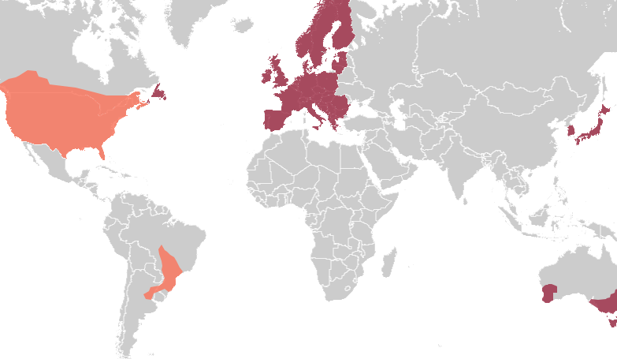

# Using PointPerfect Flex

<!--
Compatibility Icons
====================================================================================

:material-radiobox-marked:{ .support-full title="Feature Supported" }
:material-radiobox-indeterminate-variant:{ .support-partial title="Feature Partially Supported" }
:material-radiobox-blank:{ .support-none title="Feature Not Supported" }
-->

- EVK: :material-radiobox-marked:{ .support-full title="Feature Supported" }
- Facet mosaic: :material-radiobox-marked:{ .support-full title="Feature Supported" }
- Postcard: :material-radiobox-marked:{ .support-full title="Feature Supported" }
- Torch: :material-radiobox-marked:{ .support-full title="Feature Supported" }

To get millimeter accuracy we need to provide the RTK unit with correction values. Corrections, often called RTCM, help the RTK unit refine its position calculations. There are multiple options for [correction sources](http://docs.sparkfun.com/SparkFun_RTK_Everywhere_Firmware/correction_sources/), but this tutorial focuses on PointPerfect. PointPerfect Flex over NTRIP is $15 per month and is an [SSR based service](https://docs.sparkfun.com/SparkFun_RTK_Everywhere_Firmware/correction_sources/#osr-vs-ssr) meaning there are no base stations or 'dead-air' gaps in the coverage map. The contiguous 48 states in the USA, EU, Japan, and parts of Australia are covered by this service. See the coverage map [here](https://www.u-blox.com/en/pointperfect-service-coverage).

<figure markdown>

<figcaption markdown>
PointPerfect Flex Coverage Map
</figcaption>
</figure>

## Getting Access

PointPerfect Flex over NTRIP requires a set of user name, password, and mount point credentials. Please [contact SparkFun](https://www.sparkfun.com/pointperfect) to setup a monthly subscription.

An *NTRIP Client* is a small app that connects to the corrections server to get the corrections. Most GIS apps have an NTRIP Client built in.

## Using NTRIP on a Phone

The easiest way is to use the service is with a cell phone. For this example, we'll use an Android phone with SW Maps but any GIS app with a built-in NTRIP Client (most do) can connect to PointPerfect.

In the above image, the phone is running the NTRIP Client and the corrections are downloaded from the internet using the phone's cellular connection. Those connections are sent over Bluetooth to the RTK device. The RTK device gets a high-precision solution and transmits the GPS location back to the phone over Bluetooth. The phone displays the location in an app allowing work to be done.

Above, in SW Maps select the NTRIP Client. This is the small cloud icon.

In the NTRIP Client detail window, enter the following information:

    NTRIP Version: V1
    NTRIP Server: ppntrip.services.u-blox.com
    NTRIP Port: 2101
    Mount Point: NEAR-RTCM
    Username: (provided when service was set up)
    Password: (provided when service was set up) 
    Send NMEA GGA to Base Station: Please confirm this option is checked

The information can be copy/pasted from email or manually entered. Be careful to enter the data correctly. Once the credentials are entered, click Save and then Exit the NTRIP Client details window. 

Next, turn on the RTK device and connect to it over Bluetooth by clicking on the receiver button (shown above). 

Once connected, tap the NTRIP Client (cloud) icon again to open the menu. A list of clients will be shown, select the one you just entered and click 'Connect'.

Confirm that the Data Rate section shows more than 0 bytes per second over a few seconds. The number will bounce around, but every second a few hundred bytes of correction data should be downloaded and sent to the RTK device over Bluetooth. This indicates the NTRIP connection was successful.

Close the NTRIP Client window returning to the main app screen and proceed outdoors and get a clear view of the sky. Above we see a successful high-precision RTK Fix with 16mm horizontal accuracy. Now you can proceed with GIS work.

Above, if you get a 'Connection Failed' error it is likely that username or password was incorrect. Double check you credentials and try again.

## No Cellular Coverage?

What if you don't have cellular connectivity? Corrections can be obtained over any internet connection. [Starlink Roam](https://www.starlink.com/us/roam) or [Eutelsat KONNECT](https://europe.konnect.com/en-DE) can provide internet over satellite. Once WiFi is available at the job site the RTK device can be configured to connect to WiFi and get the corrections over its built-in NTRIP Client. See the [NTRIP Client docs](http://docs.sparkfun.com/SparkFun_RTK_Everywhere_Firmware/menu_gnss/#ntrip-client) for more information.
